# 在拥有 20,000 个量子比特的容错囚禁离子量子计算机上，用 26 天计算 256 位椭圆曲线离散对数

## 译文信息

- 文献 ID：S009
- 原文：[S009_2026_Haner_elliptic_curve_discrete_logarithms.pdf](../Papers/S009_2026_Haner_elliptic_curve_discrete_logarithms.pdf)
- 原文版本：arXiv:2609.05625v1 [quant-ph]；页侧版本标记日期为 2026-09-04，论文题头日期为 2026-09-09
- 原文件 SHA-256：`ba68b87dae0dfb645e7e74b9042191e6140a30f1ca20c0a561ad74565117984b`
- 翻译类型：全文翻译
- 覆盖范围：所登记 PDF 的全部 70 页，包括题名、作者、单位、摘要、目录、第 I–VII 部分、正文第 I–XII 节、脚注、全部公式和编号、算法 1–11、图 1–22、表 I–XX、致谢、参考文献 [1]–[87] 和附录 A–G；不包含单独的 supplementary material、ancillary files、网页附加内容或其他版本
- 印刷页码：有；1–70（首页未显式印出页码，按连续页码记为 1）
- PDF 页序：从 1 开始；1–70
- 页码对应关系：印刷页码与 PDF 页序一一对应，$p$ = PDF 页序 $p$；进度表页码计入所属的浮动图表和算法，因此相邻章节的范围可能重叠
- 状态：已核对
- 待核对项：无

| 原文章节 | 印刷页码 | PDF 页序 | 状态 | 待核对 |
|---|---:|---:|---|---|
| 题名、作者、单位、摘要 | 1 | 1 | 已核对 | 无 |
| 目录 | 2–3 | 2–3 | 已核对 | 无 |
| 第 I 部分：引言与概览 | 4–8 | 4–8 | 已核对 | 无 |
| I. 引言 | 4–5 | 4–5 | 已核对 | 无 |
| II. 概览 | 5–8 | 5–8 | 已核对 | 无 |
| II A. 架构 | 5–6 | 5–6 | 已核对 | 无 |
| II B. 算法与实现 | 6 | 6 | 已核对 | 无 |
| II C. 结果与文章结构 | 6–8 | 6–8 | 已核对 | 无 |
| 第 II 部分：椭圆曲线离散对数 | 7–10 | 7–10 | 已核对 | 无 |
| III. 用于 ECDLP 的 Shor 算法 | 7–8 | 7–8 | 已核对 | 无 |
| IV. 单次成功概率 | 8–10 | 8–10 | 已核对 | 无 |
| IV A. 近似预言机与成功概率 | 8–9 | 8–9 | 已核对 | 无 |
| IV B. 本文实现的成功概率的具体估计 | 9–10 | 9–10 | 已核对 | 无 |
| 第 III 部分：点加法电路 | 11–13 | 11–13 | 已核对 | 无 |
| V. 点加法的高层实现 | 11–12 | 11–12 | 已核对 | 无 |
| VI. 优化的二进制 gcd 迭代 | 12 | 12 | 已核对 | 无 |
| VII. 模平方 | 12–13 | 12–13 | 已核对 | 无 |
| VII A. 优化的平方运算 | 13 | 13 | 已核对 | 无 |
| VII B. 模平方减法 | 13 | 13 | 已核对 | 无 |
| 第 IV 部分：编译工具链 | 14–20 | 14–20 | 已核对 | 无 |
| VIII. 编译器概览 | 14 | 14 | 已核对 | 无 |
| IX. 架构约束与调度 | 14–15 | 14–15 | 已核对 | 无 |
| IX A. 架构约束 | 14–15 | 14–15 | 已核对 | 无 |
| IX B. 调度 | 15 | 15 | 已核对 | 无 |
| X. 算法组件与集成路由 | 15–19 | 15–19 | 已核对 | 无 |
| X A. 加法器的路由 | 15–16 | 15–16 | 已核对 | 无 |
| X B. 集成路由 | 16–17 | 16–17 | 已核对 | 无 |
| X C. 近似模加法器的路由 | 17 | 17 | 已核对 | 无 |
| X D. 算法组件的端到端集成路由 | 17–19 | 17–19 | 已核对 | 无 |
| XI. 验证 | 19–20 | 19–20 | 已核对 | 无 |
| XI A. 树的分层验证 | 19–20 | 19–20 | 已核对 | 无 |
| XI B. 调度验证 | 20 | 20 | 已核对 | 无 |
| 第 V 部分：架构 | 21–41 | 21–41 | 已核对 | 无 |
| XII. 架构概览 | 21–41 | 21–41 | 已核对 | 无 |
| XII A. secp256k1 设备 | 21–22 | 21–22 | 已核对 | 无 |
| XII B. 交换丢失模型 | 22–26 | 22–26 | 已核对 | 无 |
| XII B 1. 交换丢失模型 | 22–23 | 22–23 | 已核对 | 无 |
| XII B 2. 可抵抗交换的丢失检测与综合征提取 | 23–25 | 23–25 | 已核对 | 无 |
| XII B 3. 码块的存储性能 | 24–26 | 24–26 | 已核对 | 无 |
| XII C. 采用并行布局的可复用猫态工厂 | 24–28 | 24–28 | 已核对 | 无 |
| XII C 1. 用于并行测量的沿边紧排猫态工厂 | 24–26 | 24–26 | 已核对 | 无 |
| XII C 2. 复用猫态 | 27–28 | 27–28 | 已核对 | 无 |
| XII D. CLAW 指令集架构与深度为一的 CCZ 注入 | 28–33 | 28–33 | 已核对 | 无 |
| XII D 1. 并行猫态测量 | 29 | 29 | 已核对 | 无 |
| XII D 2. 空闲时的标架清除 | 29–33 | 29–33 | 已核对 | 无 |
| XII D 3. 深度为一的 CCZ 注入 | 31–33 | 31–33 | 已核对 | 无 |
| XII E. Eastinthillation CCZ 工厂 | 33–41 | 33–41 | 已核对 | 无 |
| XII E 1. 零级 T 态蒸馏 | 33–35 | 33–35 | 已核对 | 无 |
| XII E 2. Eastinthillation 工厂电路 | 34–38 | 34–38 | 已核对 | 无 |
| XII E 3. 分析 | 37–40 | 37–40 | 已核对 | 无 |
| XII E 4. 转换为 T 态工厂 | 40–41 | 40–41 | 已核对 | 无 |
| 第 VI 部分：结论 | 41 | 41 | 已核对 | 无 |
| 致谢 | 41 | 41 | 已核对 | 无 |
| 参考文献 | 41–44 | 41–44 | 已核对 | 无 |
| 第 VII 部分：附录 | 45–70 | 45–70 | 已核对 | 无 |
| 附录 A：算法 | 45–47 | 45–47 | 已核对 | 无 |
| A 1. 仿射椭圆曲线点加法 | 45–46 | 45–46 | 已核对 | 无 |
| A 2. 模平方减法 | 45–47 | 45–47 | 已核对 | 无 |
| 附录 B：失败情形分析 | 46–56 | 46–56 | 已核对 | 无 |
| B 1. 椭圆曲线点加法的例外情形 | 47–49 | 47–49 | 已核对 | 无 |
| B 2. 近似模算术的失败 | 49–56 | 49–56 | 已核对 | 无 |
| B 2 a. 近似模约减 | 49–50 | 49–50 | 已核对 | 无 |
| B 2 b. 近似相位修复 | 50 | 50 | 已核对 | 无 |
| B 2 c. 加法、减法和取负 | 50–53 | 50–53 | 已核对 | 无 |
| B 2 d. 减去平方 | 53–54 | 53–54 | 已核对 | 无 |
| B 2 e. 近似原位乘法和除法 | 54–56 | 54–56 | 已核对 | 无 |
| B 3. 失败概率界 | 56 | 56 | 已核对 | 无 |
| B 4. 使用近似算术时的算法成功概率 | 56 | 56 | 已核对 | 无 |
| 附录 C：端到端集成路由 | 57–58 | 57–58 | 已核对 | 无 |
| 附录 D：电路综合 | 59–60 | 59–60 | 已核对 | 无 |
| D 1. 综合树与前沿降级 | 59 | 59 | 已核对 | 无 |
| D 2. 紧凑重复与延迟参数 | 59 | 59 | 已核对 | 无 |
| D 3. 记忆化降级与子树重放 | 59–60 | 59–60 | 已核对 | 无 |
| D 4. 测量调度 | 60 | 60 | 已核对 | 无 |
| D 5. 布局计划 | 60 | 60 | 已核对 | 无 |
| 附录 E：架构资源总量 | 60–63 | 60–63 | 已核对 | 无 |
| E 1. 占用 | 60–62 | 60–62 | 已核对 | 无 |
| E 2. 运行时间 | 62–63 | 62–63 | 已核对 | 无 |
| E 3. 逻辑失败概率 | 63 | 63 | 已核对 | 无 |
| 附录 F：交换丢失敏感性 | 63–64 | 63–64 | 已核对 | 无 |
| 附录 G：Eastinthillation 工厂的 Q66 代表元 | 65–70 | 65–70 | 已核对 | 无 |

## 术语表

| 原文 | 统一译名 | 说明 |
|---|---|---|
| trapped-ion quantum computer | 囚禁离子量子计算机 | |
| fault-tolerant | 容错 | |
| elliptic curve discrete logarithm problem (ECDLP) | 椭圆曲线离散对数问题 | 保留 ECDLP |
| Walking Cat architecture | Walking Cat 架构 | 架构名称保留原文 |
| quantum low-density parity-check (qLDPC) code | 量子低密度奇偶校验码 | 保留 qLDPC / LDPC 的原文用法 |
| point addition | 点加法 | |
| oracle | 预言机 | |
| single-shot success probability | 单次成功概率 | |
| modular reduction | 模约减 | |
| phase repair | 相位修复 | |
| in-place | 原位 | |
| uncomputation | 反计算 | |
| integrated routing | 集成路由 | |
| lowering | 降级 | 编译表示向更低层表示的转换 |
| memoization | 记忆化 | |
| footprint | 占用 | 量子比特或布局占用 |
| transport | 输运 | 物理量子比特的移动 |
| weight | 权重 | |
| cat-state bundle / bundle pair | 猫态资源束 / 资源束对 | |
| pseudo-Mersenne | 伪梅森 | |
| magic state / magic-state factory | 魔法态 / 魔法态工厂 | |
| cat state / cat-state factory | 猫态 / 猫态工厂 | |
| syndrome extraction circuit / cycle (SEC) | 综合征提取电路 / 周期 | 随原文语境分别指电路或一轮执行 |
| physical operation cycle (POC) | 物理操作周期 | 保留 POC |
| logical frame / frame clearing | 逻辑标架 / 标架清除 | |
| feedforward | 前馈 | |
| swap-loss | 交换丢失 | |
| leakage / loss | 泄漏 / 丢失 | 两者分别对应原文的不同噪声过程 |
| leakage and loss reduction unit (LLRU) | 泄漏与丢失抑制单元 | 保留 LLRU |
| Clifford / CliNR / Eastinthillation | Clifford / CliNR / Eastinthillation | 保留名称 |
| CLAW instruction set architecture (ISA) | CLAW 指令集架构 | |
| phase fixup | 相位修正 | |
| acceptance | 接受判定 | 工厂检验结果 |
| representative | 代表元 | Pauli 算符代表元 |
| union bound | 并集界 | |
| reservoir | 储备区 | |
| zero-level / 0-level distillation | 零级蒸馏 | |

## 题名、作者与摘要

**在拥有 20,000 个量子比特的容错囚禁离子量子计算机上，用 26 天计算 256 位椭圆曲线离散对数**

原题：*Computing 256-bit elliptic curve discrete logarithms in 26 days on a fault-tolerant trapped-ion quantum computer with 20,000 qubits*

Thomas Häner\*、Felix Tripier\*、Jacob Young\*、Michael Naehrig、Andrii Maksymov、Safwan Alam、Dmitri Maslov、Matthew Parrott、Yvette de Sereville、Jordan Sullivan、Mark Webster、Nicolas Delfosse、John Gamble 和 Martin Roetteler

IonQ Inc.（IonQ 公司）

日期：2026 年 9 月 9 日。

原文定位：印刷页码 1；PDF 页序 1。页侧版本标记：arXiv:2609.05625v1 [quant-ph]，2026 年 9 月 4 日。

**摘要。** 我们最近提出了用于囚禁离子（trapped-ion）量子计算机的 Walking Cat 架构 [1]；它的一项优势是，很容易针对特定应用进行扩展和优化。作为概念验证，本文给出这类优化，以便利用 Shor 算法求解 `secp256k1` 上的 256 位椭圆曲线离散对数问题（elliptic curve discrete logarithm problem，ECDLP）；比特币等区块链技术使用的正是这条椭圆曲线。我们优化了 Schrottenloher 最近工作 [2] 中的电路，得到一个使用约 1450 个量子比特和 $40\cdot10^6$ 个 Toffoli 门求解 ECDLP 的逻辑量子电路，并给出逻辑层面成功概率的严格下界，该下界以至少 $1-2^{-128}$ 的置信度成立，同时还给出成功概率的启发式估计。我们使用自己的编译工具链，结合对逻辑布局的人工优化和集成路由（integrated routing），将所有组件编译成符合架构约束的测量调度，从而估计逻辑测量深度和所需物理量子比特数。一项关键组成是快速 CCZ 魔法态工厂以及深度为一的 CCZ 态注入，它们使 CCZ 门的执行时间缩短至原来的 $1/31$。我们通过并行执行互不重叠的基于猫态的测量，提高逻辑测量的并行度，并采用最近提出的逻辑 CliNR 协议加速 Clifford 操作。为减少量子比特开销，我们引入更高效的丢失纠正协议，设计允许回收 CliNR 辅助量子比特的布局，并根据电路的峰值测量并行度配置可复用的猫态资源。综合全部结果和优化，我们得出结论：基于该架构的囚禁离子量子计算机，能够使用 19,397 个物理量子比特，在约 25.7 天内以估计为 63% 的成功概率求解 `secp256k1` 上的 ECDLP。

\* 这些作者对本工作贡献相同。

## 目录

原文定位：印刷页码 2–3；PDF 页序 2–3。以下页码均为原文印刷页码。

| 原文目录条目 | 起始页码 |
|---|---:|
| 第 I 部分：引言与概览 | 4 |
| I. 引言 | 4 |
| II. 概览 | 5 |
| II A. 架构 | 5 |
| II B. 算法与实现 | 6 |
| II C. 结果与文章结构 | 6 |
| 第 II 部分：椭圆曲线离散对数 | 7 |
| III. 用于 ECDLP 的 Shor 算法 | 7 |
| IV. 单次成功概率 | 8 |
| IV A. 近似预言机与成功概率 | 8 |
| IV B. 本文实现的成功概率的具体估计 | 9 |
| 第 III 部分：点加法电路 | 11 |
| V. 点加法的高层实现 | 11 |
| VI. 优化的二进制 gcd 迭代 | 12 |
| VII. 模平方 | 12 |
| VII A. 优化的平方运算 | 13 |
| VII B. 模平方减法 | 13 |
| 第 IV 部分：编译工具链 | 14 |
| VIII. 编译器概览 | 14 |
| IX. 架构约束与调度 | 14 |
| IX A. 架构约束 | 14 |
| IX B. 调度 | 15 |
| X. 算法组件与集成路由 | 15 |
| X A. 加法器的路由 | 15 |
| X B. 集成路由 | 16 |
| X C. 近似模加法器的路由 | 17 |
| X D. 算法组件的端到端集成路由 | 17 |
| XI. 验证 | 19 |
| XI A. 树的分层验证 | 19 |
| XI B. 调度验证 | 20 |
| 第 V 部分：架构 | 21 |
| XII. 架构概览 | 21 |
| XII A. secp256k1 设备 | 21 |
| XII B. 交换丢失模型 | 22 |
| XII B 1. 交换丢失模型 | 22 |
| XII B 2. 可抵抗交换的丢失检测与综合征提取 | 23 |
| XII B 3. 码块的存储性能 | 24 |
| XII C. 采用并行布局的可复用猫态工厂 | 24 |
| XII C 1. 用于并行测量的沿边紧排猫态工厂 | 24 |
| XII C 2. 复用猫态 | 27 |
| XII D. CLAW 指令集架构与深度为一的 CCZ 注入 | 28 |
| XII D 1. 并行猫态测量 | 29 |
| XII D 2. 空闲时的标架清除 | 29 |
| XII D 3. 深度为一的 CCZ 注入 | 31 |
| XII E. Eastinthillation CCZ 工厂 | 33 |
| XII E 1. 零级 T 态蒸馏 | 33 |
| XII E 2. Eastinthillation 工厂电路 | 34 |
| XII E 3. 分析 | 37 |
| XII E 4. 转换为 T 态工厂 | 40 |
| 第 VI 部分：结论 | 41 |
| 致谢 | 41 |
| 参考文献 | 41 |
| 第 VII 部分：附录 | 45 |
| 附录 A：算法 | 45 |
| A 1. 仿射椭圆曲线点加法 | 45 |
| A 2. 模平方减法 | 45 |
| 附录 B：失败情形分析 | 46 |
| B 1. 椭圆曲线点加法的例外情形 | 47 |
| B 2. 近似模算术的失败 | 49 |
| B 2 a. 近似模约减 | 49 |
| B 2 b. 近似相位修复 | 50 |
| B 2 c. 加法、减法和取负 | 50 |
| B 2 d. 减去平方 | 53 |
| B 2 e. 近似原位乘法和除法 | 54 |
| B 3. 失败概率界 | 56 |
| B 4. 使用近似算术时的算法成功概率 | 56 |
| 附录 C：端到端集成路由 | 57 |
| 附录 D：电路综合 | 59 |
| D 1. 综合树与前沿降级 | 59 |
| D 2. 紧凑重复与延迟参数 | 59 |
| D 3. 记忆化降级与子树重放 | 59 |
| D 4. 测量调度 | 60 |
| D 5. 布局计划 | 60 |
| 附录 E：架构资源总量 | 60 |
| E 1. 占用 | 60 |
| E 2. 运行时间 | 62 |
| E 3. 逻辑失败概率 | 63 |
| 附录 F：交换丢失敏感性 | 63 |
| 附录 G：Eastinthillation 工厂的 Q66 代表元 | 65 |

## 第 I 部分：引言与概览

### I. 引言

<!-- 原文印刷/PDF 第 4–5 页 -->

对于密码学、化学、材料科学、数据科学、微分方程和优化中的某些计算问题，量子计算机有望相对于经典计算机提供显著加速 [3–14]，因此也有望加快科学发现的进程 [15]。

其中一些应用的资源估计已被用来衡量该领域的进展，因为这类估计反映了量子算法设计、电路优化、容错量子计算架构及量子纠错方面的改进。例如，在过去 14 年里，使用 Shor 算法 [3] 分解 2048 位整数所需的物理量子比特数已下降三至四个数量级 [16–19]：从 2012 年的约 $10^9$ 个量子比特 [20, 21]，降至具有二维网格连接的 $10^6$ 个量子比特 [22]，或在假定具有长程连接时的 $10^5$ 个量子比特 [23]。

求解椭圆曲线离散对数问题（elliptic curve discrete logarithm problem，ECDLP）也取得了类似进展。自 Proos 和 Zalka 在 2003 年给出门数为 $6\cdot10^9$ 的初始估计 [24] 以来，一系列工作 [25–27] 已将资源需求（不对多个实例进行摊销 [27]）降至 2023 年的约 $200\cdot10^6$ 个 Toffoli 门 [27]，最终在 2026 年降至 1462 个逻辑量子比特和 $84\cdot10^6$ 个 Toffoli 门 [2]。此外，近期工作还研究了如何降低空间需求：利用空间效率更高的加法器 [2, 28–30]，或压缩输出 [31]，已实现约 1200 个逻辑量子比特；使用位置控制算术甚至可降至 850 个以下 [32]，但由此得到的 Toffoli 门数更大（后两种情况中的增加尤为显著）。

此外，256 位曲线 `secp256k1` 的素数为伪梅森素数（pseudo-Mersenne prime），因此可以进一步优化。于是，在 `secp256k1` 上求解 ECDLP 所需的门数可以少于其他椭圆曲线 [2, 28]：已有工作表明，约 1462 个量子比特和 $60\cdot10^6$ 个 Toffoli 门即已足够 [2]。近期的高层资源估计表明，在中性原子量子计算机上解决这一问题可能需要不到 20,000 个物理量子比特 [33]，在超导量子计算机上则需要少于 500,000 个物理量子比特 [28]。

本工作设计了一种专用的容错囚禁离子量子计算机架构，能够以约 20,000 个量子比特，在 26 天内求解 `secp256k1` 上的 ECDLP；而此前利用囚禁离子架构解决这一问题的估计需要 120 万 [34] 至 940 万个量子比特 [27]。我们的工作在若干方面超出了此前的资源估计研究 [2, 26–28] 和架构方案 [33, 35]。具体而言，我们作出了以下贡献：

1. 我们开发并详细描述了一种用于 ECDLP 的囚禁离子架构，其中包括编译器，以及全部逻辑操作、量子纠错码和纠错电路的完整描述。该设计与 Walking Cat 架构 [1] 兼容。据我们所知，这是第一个基于量子 LDPC 码的囚禁离子 ECDLP 架构。
2. 我们将 Schrottenloher 电路 [2] 的 Toffoli 门数从 $2^{25.78}\approx5800$ 万降至 3900 万，并使用 1457 个逻辑量子比特。
3. 我们推导了整个量子算法成功概率的严格界，同时计入算术电路中的近似误差，包括相位误差和计算基误差。
4. 我们引入 Toffoli 态工厂、快速 Toffoli 注入电路，并提高基于猫态的逻辑测量并行度，使 Walking Cat 架构中 Toffoli 门的执行时间缩短至原来的 $1/31$。
5. 我们量化并计入了算术组件布局，以及逻辑操作所消耗的辅助量子比特的分配和输运开销。
6. 我们实现了一个编译器，将全部高层算法组件编译为在该架构上可执行的程序，以给出准确的深度估计和物理量子比特数；我们用集成逻辑路由替换所有朴素的 Clifford 分解，并得到精确的深度计数。
7. 我们考虑了量子比特输运、泄漏、丢失和重新装载对逻辑操作时间与噪声的影响。这些影响对原子量子比特很显著，却常被资源估计忽略 [23, 27, 33]。
8. 我们根据综合征提取电路的详细结构，推导出逻辑操作时间的保守估计；此前某些估计则假定任意码的综合征提取时间均为 $1\,\mathrm{ms}$，这可能导致过于乐观的时间估计 [23, 27, 33]。
9. 我们计入所有逻辑操作，包括 Toffoli 门、Clifford 门和逻辑测量。后两类操作占总运行时间的显著比例，却常被其他资源估计省略 [23, 28, 33]。例如，Gidney 加法器 [36] 的一半成本来自对临时 AND 的基于测量的反计算，而其 Toffoli 门数并未体现这一成本。

在整个工作中，我们优先追求简洁性，而不是穷尽优化。例如，增加经典后处理的工作量，或执行更多次量子算法（也可以并行执行），能够缩小每个实例所需的量子电路 [31, 37]。在编译器中，我们在整个应用里使用同一类加法器，而不根据可用临时空间和运行时间要求，在优化宽度与优化深度的加法器之间切换。在架构层面，我们同样在整个计算中保持设备配置固定，而不在存储资源与门资源之间动态重新分配量子比特。最后，我们将每次逻辑测量都视为与一次 Toffoli 注入持续相同时间，从而给出运行时间的保守上界。我们还假定全部 69 个存储块在整个计算期间都处于活动状态，以得到成功概率的下界，尽管存储的实际存续时间通常更短。这些选择留下了进一步优化的空间，但对于仅能带来有限收益的改动，我们选择放弃，以得到更易于分析和验证的简单设计。

### II. 概览

#### A. 架构

<!-- 原文印刷/PDF 第 5–6 页 -->

我们针对 ECDLP 的专用架构源自 Walking Cat 架构 [1]；后者是一种利用囚禁离子进行容错量子计算的通用架构 [38–42]。Walking Cat 架构采用囚禁离子的二维网格，每个离子编码一个量子比特，并通过电子量子比特控制 [43] 在网格上进行输运，从而建立量子比特之间的长程连接。输运使量子 LDPC 码 [44] 得以使用，因此该架构比基于表面码的架构更高效 [21, 45]。我们假定双量子比特门的噪声率为 $10^{-4}$，这一水平已在小型囚禁离子设备上得到实验演示 [46]；单量子比特操作的噪声率为 $10^{-5}$，这也处于当前囚禁离子设备可以达到的范围内 [47]。

在通用 Walking Cat 架构 [1] 上朴素实现用于 ECDLP 的 Shor 算法是可行的，但面临以下挑战。(1) 文献 [1] 中的魔法态工厂所产生的 $T$ 态（更准确地说是 $H$ 态），其逻辑错误率至多只能低至 $7\cdot10^{-8}$。然而，使用我们的电路求解 `secp256k1` 上的 ECDLP 需要 3900 万个 Toffoli 门，总共消耗 2.73 亿个 $T$ 态。这里我们假定使用精确 Toffoli 的实现 [48]，即使用七个 $T$ 门和七个 CNOT 门，而不采用 Jones [49] 和 Maslov [50] 基于相对相位 Toffoli 的四 $T$ 构造，因为后者需要一个额外的逻辑辅助量子比特，因而较难比较成本。上述 $T$ 态逻辑错误率不足以使算法具有较高的成功概率。(2) 每次 $T$ 态注入消耗一次逻辑测量，平均约需 $40\,\mathrm{ms}$；一个 CNOT 门平均约需 $90\,\mathrm{ms}$（假定每个 CNOT 门需三次逻辑测量，每次逻辑测量需五个综合征提取周期 SEC，每个 SEC 需 $6.7\,\mathrm{ms}$）。若按顺序实现这些操作，每个 Toffoli 门的运行时间至少为 $910\,\mathrm{ms}$，总运行时间为 411 天。增加魔法态工厂的数量只能带来小幅改进，因为该算法的 Toffoli 宽度被限制为一，也限制了其 $T$ 宽度。事实上，Babbush 等人的资源估计 [28] 假定顺序执行 Toffoli 门。(3) 存储 1500 个逻辑量子比特需要大量物理量子比特。例如，用距离为 9 的表面码存储这些逻辑量子比特将消耗 243,000 个量子比特，这还不包括逻辑操作和魔法态工厂的成本。也可以使用 Walking Cat 架构中的 Q70 码，它将六个逻辑量子比特编码到 70 个数据量子比特中，但即使不计猫态工厂和魔法态工厂，仍需要分布在 250 个存储块中的 55,000 个量子比特。就量子比特数而言，一个合理选择是 Q102 码：它将 22 个逻辑量子比特编码到 102 个数据量子比特中（另用 102 个辅助量子比特进行综合征提取，以及 102 个信标量子比特进行丢失纠正），存储 1500 个逻辑量子比特约需 20,000 个量子比特。(4) 像 Q102 这样每个块编码许多逻辑量子比特的稠密码，可能降低逻辑门的并行度，因为在任意 Clifford 标架下，在同一块中同时执行多个逻辑操作颇具挑战。可以考虑使用近期提出的逻辑 CliNR 方案 [51] 简化 Clifford 标架，但若为每个 Q102 存储块都提供 CliNR，就需要为每个存储块增加两个 Q102 块，总计增加 40,000 个量子比特。

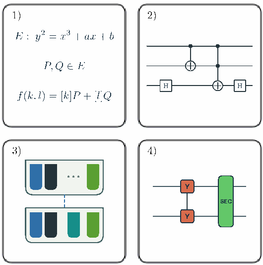

**图 1：** 以用于 ECDLP 的 Shor 算法在逐级降级的不同表示之间转换的端到端流水线，概览本文内容。阶段 1 给出算法的高层数学描述（第二部分）。阶段 2 用高层逻辑量子电路描述算法（第三部分）。阶段 3 将这些电路编译为可执行且满足架构约束的测量调度（第四部分）。子图 3 展示了在连续测量层之间将逻辑量子比特分配到存储块的方式：每个方框代表一个存储块，每个彩色矩形代表一个逻辑量子比特，虚线表示通过集成路由在存储块之间移动逻辑量子比特。阶段 4 利用量子纠错（QEC）架构的逻辑指令集架构（instruction set architecture，ISA），将调度转换为其原生操作（第五部分）。图中：阶段 1 的曲线为 $E:y^2=x^3+ax+b$，$P,Q\in E$，$f(k,l)=[k]P+[l]Q$；$H$ 表示 Hadamard 门，$Y$ 表示 $Y$ 操作，SEC 表示综合征提取周期。

为应对挑战 (1) 和 (2)，我们设计了两级魔法态工厂，产生逻辑错误率低于 $10^{-9}$ 的魔法态。我们的魔法态工厂直接在量子 LDPC 码中产生 CCZ 态，而不是由 $T$ 门构造 Toffoli 门。完成布局和路由优化后，量子算法的运行时间主要由 Toffoli 门决定，因此这一做法显著缩短了运行时间。为了加快 CCZ 态的生产和注入，我们为每个块设置多个猫态工厂，并利用支撑不相交的逻辑算符并行执行逻辑操作。这使我们能够构造快速 CCZ 工厂以及深度为 1 的 CCZ 注入电路；由于 CCZ 门和 Toffoli 门在局部 Clifford 变换下等价，我们利用该电路实现 Toffoli 门。快速 Toffoli 注入和 Clifford 标架跟踪使 Toffoli 门时间达到 $29.5\,\mathrm{ms}$，比朴素实现快 31 倍。四个 Toffoli 工厂总共消耗 $1276=4\cdot319$ 个量子比特，即足以以低于 $28\,\mathrm{ms}$ 的平均生产时间产生 Toffoli 态，持续供应 Toffoli 门。对于挑战 (3)，我们优化 Walking Cat 架构以使用稠密的 Q102 码。我们采用挑战 (4) 中建议的逻辑 CliNR 方案，但为避免额外增加 40,000 个量子比特，我们利用量子算法的结构及其有限的 Toffoli 宽度，将逻辑 CliNR 的实现流水线化。我们发现，四个额外 Q102 块就已足够，与朴素的 CliNR 实现相比减少了 39,200 个量子比特。此外，我们继续利用量子算法有限的 Toffoli 宽度降低量子比特数。由于可并行执行的 Toffoli 门数相对较少，许多猫态会长时间闲置。我们不为所有猫态工厂都填满量子比特，而是使用数量受限的猫态量子比特，按需将其输运到不同的猫态工厂。通过精心安排流水线和路由，我们将所需猫态量子比特数最小化。最后，我们改进了 Walking Cat 架构底层的量子比特丢失模型，并引入新的泄漏与丢失纠正单元。这些改进共同消除了对信标量子比特的需求，使每个存储块的量子比特数减少约三分之一。

#### B. 算法与实现

在逻辑电路层面，我们对 Schrottenloher 的量子电路 [2] 提出了两项优化，在使用 1457 个逻辑量子比特的情况下，将 Toffoli 门数从 $58\cdot10^6$ 降至 $39\cdot10^6$。具体而言，我们为原位乘法（in-place multiplication）[2, 52] 采用另一种表示，使受控加法变成条件取逆加法，其非 Clifford 门成本约为前者的一半 [36]；我们还基于一次 Karatsuba 拆分 [53] 以及针对平方对 Litinski 非模乘法器 [54] 的专门优化，构造了适用于伪梅森素数的模平方器。

得到的点加法电路是近似的：它对 $\mathbb F_p$ 中大多数（但并非全部）输入产生正确输出，且没有 $(-1)$ 相位错误。因此，我们推导了各个组件以及整个双标量乘法的成功概率界。为了将组件层面的成功概率界紧致地转化为整个算法的失败概率，我们使用随机偏移掩码。由于每次运行算法时都会重新采样掩码，我们能够对每个固定的输入标量对证明失败概率上界 $p_f$。继而，可以将这一逐输入的界转化为 Shor 算法成功概率的下界；与精确实现双标量乘法时的成功概率相比，这一下界至多降低 $4p_f$。此前的工作 [2, 22, 24, 28] 使用启发式以及非形式化的保真度或单次运行失败论证，而通过态距离得到的界 [19, 55] 只能将成功概率的降低量界为 $O(\sqrt{p_f})$。

随后，我们实现这些逻辑电路并将它们映射到我们的架构。我们描述内部编译工具链及其验证流水线，并用它们为算法中的每个高层组件生成可执行程序，从而得到严格的空间与深度估计。为减少组件（加法器、乘法器等）的时空占用，我们优化逻辑量子比特到架构中不同存储块的分配。在最终深度估计中，我们计入了这些不同分配方式带来的开销。此前的门数资源估计抽象掉了 Clifford 和路由成本；我们则将每个计入成本的组件编译为可执行、满足架构约束且包含路由的测量调度。借助集成路由（integrated routing），即把两个组件之间的跨块路由操作与这两个组件本身合并的过程，我们能够将路由开销降至总运行时间的 5%。

#### C. 结果与文章结构

<!-- 原文印刷/PDF 第 6–8 页 -->

我们将准确的深度估计与以下三项结合：(1) 所提架构给出的逻辑测量时间，(2) 算法成功概率的严格下界，(3) 逻辑错误概率的估计值。由此得到结论：我们提出的架构使用约 20,000 个物理量子比特，可在每次尝试约 25.7 天内求解 `secp256k1` 上的 ECDLP。以 Mosca 的严格下界 [56] 为起点，单次运行成功概率的估计值为 40.7%；以 Ekerå 的启发式成功概率估计 [37] 为起点，得到的结果为 63.3%。

表 I 列出了各组件的深度、它们对全部 28 次窗口化点加法的总深度贡献（其中包括半经典逆量子傅里叶变换 iQFT）、以小时计的总运行时间，以及设备的物理量子比特占用。

本文按照图 1 所示流水线的顺序组织。第二部分介绍用于 ECDLP 的 Shor 算法，并讨论使用近似算术时的算法成功概率。第三部分介绍我们实现双标量乘法所用的算术电路和优化。第四部分描述编译器、组件的逻辑布局、集成路由和验证流水线。第五部分在 Walking Cat 架构 [1] 扩展版的基础上，提出囚禁离子的量子电荷耦合器件（quantum charge-coupled device，QCCD）模型。相对于基线架构，该模型通过为 ECDLP 的 Shor 算法定制逻辑 ISA，并优化逻辑操作所需资源态的处理，实现了显著的时空节省。最后，第六部分讨论结果并总结全文。

**表 I：** 在每个测量层用时 $0.02950\,\mathrm{s}$ 的条件下，使用 Shor 算法求解 `secp256k1` 上 ECDLP 的算法组件层数与运行时间核算。每次普通查表按约 236,599 个基础层，加上平均 24,483 个随机惩罚层计费（总计 261,082 层）；每次相位修正查表按 36,857 个基础层，加上平均 11,984 个随机惩罚层计费（总计 48,841 层）。初始大小为 $2^{18}$ 的查表按 940,028 个基础层，加上平均 150,513 个随机惩罚层计费（总计 1,090,541 层）。CliNR 见第五部分。总期望运行时间为 $616.555\,\mathrm{h}$，即 **25.690 天**。物理量子比特占用为 19,397；架构讨论见第五部分，占用推导见第 E.1 节。（印刷/PDF 第 8 页。）

| 组件 | 每次实例层数 | 每个窗口实例数 | 每个窗口层数 | 28 个窗口层数 | 运行时间（小时） |
|---|---:|---:|---:|---:|---:|
| 一元查表（含惩罚） | 261,082 | 3 | 783,246 | 21,930,888 | 179.686 |
| 近似模减法 | 912 | 4 | 3,648 | 102,144 | 0.837 |
| 原位乘法 | 820,994 | 2 | 1,641,988 | 45,975,664 | 376.691 |
| 近似模加法 | 674 | 3 | 2,022 | 56,616 | 0.464 |
| 平方减法 | 123,530 | 1 | 123,530 | 3,458,840 | 28.339 |
| 近似模取负 | 179 | 1 | 179 | 5,012 | 0.041 |
| 一元相位修正（最坏情况） | 48,841 | 1 | 48,841 | 1,367,548 | 11.205 |
| 组件间路由 | 20 | 1 | 20 | 560 | 0.005 |
| 转向处的 CliNR | 7.73 | 5,783 | 44,703 | 1,251,684 | 10.255 |
| iQFT（每个窗口的平均值） | 408 | 1 | 408 | 11,424 | 0.094 |
| 28 个窗口小计 | | | 2,648,585 | 74,160,380 | 607.616 |
| 初始查表（大小为 $2^{18}$） | 1,090,541 | — | — | 1,090,541 | 8.935 |
| 窗口循环外的初始 iQFT | 408 | — | — | 408 | 0.003 |
| 总期望值 | | | | 75,251,329 | 616.555 |
| 物理量子比特占用 | | | | | 19,397 |

## 第 II 部分：椭圆曲线离散对数

<!-- 原文印刷/PDF 第 7–10 页 -->

本部分介绍用于椭圆曲线离散对数问题（ECDLP）的 Shor 算法，并给出使用预言机（oracle）近似版本取代理想实现时的成功概率界。

### III. 用于 ECDLP 的 Shor 算法

Shor 在提出整数分解算法的同时，还给出了计算离散对数的算法 [3]。Proos 和 Zalka [24] 具体给出了求解 ECDLP 的变体。后续工作探索了各种优化和时空权衡 [2, 25–28, 35]。

我们对用于 ECDLP 的 Shor 算法的讨论，限于定义在大特征有限域上的椭圆曲线，并在素数阶子群中进行。设 $E:y^2=x^3+ax+b$（$a,b\in\mathbb F_p$）是定义在素域 $\mathbb F_p$ 上的椭圆曲线。$E$ 上的 $\mathbb F_p$ 有理点连同无穷远点 $\mathcal O$ 所构成的集合

$$
E(\mathbb F_p)=\{(x,y)\in\mathbb F_p\times\mathbb F_p\mid y^2=x^3+ax+b\}\cup\{\mathcal O\}
$$

是以 $\mathcal O$ 为单位元的阿贝尔群。对于整数 $k\in\mathbb Z$ 和点 $P$，用 $[k]P$ 表示 $k$ 重和 $P+P+\cdots+P$（若 $k$ 为负，则 $[k]P=-[-k]P$）。设 $P\in E(\mathbb F_p)$ 为素数阶 $r$ 的点，即 $[r]P=\mathcal O$，且由 $P$ 生成的子群 $\langle P\rangle=\{[k]P\mid k\in\mathbb Z\}$ 的阶为 $r$。$\langle P\rangle$ 中的椭圆曲线离散对数问题（ECDLP）是：给定 $Q\in\langle P\rangle$，计算满足 $Q=[d]P$ 的 $d\in\mathbb Z_r$。

ECDLP 是周期寻找问题和隐藏子群问题的特例，使用量子傅里叶变换（quantum Fourier transform，QFT）。在这里自然会采用 $r$ 维 QFT，但实际中更倾向使用 $2^n$ 维 QFT，其中 $n$ 是 $r$ 的位长，满足 $2^{n-1}\le r<2^n$。在这种设置下，算法计算以下量子态 $|\Psi\rangle$，它是所有标量 $k,l\in[0,2^n)$ 的叠加：

$$
|\Psi\rangle=\frac1{2^n}\sum_{k,l\in[0,2^n)}|k\rangle|l\rangle|[k]P+[l]Q\rangle.
$$

对前两个寄存器施加逆 QFT 后，测量它们便得到一对经典值；通过经典后处理，可以以较高概率从中恢复离散对数。使用半经典傅里叶变换 [57]，可以将标量量子比特寄存器 $|k\rangle|l\rangle$ 上的 QFT 操作与点加法操作交错进行，从而将所需量子比特数降为一个可重复使用的量子比特。本文采用窗口大小为 $w=16$ 的窗口化半经典 QFT [26, 27]，并舍弃最后三个窗口，改以额外的经典后处理完成相应工作 [27, 37]。此外，我们用直接查表替换第一次窗口化点加法 [28]，因此总共需要 28 次窗口化点加法。

整个算法的效率与成功概率，主要取决于成本最高的操作的效率和精度：该操作计算量子操作 $U_f$，以给定的、构成 ECDLP 实例的固定点 $P$ 和 $Q$ 为基础，实现双标量乘法 $f(k,l)=[k]P+[l]Q$：

$$
U_f:|k\rangle|l\rangle|\mathcal O\rangle\mapsto|k\rangle|l\rangle|[k]P+[l]Q\rangle=|k\rangle|l\rangle|f(k,l)\rangle.
$$

本文聚焦于比特币所用椭圆曲线 `secp256k1` 的 $U_f$ 量子电路。该曲线的短 Weierstrass 形式为 $E:y^2=x^3+7$，定义在素域 $\mathbb F_p$ 上，其中 $p$ 为伪梅森素数

$$
p=2^{256}-c,\qquad c=2^{32}+2^{10}-2^6+2^4+1=2^{32}+977.
$$

该曲线具有素数阶，也就是说，曲线上的点数 $r=\#E(\mathbb F_p)$ 由 $r=p+1-t$ 给出，其中 $t$ 是 Frobenius 的迹（此处 $t=432420386565659656852420866390673177327$）。选择这条曲线有几个原因。首先，比特币系统使用它，并依赖它的安全性来保护大量加密货币；针对这条特定曲线的具体资源估计具有很高价值。其次，Babbush 等人近期用于讨论加密货币抵抗量子攻击能力的资源估计 [28]，以及 Schrottenloher 成本最低的最新电路 [2]，也都基于 `secp256k1`（同样因为 $p$ 的特殊伪梅森形式）。

### IV. 单次成功概率

本节考虑用于 ECDLP 的 Shor 算法单次运行的成功概率。所有最先进的 Shor 算法实现，都必须处理包含一定数量失败计算的叠加态，因为它们使用了近似算术等优化 [2]。因此，有必要分析此类失败如何影响整体成功概率。

这里我们界定使用双标量乘法的近似实现所导致的成功概率下降量：这种实现在小部分输入上产生错误输出或残余相位。

#### A. 近似预言机与成功概率

此前的工作 [2, 24] 发现，除了使用通用点加法公式并忽略少量例外情形（例如点倍加与加上 $\mathcal O$）之外，还可以进一步引入近似来降低双标量乘法的成本。我们的电路也利用这类近似，还采用会引入相位错误的近似。这意味着，在以傅里叶基测量输入寄存器之前，我们制备的不是理想态

$$
|\Psi\rangle=\frac1{2^n}\sum_{k,l}|k\rangle|l\rangle|[k]P+[l]Q\rangle
=\frac1{2^n}\sum_{k,l}|k\rangle|l\rangle|f(k,l)\rangle,
$$

而只是一个近似态。与此前工作 [26, 27] 一样，我们的实际实现采用双标量乘法的窗口化实现，并使用半经典量子傅里叶变换 [57]。由于两种变体等价，在理论分析中，我们将假装一直保留分别承载标量 $k$ 和 $l$ 的两个输入寄存器，并在算法最后、测量输入寄存器之前才施加逆量子傅里叶变换。

在制备近似态以替代上述理想态时，我们还引入若干随机掩码，用参数 $\omega$ 统一表示。我们制备的态中，双标量乘法的输出被一个仅依赖于 $\omega,P,Q$ 的（随机）椭圆曲线点平移。每次运行我们的 Shor 实现时，均匀采样非零 $a_0\xleftarrow{\$}\mathbb F_r^*$，并将累加器寄存器初始化为点 $[a_0]P\ne\mathcal O$；我们还用固定曲线点平移查找表，使所有表中点都不是无穷远点 $\mathcal O$，这会引入与 $k,l$ 无关的额外常量平移 $[\mu_P]P+[\mu_Q]Q\in E(\mathbb F_p)$。因此，我们计算

$$
|k\rangle|l\rangle|\mathcal O\rangle\mapsto
|k\rangle|l\rangle|[a_0+\mu_P]P+[\mu_Q]Q+[k]P+[l]Q\rangle.
$$

这避免了对第一次点加法以及加上查表点进行特殊处理；在这些操作中，若某个加数为 $\mathcal O$，就会成为加法公式的例外情形。这也使不同输入标量 $(k,l)$ 上出现的例外情形和算术失败随机化。尽管这样的平移不影响 Shor 算法的成功概率 [24]，我们仍假定在施加量子傅里叶变换前，减去点 $[a_0+\mu_P]P+[\mu_Q]Q$ 来移除该平移，以便在分析中忽略它。但这一假想的（且精确的）移除 $[a_0+\mu_P]P+[\mu_Q]Q$ 的操作在输入寄存器上作用为恒等，因此实际中我们并不实现它。

我们用 $f_\omega(k,l)$ 表示包含随机掩码、计算 $[a_0+\mu_P]P+[\mu_Q]Q+[k]P+[l]Q$ 的理想函数，用 $\tilde f_\omega(k,l)$ 表示我们的电路采用近似算术（下文将详细说明）所计算的函数；后者是对 $f_\omega(k,l)$ 的近似。计算 $\tilde f_\omega(k,l)$ 的电路的整数值版本见算法 4、5 和 6。

因此，在施加逆量子傅里叶变换之前，我们制备的态可以写为

$$
|\widetilde\Psi_\omega\rangle:=\frac1{2^n}\sum_{k,l}s_\omega(k,l)|k\rangle|l\rangle|\tilde f_\omega(k,l)\rangle,
$$

其中 $s_\omega(k,l)\in\{-1,1\}$ 吸收 $(-1)$ 相位错误。我们定义失败集合

$$
B_\omega=\bigl\{(k,l)\in[0,2^n)\times[0,2^n)\mid
f_\omega(k,l)\ne\tilde f_\omega(k,l)\ \lor\ s_\omega(k,l)=-1\bigr\},
$$

它包括椭圆曲线例外情形、算术近似和相位错误造成的失败。失败意味着存在残余相位（例如由近似相位修正产生），或计算基上的输出错误（例如 gcd 计算给出错误输出）。分析中，我们假定不引入其他错误，即对 $(k,l)\notin B_\omega$，有 $f_\omega(k,l)=\tilde f_\omega(k,l)$ 且 $s_\omega(k,l)=1$。

点加法电路所用的随机偏移掩码 $\omega$，使给定点加法会失败的输入 $(k,l)$ 随机化。这使我们能够证明存在常数 $p_f>0$，使得对每个固定的 $(k,l)$，电路在随机掩码 $\omega$ 下失败的概率至多为 $p_f$；也就是说，我们将计算满足下式的 $p_f$：对所有 $(k,l)\in[0,2^n)\times[0,2^n)$，

$$
\Pr_\omega[(k,l)\in B_\omega]\le p_f.
$$

引入投影算符 $\Pi_S$：它将后处理成功的测量结果集合经逆 QFT 拉回。于是，理想情况与近似情况的成功概率分别为

$$
p_S=\|\Pi_S|\Psi\rangle\|^2,
\qquad
\tilde p_S=\mathbb E_\omega[\|\Pi_S|\widetilde\Psi_\omega\rangle\|^2].
$$

给定满足 $p_{S,\mathrm{lb}}\le p_S$ 的下界 $p_{S,\mathrm{lb}}$，我们证明（见第 B.4 节），对随机偏移掩码取期望后的成功概率至少为

$$
\tilde p_S\ge\left(\max\left\{0,\sqrt{p_{S,\mathrm{lb}}}-2p_f\right\}\right)^2.
$$

#### B. 我们实现的成功概率的具体估计

在实现中，我们选择精度参数，例如近似模约减 [2] 中截断进位传播的位数，使得以至少 $1-2^{-128}$ 的置信水平，保证全部 28 次点加法的序列（而非文献 [27] 中的 32 次）的失败概率至多为

$$
p_f\le0.0335.
$$

我们将基于 Monte Carlo 的界（用于原位乘法，置信水平 $1-2^{-128}$ 正是由此产生）与其他组件的精确计算界结合，得到上述界，详见附录 B。下文的界均继承这一置信水平；但至多为 $2^{-128}$ 的非覆盖概率，与影响最终资源估计的其他方面的不确定性相比极小，因此下文省略这一点。

为了界定使用近似预言机的 Shor 算法单次运行的成功概率，我们可以从 Mosca 针对理想预言机实现及维数为二的幂的 QFT 所给出的成功概率下界 [56, p. 58] 出发：

$$
p_S\ge p_S^{(\mathrm{Mosca})}=\frac{r-1}{r}\left(\frac8{\pi^2}\right)^2\approx0.657.
$$

由此得到，在假定没有逻辑错误时，成功概率的下界为

$$
\tilde p_S\ge0.553.
$$

Mosca 为两个标量寄存器各使用两个填充量子比特；但实际上每个寄存器额外增加一个量子比特即已足够，因为阶满足 $r<2^n$，所以取 $M=2^{n+1}$ 即可达到所需相位精度 $\frac1{2r}$ [56]。为匹配这一设置，我们将替代第一次窗口化点加法的查表规模增大到 $2^{18}$，并将后续窗口边界移动一个标量位。扩大初始查表对总运行时间的影响较小（见表 I），且已包含在运行时间估计中；重新编号不会改变门数或量子比特数。然后利用经典后处理 [27, 37]，恢复算法中移除的最后三个相位估计窗口所对应的 48 位。通过增加经典后处理的工作量或量子算法的（并行）运行次数，可以移除超过三个窗口化点加法 [31, 37]；但为便于与此前工作比较，我们在这里没有采用这些优化。

除了 Mosca 的下界之外，也可以从 Ekerå 的启发式成功概率估计 [37] 出发。假定预言机精确，并采用文献 [37] 所述后处理，则

$$
p_S^{(\mathrm{Eker\mathring a})}=0.99,
$$

由此，使用我们的近似预言机时，算法成功概率的估计为

$$
\hat p_S\approx0.861.
$$

最后，我们计入第 E.3 节给出的因逻辑错误而失败的概率 26.45%。

**端到端成功概率估计：** 计入逻辑错误概率后，采用 Mosca 下界时，我们实现的单次运行成功概率为 40.7%；采用 Ekerå 的后处理和启发式成功概率估计时，则为 63.3%。

上文引用的运行时间和成功概率均针对每次尝试。一般来说，可以多次重复算法以提高整体成功概率，也可以直接在多台设备上并行运行。假定各次失败独立，且单次成功概率估计为 63.3%，在五台相同设备上并行运行该应用，可使至少一次成功的概率从 63.3% 提高到 $1-(1-0.633)^5=99.3\%$。换言之，借助多台设备，可以在不增加墙钟运行时间的情况下可靠地运行算法。

## 第 III 部分：点加法电路

<!-- 原文印刷/PDF 第 11–13 页 -->

在曲线 $E$ 上计算椭圆曲线离散对数的 Shor 算法中，成本最高的组件是实现双标量乘法的量子操作

$$
U_f:|k\rangle|l\rangle|\mathcal O\rangle\mapsto|k\rangle|l\rangle|[k]P+[l]Q\rangle,
$$

其中 $k,l\in[0,2^n)$ 为 $n$ 位标量，$\mathcal O$ 为无穷远点，$P$ 和 $Q$ 为离散对数实例给定的两个椭圆曲线点，满足 $Q=[d]P$。

与此前工作 [2, 26–28, 35] 一样，我们通过重复点加法来实现标量乘法 $[k]P$，将标量 $k$ 分解为窗口大小为 $w$ 的窗口化二进制表示 $k=\sum_{i=0}^{L-1}k_i2^{i\cdot w}$，其中 $L=\lceil n/w\rceil$，$k_i\in\{0,1,\ldots,2^w-1\}$，即

$$
[k]P=\sum_{i=0}^{L-1}[k_i2^{i\cdot w}]P.
$$

对于每个窗口索引 $i\in\{0,1,\ldots,L-1\}$，我们用经典计算预先生成一张包含 $2^w$ 个点 $[k_i2^{i\cdot w}]P$ 的表，其中 $k_i\in\{0,1,\ldots,2^w-1\}$。在量子标量乘法的第 $i$ 次窗口迭代中，我们将相应表载入量子寄存器，然后用点加法电路将其加到累加器寄存器上。将标量倍乘 $[k]P$ 计算到累加器之后，再以类似方式加上 $[l]Q$，使用与 $l$ 的窗口化分解对应的预计算表。

虽然我们的电路在高层结构上相同，但我们引入了前述若干随机偏移掩码：用经典采样得到的随机非零点初始化累加器点，并向每张预计算表加入一个经典采样得到的随机偏移点，从而改变表中各项，避开无穷远点（见附录 B）。两者均提供了随机性来源，使我们能够证明更紧的成功概率界。

本部分描述我们用于将两个椭圆曲线点相加的量子电路。我们以 Schrottenloher 的近期构造 [2] 为起点；它结合了 Proos 和 Zalka 的寄存器共享思想 [24]、Khattar 等人的 Dialog 表示 [52]，以及经过优化的近似算术。我们对该构造作出两项改动：

首先，我们采用另一种二进制 gcd 计算的表示，使受控（模）加法变成条件取逆（模）加法。在我们的设置下，后者的成本约为前者的一半 [2, 36]。这一思路与 Litinski 优化的竖式乘法电路 [54] 类似。

其次，我们利用 Litinski 乘法器 [54] 针对非模平方的专门版本，并借助一次 Karatsuba 拆分 [53]，显式执行对伪梅森素数的模约减，从而实现模平方步骤。

此外，我们还作出一些小幅优化，例如使用基于测量的反计算来清除临时谓词。这会在算术错误之外引入相位错误，我们在推导算法成功概率时将其计入。

综合所有优化，我们得到了一个窗口化椭圆曲线点加法电路，使用约 $1.196\cdot10^6$ 个 Toffoli 门（不含三次大小为 $2^{16}$ 的查表），并将最终宽度控制在不超过文献 [2] 的水平：包括 16 个窗口量子比特在内共 1462 个量子比特。为得到这些门数并便于直接比较，我们沿用此前工作 [28] 的约定，即只计数实际执行的门，并使用同一公式（见下文）估计整个算法的 Toffoli 门数。上述 Toffoli 门数对应于 100 次运行中观察到的最大门数。总共进行 28 次点加法 [27, 28, 37] 时，Shor 算法完整运行一次的门数估计约为 $28(1.196\cdot10^6+3\cdot2^{16})\approx39.0\cdot10^6$ 个 Toffoli 门。

### V. 点加法的高层实现

我们先抽象描述点加法电路。我们沿用 Schrottenloher [2] 的高层构造，通过三次正向查表 [35] 实现窗口化椭圆曲线点加法，并在消耗输出寄存器之后，立即使用基于测量的反计算将其释放。我们忽略点加法的例外情形（下文将证明其贡献可以忽略），但待加的经典点为无穷远点的情况除外。这一情况必须处理，特别是在窗口参数 $w$ 较小时，因为输入表中有 $2^{-w}$ 的比例为 $\mathcal O$。不过，我们不采用文献 [2] 为电路增加控制的方式，而是为每张经典预计算表选择一个偏移点，将它加到表中的每个点上，使这些点均不为无穷远点 $\mathcal O$。这会产生等于所有表偏移点之和的常量平移，可以在最后减去。由于常量平移不会改变算法结果 [24]，实际中我们选择不移除它。

考虑将累加器点 $A=(x_1,y_1)$（在开始时初始化为随机非零的 $A=[a_0]P$）与表中点 $T=(x_2,y_2)$ 相加的一次点加法。查表之后，我们原位计算坐标差 $(\Delta x,\Delta y)=(x_1-x_2,y_1-y_2)$，并清除查表寄存器。利用原位乘法 [2, 52]，我们计算 $\Delta y\mapsto\lambda$，其中 $\lambda=(\Delta x)^{-1}\Delta y$；但这里采用条件取逆加法，替代 Schrottenloher 实现中的受控加法（或减法）。

然后我们查出 $3x_2$，更新 $\Delta x\mapsto\Delta x+3x_2=x_1+2x_2$，并清除查表寄存器。接着计算映射 $x_1+2x_2\mapsto(x_1+2x_2-\lambda^2)=(x_2-x_3)$，并利用与上面相同的原位乘法实现，计算 $\lambda\mapsto\lambda(x_2-x_3)=(y_3+y_2)$。

我们通过第三次、也是最后一次查表完成点加法：修正坐标偏移，并用基于测量的反计算撤销查表，以此前对查出坐标进行 $X$ 基测量得到的全部测量掩码的异或作为输入。电路的详细整数值表示见算法 4、5 和 6。

### VI. 优化的二进制 GCD 迭代

本节描述我们对 Schrottenloher 近期发表的二进制 gcd 电路实现 [2] 所作的一项优化；该实现在内部使用 Khattar 等人的 Dialog 表示 [52]，完成椭圆曲线点加法电路中的两次原位乘法。

对于近似实现，可以将二进制 gcd 中的比较替换为更短的比较，仅考虑最高的 $n_{\mathrm{cmp}}<n$ 位 [2]，其失败概率随 $n_{\mathrm{cmp}}$ 指数下降。因此，在应用规模下，每次迭代中成本最高的组件是受控加法器和受控寄存器交换。

我们先回顾一个观察：受控操作有时比条件伴随操作更昂贵，即 $U^c=|0\rangle\langle0|\otimes\mathbf1+|1\rangle\langle1|\otimes U$ 可能比 $U^{(\dagger)c}=|0\rangle\langle0|\otimes U+|1\rangle\langle1|\otimes U^\dagger$ 更昂贵 [54, 58, 59]。加法器也属于这种情况 [54]，因此我们希望将受控加法器替换为条件取逆加法器。

为此，我们采用寄存器值的另一种表示：构造 dialog 时不存储 $(u,v)$，回放 dialog 时不存储 $(r,s)$，而是存储 $(u,\tilde v)$ 和 $(r,\tilde s)$，其中

$$
\tilde v:=v+(1-a)u,\qquad\tilde s:=s-(1-a)r,
$$

其中 $a:=v[0]$ 为 $v$ 的奇偶性。我们还要求 $u$ 是奇数寄存器，并保留一个持久的方向量子比特来存储方向。

在每次迭代中，利用 $\tilde v$ 和 $u$ 总为奇数，可以由当前寄存器计算下一个奇偶位 $a_{\mathrm{new}}$：

$$
a_{\mathrm{new}}=v_{\mathrm{new}}[0]=\left(\frac{\tilde v-u}{2}\right)[0]=\tilde v[1]\oplus u[1],
$$

第三个等号成立，是因为在通常表示中，$\tilde v-u=v+(1-a)u-u=v-au=2v_{\mathrm{new}}$。正确的一次迭代必须得到 $u_{\mathrm{new}}=u$，以及

$$
\tilde v_{\mathrm{new}}=v_{\mathrm{new}}+(1-a_{\mathrm{new}})u_{\mathrm{new}}.
$$

由于 $v_{\mathrm{new}}=(\tilde v-u)/2$，若 $a_{\mathrm{new}}=1$（即 $\tilde v_{\mathrm{new}}=v_{\mathrm{new}}$），我们可以先减去 $u$，再除以二。若 $a_{\mathrm{new}}=0$，则需要 $\tilde v_{\mathrm{new}}=v_{\mathrm{new}}+u$，因此可以先加上 $u$，再除以二。总之，

$$
\underbrace{v+(1-a)u}_{\tilde v}+(-1)^{a_{\mathrm{new}}}u
=\underbrace{v-au}_{2v_{\mathrm{new}}}+\delta_{a_{\mathrm{new}},0}\,2u,
$$

可改写为

$$
\frac{\tilde v+(-1)^{a_{\mathrm{new}}}u}{2}
=v_{\mathrm{new}}+(1-a_{\mathrm{new}})u=\tilde v_{\mathrm{new}}.
$$

类似计算表明，在 dialog 回放期间，$r,s$ 寄存器的更新为

$$
\tilde s_{\mathrm{new}}=\tilde s-(-1)^{a_{\mathrm{new}}}r\pmod p.
$$

因此，改用这一表示后，可以将受控（模）加法器替换为条件取逆（模）加法器。对于伪梅森素数，可以在文献 [2] 所述近似模加法器的前后施加条件按位取反，高效实现条件取逆模加法器。对于文献 [2] 中处理 $x+y=p$ 情况的近似模加法器，还需要一个小改动：在加法分支中，调用条件取逆加法器之前，利用近似比较有条件地交换值 $0\leftrightarrow p$。

要理解为什么按位取反对于伪梅森素数 $p=2^n-c$ 已经足够，可注意到它相当于正确的模取负后，再作一次 $c-1$ 的非模平移；这会使比例为 $(c-1)/p$ 的输入不再是规范表示。对于规范输入，在我们的设置下，近似模加法器以较高概率正确工作（见附录 B），最后的按位取反则再次移除该平移。

每次迭代的条件取逆加法器之后，我们还必须为下一次迭代更新 $u,\tilde v$ 寄存器的方向。若 $v_{\mathrm{new}}$ 为奇数，即 $a_{\mathrm{new}}=1$，则在 $u>v$ 时需要交换。因为此时 $v=\tilde v$，这等价于以 $m_i:=a_{\mathrm{new}}\wedge(u_{\mathrm{new}}>\tilde v_{\mathrm{new}})$ 为条件交换寄存器。

### VII. 模平方

对于椭圆曲线点加法中的模平方步骤，即实现

$$
|x\rangle|y\rangle\mapsto|x\rangle|(y-x^2)\bmod p\rangle,
$$

我们以文献 [54] 中的非模整数竖式乘法器为起点。该乘法器使用一系列条件取逆加法器（而不是受控加法器）；我们从中推导出专用于平方的版本，使非 Clifford 门成本大致减半。

然后，利用伪梅森素数 $p$ 的特殊形式，我们将一次 Karatsuba 拆分 [53] 与显式近似模约减结合。对于较小的 128/129 位整数的平方，则使用优化后的（非模）平方器。

#### A. 优化的平方运算

给定 $n$ 量子比特输入寄存器 $|x\rangle$ 和 $2n$ 量子比特输出寄存器 $|z=0\rangle$，目标是实现映射 $|x\rangle|z=0\rangle\mapsto|x\rangle|x^2\rangle$。

首先将 $x=\sum_{i=0}^{n-1}x_i2^i$ 的平方写为

$$
\begin{aligned}
x^2
&=\sum_{i=0}^{n-1}x_i2^i\sum_{j=0}^{n-1}x_j2^j\\
&=\sum_i2^{2i}x_i+\sum_{i=0}^{n-1}\sum_{j>i}2^{i+j+1}x_ix_j\\
&=\sum_i2^{2i}x_i+\sum_{i=0}^{n-1}2x_i2^{2i+1}
\underbrace{\sum_{j>i}2^{j-i-1}x_j}_{=:h_i}.
\end{aligned}
$$

因为我们希望使用条件取逆加法器而非受控加法器，需要把系数 $2x_i$ 改写成 $(2x_i-1)$ 的形式，因此

$$
x^2=\sum_i2^{2i}x_i+\sum_{i=0}^{n-1}(2x_i-1)2^{2i+1}h_i
+\sum_{i=0}^{n-1}2^{2i+1}h_i.
$$

上式的最后一项和可以改写为

$$
\sum_{i=0}^{n-1}\sum_{j>i}2^{i+j}x_j
=\sum_{j=0}^{n-1}x_j\sum_{i=0}^{j-1}2^{i+j}
=\sum_{j=0}^{n-1}x_j(2^{2j}-2^j).
$$

代回并将结果并入中间的求和项，得到

$$
x^2=-x+\sum_{i=0}^{n-1}(2x_i-1)2^{2i+1}(h_i+x_i),
$$

因为对于 $x_i\in\{0,1\}$，有 $(2x_i-1)x_i=x_i$。由此可见，可以先执行一次 $(n+1)$ 位的减去 $x$ 操作，再执行 $n$ 个操作来实现平方：若 $x_i=1$，则加上 $h_i+1$；若 $x_i=0$，则减去 $h_i$。从最低有效位开始，使这些操作不必覆盖完整的 $2n$ 位输出寄存器，而只需修改长度依次为 $n+1,n,\ldots,2$ 的滑动窗口；每一步将窗口高端向最高有效位移动一个位置。

与文献 [54] 类似，我们将这些操作实现为条件取逆加法；但不对输出取反，而是以 $x_i$ 为条件，对输入 $h_i$ 按位取反（先将其填充到活动输出窗口的长度）。若 $x_i=1$，实施映射

$$
h_i\mapsto2^{n+1-i}-1-h_i.
$$

随后无条件执行减法，再撤销输入寄存器的条件取反。这样，$x_i=1$ 情况下所需的 $+1$ 偏移就会自动处理，不再需要额外的非 Clifford 门。

在计算上述求和的前 $n-1$ 个操作的每一步之前，我们都用一个 CNOT 门（从索引 $n+i$ 到 $n+i+1$）对乘积寄存器作符号扩展。最后一步 $i=n-1$ 可以直接用单个 CNOT 门实现。

假定采用文献 [36] 的加法器，它将两个 $w$ 量子比特数相加需要 $w-1$ 个 Toffoli 门，则该平方器的 Toffoli 门数为

$$
T(n)=n+\sum_{i=0}^{n-2}(n-i)=\frac12n(n+3)-1,
$$

与直接使用文献 [54] 的乘法器相比，节省约 50% 的非 Clifford 门。

#### B. 模平方减法

为了实现操作 $|x\rangle|y\rangle\mapsto|x\rangle|(y-x^2)\bmod p\rangle$，电路按如下方式使用一次 Karatsuba 分解。我们将表示 $n$ 位寄存器的输入值视为小于 $2^n$ 的整数，它们不一定是小于 $p$ 的规范代表元。中间结果也用各自位数的整数值表示。

设 $n$ 为偶数，$B=2^{n/2}$。我们用记号 $x_{[t,t+\ell)}=\lfloor x/2^t\rfloor\bmod2^\ell$ 表示非负整数 $x$ 从第 $t$ 位起的 $\ell$ 位片段。记 $x_L=x_{[0,n/2)}$、$x_H=x_{[n/2,n)}$，分别为表示 $x$ 低位部分和高位部分的整数。若 $x<2^n$，则 $x=x_L+Bx_H$，其中 $0\le x_L,x_H<B$。由于 $B^2=2^n\equiv c\pmod p$，有

$$
\begin{aligned}
-x^2&=-B^2x_H^2-2Bx_Hx_L-x_L^2\\
&\equiv(B-c)x_H^2+(B-1)x_L^2-B(x_H+x_L)^2\pmod p.
\end{aligned}
$$

利用上一节的平方操作，我们先在一个 $n$ 量子比特辅助寄存器中计算精确整数平方 $x_L^2$，然后将 $Bx_L^2$ 模 $p$ 加到 $y$ 上，减去 $x_L^2$，并对该寄存器作反计算。于是 $y$ 寄存器中得到 $y+(B-1)x_L^2\bmod p$。对 $x_H$ 执行类似步骤，加入 $(B-c)x_H^2$。之后，原位计算 $(n/2+1)$ 位的和 $x_L+x_H$，将它的平方写入 $(n+2)$ 量子比特的临时空间，再从 $y$ 中模 $p$ 减去 $B(x_L+x_H)^2$。最后对平方作反计算，并通过减去 $x_L$ 恢复 $x_H$。

附录 A 的算法 7 详细给出了整数层面的操作顺序。它使用组件 $\mathrm{AddSlice}^{q}_{\sigma}$（其中调用相位纠正 $\mathrm{PhaseGE}^{q}$），以及 $\mathrm{AddBMultiple}^{q}_{\pm}$ 和 $\mathrm{AddCMultiple}^{q}_{-}$。这些操作分别见附录 A 的算法 8、9、10 和 11。

## 第 IV 部分：编译工具链

### VIII. 编译器概览

<!-- 原文印刷/PDF 第 14 页 -->

本部分描述我们的逻辑编译器：对于给定量子算法，它为目标逻辑指令集架构（ISA）综合量子电路。具体而言，我们将第三部分的椭圆曲线电路编译到第五部分所述的专用 Walking Cat 架构。

对于我们的容错架构，允许的指令集包括逻辑 Pauli 测量、通过跟踪完成的 Clifford 更新，以及魔法态消耗。编译器由这些指令生成可执行、满足架构约束的测量调度，并精确核算资源。我们分别为每个算法层面的组件生成测量调度，再通过端到端集成路由将它们组合，开销为 5%。表 I 按组件列出了总成本的细分。在系统图上降级为原生操作（输运、物理门和读出）的工作发生在编译器之下：运行时利用 ISA 原语库完成这些操作。

在数百个逻辑量子比特的规模下，以最优方式编译到这样的 ISA 已难以求解，因为目标算法会膨胀为数百万个操作，实现方案的选择组合不断增加，同时还必须遵守架构约束。把算法展平为门级网表的编译器，会丢弃实现这种优化所需的结构，只剩局部重写；而高层资源估计框架虽然保留结构，却不将其降级为可执行指令。我们采用基于可复用编译原语的层次化方法来弥合这一差距，在充分掌握目标架构信息的情况下选择、降级并调度这些原语。

编译器采用文献 [1] 的层次化指令模型，类似于 Qualtran [60, 61]、QREF [62, 63] 和 ProjectQ [64] 的模型，也类似于经典的层次化编译框架 MLIR [65]。在此模型内，可以用更高层的逻辑组件扩展基于架构的操作库。每个组件都有一个 *spec*，定义其语义输入、输出（即其端口）和参数；还有一个或多个 *def*，描述如何将它分解为其他更小组件的 spec。低层门是该架构上合法的组件，而平方减法等高层算法结构则由多层抽象组成，每层的 def 和 spec 都逐渐变小。任何组件都可以以经典结果为条件。def 声明自己的辅助量子比特，因此，不同实现可以在保持组件输入输出不变的同时，提供不同的深度、宽度、非 Clifford 成本和布局权衡。当编译器递归地将根组件降级为综合树 [1] 时，这一系统使其能够根据架构及周围电路上下文，在可复用且经手工优化的实现之间作出选择。

本部分其余内容的结构如下。第 IX 节描述编译所针对的架构约束，以及实施这些约束的调度例程。第 X 节描述算法组件的布局和连接它们的集成路由。第 XI 节描述如何使用独立的“契约”证明 def 实现了其声称的 spec，以及如何依据资源与架构约束检查编译后的调度。

### IX. 架构约束与调度

spec 和 def 是组件层次结构的无状态描述：它们记录组件做什么、可以如何分解，以及它在量子比特上的语义作用（例如将所有声明的辅助量子比特恢复到 $|0\rangle$），但不记录逻辑量子比特与算法量子比特之间的分配、魔法态到工厂的绑定，或某个 def 的子 spec 是否还需要在该架构上继续分解。这些状态在电路综合过程中跟踪；这一过程绑定量子比特与资源、实施架构约束，并调度操作。

#### A. 架构约束

第五部分所述的架构为编译器提供以下能力和约束：

1. 存储块采用 Q102 码，每块提供 22 个逻辑量子比特。
2. 存储块内的纠缠型 Clifford 操作可以通过标架跟踪执行。我们针对结构化算术电路对这一点作了经验验证，并在第 XII.D.3 节讨论。
3. 每个存储块可以参与最多三次满足兼容条件的逻辑测量。与上一项一样，这一点已验证，并在第 XII.D.1 和 XII.D.3 节讨论。
4. 处理器每层可以进行一次 CCZ 注入，工厂侧清理在下一层进行。唯一例外是查表期间注入的 CCZ 门，其影响在第 XII.D.3 节讨论。
5. 处理器提供 24 对存储侧猫态资源束。
6. 处理器提供 69 个存储块。
7. 一次结构化的逻辑 CliNR 扫描执行逻辑标架清除，追随结构化串行算术的进度（第 XII.D.2 节进一步讨论）。

#### B. 调度

<!-- 原文印刷/PDF 第 15 页 -->

当编译器将根组件分解成树时，它确保满足存储块容量和叶操作合法性的约束。随后，我们按顺序将分解后的树输出到测量调度例程中，由该例程贪心地将测量装入各层，每层之后跟随通过标架跟踪执行的 Clifford 更新。在下文描述的复杂调度过程中，调度器始终实施各块的并行度限制、调度时的测量兼容条件、CCZ 注入容量限制，以及全局存储侧猫态资源束并行度限制。

**算法 1：测量调度例程。** 记号：对于测量 $M$，$\mathrm{floor}$ 是 $M$ 的因果下界；$\mathrm{seed}$ 是可行的初始放置位置；$i$ 是当前检查是否可以放置的层；$\mathrm{best}$ 是已找到的最早可行放置层；$\mathrm{CanPlace}(M,i)$ 检验架构约束：注入数、猫态资源束并行度、块容量和不相交测量兼容性。

| 行 | 操作 |
|---:|---|
| 1 | **对从树中输出的每个叶节点，执行：** |
| 2 | 若叶节点是一次测量 $M$，则： |
| 3 | 　　为 $M$ 找到 $\mathrm{floor}$ 和 $\mathrm{seed}$。 |
| 4 | 　　$(\mathrm{best},i)\leftarrow(\mathrm{seed},\mathrm{seed})$。 |
| 5 | 　　**当 $i>\mathrm{floor}$ 时，执行：** |
| 6 | 　　　　使 $M$ 穿过先前的 Clifford 操作传播并变换。 |
| 7 | 　　　　若某个条件 Clifford 改变了 $M$ 的测量基，则： |
| 8 | 　　　　　　跳出循环。 |
| 9 | 　　　　否则，若 $M$ 穿过一个与其反对易的条件 Pauli，则： |
| 10 | 　　　　　　将该条件异或到它的虚拟含义中。 |
| 11 | 　　　　若 $M$ 与第 $i$ 层中的某个测量反对易，则： |
| 12 | 　　　　　　跳出循环。 |
| 13 | 　　　　若并行注入测量不再兼容，则： |
| 14 | 　　　　　　跳出循环。 |
| 15 | 　　　　若 $\mathrm{CanPlace}(M,i)$，则： |
| 16 | 　　　　　　$\mathrm{best}\leftarrow i$。 |
| 17 | 　　　　$i\leftarrow i-1$。 |
| 18 | 　　将 $M$ 放入 $\mathrm{best}$ 层。 |
| 19 | 否则，若叶节点是 Clifford 操作，则： |
| 20 | 　　若它以虚拟测量为条件，则： |
| 21 | 　　　　解析虚拟测量。 |
| 22 | 　　放置该操作。 |

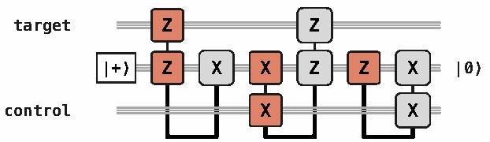

**图 2：** 任意 Pauli 控制 Pauli（Pauli-controlled-Pauli，PcP）门都可以使用三个测量层和一个辅助量子比特来分解，图中以 CNOT 门为例。第一次测量类似于将第一个量子比特复制到干净的辅助量子比特上，这为基于测量的集成路由操作提供了直观理解。图中 `target` 为目标量子比特，`control` 为控制量子比特；辅助量子比特从 $|+\rangle$ 开始、结束于 $|0\rangle$，$X$ 和 $Z$ 保留原 Pauli 标记。

### X. 算法组件与集成路由

我们利用布局计划（第 D.5 节）为编译器提供高层的策略性推理。布局计划建议算法量子比特到逻辑量子比特的优化映射，也可以选择强制将某个 spec 分解为指定的 def。每个算法组件都按为其专门编写的布局计划进行编译和优化，以减小目标架构上的测量层深度。然而，算法可能需要顺序执行布局不兼容的算法组件；事实上，大多数算法组件内部也包含连续但布局不兼容的子组件。如何高效连接它们，就是本节要解决的集成路由问题。

#### A. 为加法器安排路由

组件布局将组件的端口映射到一个或多个存储块中的量子比特。利用存储块内的纠缠型 Clifford 跟踪以及不同块之间的并行性，可以最小化执行组件所需的测量深度。要理解这一做法的效果，可考虑纠缠型 Clifford 操作（即 Pauli 控制 Pauli 门）的传统分解，见图 2。该协议需要三次测量和一个辅助量子比特来形成量子比特之间的连接。通过精心路由，我们避免了对算法中的每一个 CNOT 或 CZ 门都采用这种分解。图 3 给出一个加法器及其自然布局，展示我们的架构如何最好地支持简单的结构化 def。

两个量子寄存器相加是第三部分算术的核心。加法器的规格声明两个 $n$ 量子比特语义寄存器 $|x\rangle$ 和 $|y\rangle$，并将第一个模 $2^n$ 加到第二个中。不同 def 以不同资源权衡实现这一规格：Cuccaro 等人风格的脉动加法器 [29]、超前进位加法器 [66]、Gidney 临时 AND 加法器 [36]、无需辅助量子比特的 Takahashi 加法器 [30]、对数深度的 Remaud–Vandaele 加法器 [67]，以及它们之间的混合形式。受控加法器和常量操作数加法器也作为各自独立的系列存在，具有不同的语义 spec。

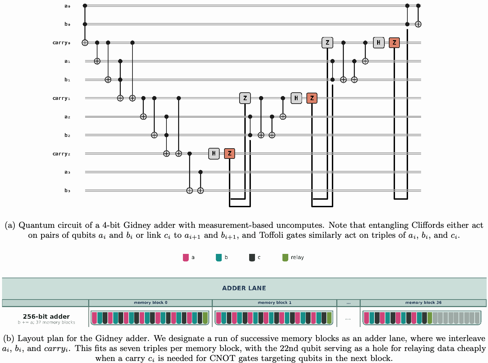

**图 3：Gidney 加法器的布局与电路。** (a) 带有基于测量的反计算的四位 Gidney 加法器量子电路。注意，纠缠型 Clifford 操作要么作用于量子比特对 $a_i,b_i$，要么将 $c_i$ 与 $a_{i+1},b_{i+1}$ 连接；Toffoli 门同样作用于三元组 $a_i,b_i,c_i$。(b) Gidney 加法器的布局计划。我们将一串连续存储块指定为加法器通道，交错排列 $a_i,b_i,\mathrm{carry}_i$。每个存储块可放入七个三元组，第 22 个量子比特留作空位，用于在需要进位 $c_i$ 控制以下一块量子比特为目标的 CNOT 门时，低成本地中继数据。图内标记：$a,b,c$ 分别沿用寄存器/进位记号，`carry` 为进位，`relay` 为中继；`ADDER LANE` 为加法器通道；`memory block 0/1/36` 分别为存储块 0/1/36；`256-bit adder` 为 256 位加法器；`b += a; 37 memory blocks` 表示 $b\mathrel{+}=a$，使用 37 个存储块。

为了简洁、便于采用路由技巧，并保持逻辑标架分析的一致性，我们使用 Gidney 风格的脉动进位加法器，甚至常量加法也如此（通常仅增加很少成本或没有额外成本，见图 4）。图 3b 展示了 Gidney 加法器的优化布局：将每个 $x_i,y_i,\mathrm{carry}_i$ 紧密排列在相邻量子比特上，使 CCZ 注入以及加法器脉动反计算阶段中对进位执行的基于测量的反计算（measurement-based uncomputation，MBU）所产生的经典控制 CZ 门都位于存储块内部，从而可以通过标架跟踪在软件中执行。同样，加法器中的几乎所有 CNOT 门也都落在单个存储块内，天然可以通过标架跟踪执行。余下的跨块 CNOT 门按如下方式通过集成路由处理：只要某个 $\mathrm{carry}_i$ 控制的 CNOT 门需要跨越存储块，我们就利用下一存储块的第 22 个量子比特，快速将 $\mathrm{carry}_i$ 向前复制。这次额外测量几乎没有损失，令人意外；我们将在下一节末尾进一步讨论。

#### B. 集成路由

虽然单个低层组件可以按自然方式映射到存储块，以尽量利用纠缠型 Clifford 跟踪，但要在不阻塞整个算法串行执行的前提下，满足连续组件各自的自然布局要求，并非易事。为应对这一挑战，我们开发了集成路由；具体而言，我们利用算术的串行脉动特征和架构层面的测量并行性，隐藏在存储块之间逻辑移动数据的成本。

基本数据移动操作有几种，每种都能分解为少量测量：

- **复制（Copy）：** 通过一次跨块 $ZZ$ 联合测量，创建一个量子比特的纠缠逻辑基副本。
- **扇出（Fanout）：** 用一层跨块 $XX$ 联合测量创建 Bell 对，再用一层 $ZZ$ 联合测量使它们与原量子比特纠缠，从而在多个块中创建该量子比特的多个副本，形成两层砖墙式测量结构。
- **MBU：** 基于测量的反计算通过在 $X$ 基中测量一个量子比特，并向该量子比特的源施加条件 $Z$ Pauli 纠正，来清除该量子比特。
- **移动（Move）：** 创建逻辑基副本，再对原量子比特进行 MBU，将逻辑基量子比特从一个块移到另一个块；参见文献 [68] 的图 12。
- **交换（Swap）：** 通过一个或多个临时量子比特，按顺序移动量子比特来交换两个量子比特。若采用本就位于局部的临时量子比特，交换可视为两次并行移动加上局部跟踪的 Clifford 交换。

首先，由于编译器能够通过经典记账，使条件 Pauli 穿过测量传播，移动中的 MBU 成本往往被隐藏，因此移动操作的成本通常仅为串行跨块测量层数。其次，由于每个块最多可以并行进行三次测量，在前一组件的脉动算术向低位收拢时，我们就能为下一组件重新配置存储块。第三，逻辑 CliNR（见第 XII.D.2 节）也在进行同样的脉动扫描，可同时用于纳入局部交换，并保证在空逻辑标架下低成本完成移动。第四，在组件之间的某些关键位置，逻辑 CliNR 会造成约 7.73 层的短暂停顿；这些成本已计入表 I，也为路由移动完成提供了额外时间。综合起来，集成路由使算法组件的层深度非常接近脉动算术本身的串行层深度，通常也就是 Toffoli 门及其相应脉动 MBU 的数量。

#### C. 近似模加法器的路由

这里给出模加法器的一个完整示例，展示如何利用集成路由逼近串行下界。我们使用与文献 [2] 类似的近似模加法器，计算 $|x,y\rangle\to|x,y+x\bmod p\rangle$；其 def 包含以下操作序列：

**算法 2：相位近似模加法器。**

| 行 | 操作 |
|---:|---|
| 1 | 用一个 256 位 Gidney 风格的带进位输出加法器计算 $\lvert x,y\rangle\to\lvert x,x+y\rangle$。 |
| 2 | 将 $x$ 的低 65 位卸载到加法器中部的工作量子比特中。 |
| 3 | 将进位输出量子比特扇出到低位区域的中继量子比特上，并用它控制伪梅森模纠正常量 $c$ 的受控装载。 |
| 4 | 对每个进位输出量子比特的块内局部副本进行 MBU，为 Gidney 加法器的块内局部中继量子比特腾出空间。 |
| 5 | 使用 65 位 Gidney 风格寄存器加法器，计算 $\lvert c,x+y\rangle\to\lvert c,x+y+c\bmod2^{65}\rangle$。 |
| 6 | 对 $c$ 的局部副本进行 MBU。 |
| 7 | 将 $x$ 的低位从紧密存放的中间区域送回。 |
| 8 | 在 $x$ 和 $y$ 的高 32 位上运行相位比较器，纠正全部 MBU 的相位。 |

这一序列的具体细节见图 4。加法器脉动算术的串行下界为：256 位加法器脉动深度的两倍，加上 65 位加法器脉动深度的两倍，再加上相位比较器的脉动深度。注意，相位比较器的一半与低宽度常量加法器的收尾脉动并行执行。因此，总下界约为 $510+128+31=669$，而我们的相位近似模加法器编译后的层深度为 674。逻辑 CliNR 的惩罚在 256 位加法器与低宽度常量加法器的衔接处增加约 7.73 层（如第 XII.D.2 节所述），造成的延迟足以完全隐藏五层的路由开销。这展示了集成路由的效果，也解释了为什么即使对常量加法器采用 Gidney 风格的寄存器算术，测量深度也几乎没有损失。在这一示例中，测量调度器也展示了其能力：即使需要在存储块之间中继数据，调度例程仍通过将每次中继与注入到后一块的第一次 CCZ 并行执行，达到上述深度。给定块中尚未到达的中继数据，会使我们暂时无法解释注入测量结果、施加通过跟踪执行的条件 CZ 门，以及注入下一 CCZ 门，但我们仍可释放工厂资源。因此，只有最后两个存储块之间的中继会增加加法器的串行深度。我们的调度器能够自动发现这一优化。

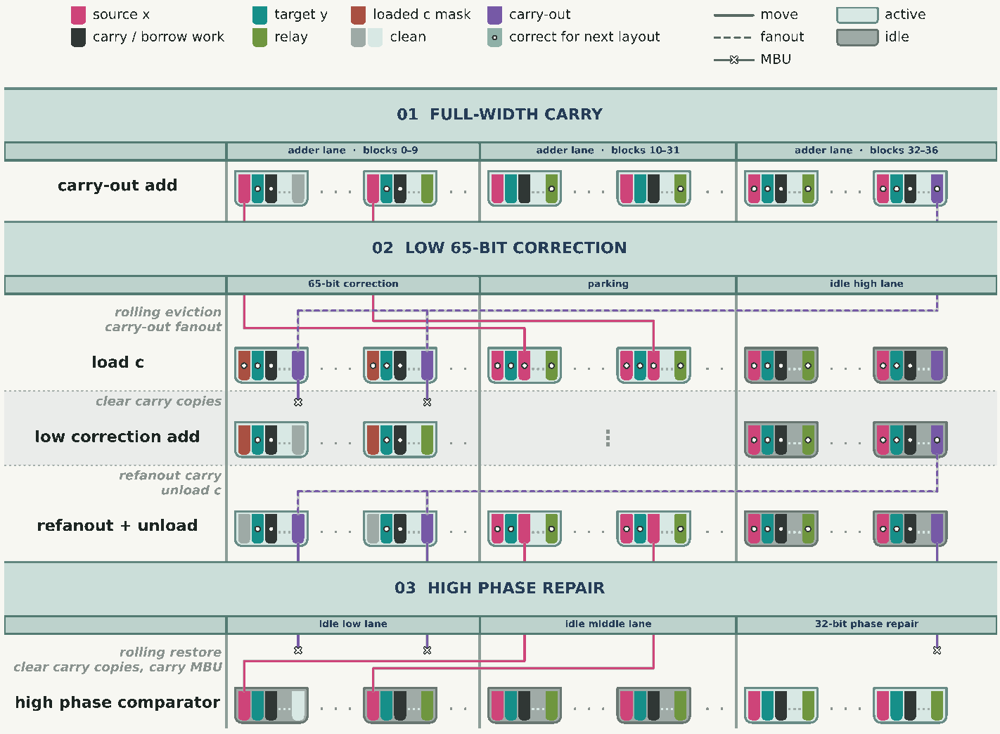

**图 4：** 算法 2 所述相位近似模加法器的路由。图内文字对应如下。

| 图内文字 | 中文 |
|---|---|
| source x；target y；loaded c mask | 源寄存器 $x$；目标寄存器 $y$；已装载的 $c$ 掩码 |
| carry / borrow work；relay；clean | 进位/借位工作量子比特；中继；干净量子比特 |
| carry-out；correct for next layout | 进位输出；已适配下一布局 |
| move；fanout；MBU | 移动；扇出；基于测量的反计算 |
| active；idle | 活动；闲置 |
| 01 FULL-WIDTH CARRY | 01 全宽进位 |
| adder lane · blocks 0–9 / 10–31 / 32–36 | 加法器通道：块 0–9 / 10–31 / 32–36 |
| carry-out add | 带进位输出加法 |
| 02 LOW 65-BIT CORRECTION | 02 低 65 位纠正 |
| 65-bit correction；parking；idle high lane | 65 位纠正；暂存；闲置的高位通道 |
| rolling eviction；carry-out fanout | 滚动移出；进位输出扇出 |
| load c；clear carry copies | 装载 $c$；清除进位副本 |
| low correction add | 低位纠正加法 |
| refanout carry；unload c | 再次扇出进位；卸载 $c$ |
| refanout + unload | 再次扇出并卸载 |
| 03 HIGH PHASE REPAIR | 03 高位相位修复 |
| idle low lane；idle middle lane；32-bit phase repair | 闲置的低位通道；闲置的中位通道；32 位相位修复 |
| rolling restore；clear carry copies, carry MBU | 滚动恢复；清除进位副本，并对进位进行 MBU |
| high phase comparator | 高位相位比较器 |

#### D. 算法组件的端到端集成路由

这里简要介绍表 I 中各算法组件内部的集成路由策略，相位近似模加法器除外。

**查表。** 查表由对索引位的深度优先遍历组成，使用临时量子比特辅助保存部分结果。将临时量子比特和最低索引量子比特放在同一块中，可以使所有遍历所需的 CNOT 门保持在块内。为使 CCZ 注入也如此，我们利用复制和 MBU 操作，循环地将相关索引量子比特的副本移入和移出该块。我们还利用扇出和 MBU，依次将每个控制位中继到各装载目标块中，从而将受控掩码装载 CNOT 门安排在块内。进一步地，按照文献 [68] 的拉链构造，将 $k=16$ 的查表拆分为两个并行的 $k=15$ 查表，并在每个目标块中使用索引位副本和第二个中继量子比特。

**近似模减法。** 其工作方式与模加法器类似，但在加法器前后执行模取补。模取补通过标架跟踪的 $X$ 门按位取反，再无条件执行低宽度常量加法 $2^{65}-c$ 来完成，其中 $c$ 为伪梅森模纠正常量。在每次常量纠正前后，我们同样利用加法器中部紧密存放并恢复 $x$ 的低 65 位。

**原位乘法。** 我们的原位乘法实现 [2, 52] 对 $u,v$ 寄存器的算术使用 Gidney 加法器 [36]，将它们放在加法器通道中，并在附近计算历史位。随着 $u,v$ 被约减，加法器通道缩小，释放出越来越多的量子比特，供我们逐步装入 $y$。我们利用专用计算区域，将每组六个局部历史量子比特压缩为五个 [2]，并将压缩后的历史量子比特紧密存入长期存储。$u,v$ 被约减并清除后，将 $y$ 寄存器余下部分从紧密存储中展开到加法器通道中，回放历史以执行原位乘法或除法，然后在沿 $u-v$ 序列逆向操作以反计算历史的同时，再次紧密存放 $y$。这是算法中最宽的部分：峰值时有 68 个活动存储块，再加一个块存放算法中 16 个闲置索引位。

**平方减法。** 我们的平方减法例程使用第 VII 节所述的单层 Karatsuba 拆分。该例程把寄存器 $y$ 各部分的平方累积到乘积寄存器中，然后将不同对齐方式的平方项加到真正的累加器 $x$ 上，再对每个平方作反计算。我们同样采用基于 Gidney 的算术：核心平方例程反复移位并执行条件取逆加法。每次计算 $y$ 的一个 128 位部分（或 $y$ 的高、低两半之和）的平方后，乘积寄存器已经移位近 128 次，几乎恰好对齐到表示移位值 $B\cdot\mathrm{product}$ 的位置。随后可以交换 $y$ 和 $x$，累加 $B\cdot\mathrm{product}$ 以及任意常量倍数 $c\cdot\mathrm{product}$；后者通过在不同偏移位置对 $\mathrm{product}$ 作移位加法或减法来实现。

**近似模取负。** 近似模取负几乎就是通常的近似模取补，但增加一个纠正步骤：我们使用一条结构类似加法器的脉动 Toffoli 链，检测边界情形 $x=p$ 并将 $p$ 替换为 0 [2]。虽然基本路由细节已由此前的组件涵盖，但这里要说明，采用这一例程，是为了避免通常用于完成一轮窗口化点加法的精确模算术。这样既保持了最大电路宽度，又使我们能够在整个电路中始终使用 Gidney 风格的寄存器加法。

**窗口化点加法的集成路由。** 我们为点加法例程的整个窗口组合集成路由；每个窗口的集成路由总惩罚几乎为**零**。我们分别编译每个主要算法组件并将成本相加，再保守地为每个窗口增加 20 层成本。此外，将算法组件跨越衔接处压缩所减少的层深度，将远大于集成路由可能引入的任何惩罚。我们的路由策略最好通过附录中的图 21 来直观描述。

值得说明的是，由于所有相位比较器都无条件执行，除 iQFT 实现（第 XII.E.4 节）之外，我们没有需要计入的条件执行测量。利用图 4 的策略，将每个相位比较器的前一半与其他脉动串行算术组件并行执行，可以达到与条件执行相同的平均成本。

### XI. 验证

要信任达到容错计算规模的电路定义与编译，是一个困难问题。我们将它拆成两部分来处理：首先证明顶层组件被分解成正确的树；其次证明调度器将该树转换为能在我们架构上执行的有效程序。

#### A. 树的层次化验证

综合在组件树上执行的唯一操作，是将某个 spec 替换为它的某个 def。这带来一个有力的认识：只要验证每一个 def 都实现其 spec，就能信任树执行的每个操作，进而信任最终树的正确性。为此，我们还利用另一个关键认识：许多组件可以在不引入叠加、纠缠等真正量子行为的情况下描述。具体而言，对于我们的电路，几乎每个组件都是可逆经典电路的量子实现，因此可以像文献 [64, 69] 那样进行经典仿真。

对每个 spec，我们指定一个契约（contract）：它是描述 spec 端口上语义作用的、可由机器检查的参考。辅助量子比特等实现细节不出现在契约中。这些契约采用定义在某个已声明定义域上的函数形式，分为复杂度逐步增加的三类：

1. **基契约（basis contract）：** spec 将计算基态映射为计算基态。可逆经典电路属于这一类，包括 CNOT 门和 Toffoli 门。这类契约几乎可以直接用经典方法验证。
2. **基加相位契约（basis-plus-phase contract）：** 基契约的二维变体。除了基态映射外，spec 还可以对任意给定基态施加一个相位函数。我们的电路中常见的例子是 MBU 及其对应的相位纠正组件。
3. **算符契约（operator contract）：** 用于产生叠加或纠缠的组件的完整算符。所有基于测量的协议最终都属于这一类，但依赖测量的小组件的整体作用几乎总落在前两类中。

对于每个 def，验证器展开其直接子组件，包括结构化控制流，并按执行顺序复合各子组件的契约。它将每个用于比较的输入以及实现所用的辅助量子比特映射到 def 的内部寄存器布局，求出子组件复合的作用，将结果投影回语义端口，并与 spec 契约比较。干净辅助量子比特必须恢复到 $|0\rangle$。对子组件的调用也必须满足各自声明的输入定义域。如果 spec 具有基契约，但某个 def 的子组件具有基加相位契约，验证便要证明相位函数相互抵消，从而约化为相位函数恒等的基契约。

对于 ECC 流水线中占主导地位的可逆算术，契约仅是关于基态值的函数。例如，加法器规格的契约是 $(x,y)\mapsto(x,x+y\bmod2^n)$。通过用简单的基契约表示所有基于测量的协议（例如移动、交换、复制等），并用基加相位契约表示 MBU 和 CCZ 注入，我们避免直接展开那些子组件具有算符契约的 def。我们独立认证每个小型测量原语执行的作用是否正确。

对于输入定义域较小的组件，验证例程进行穷举；对于定义域较大的组件（包括近似组件），则随机采样。例如，对一个两位加法器 def，验证器遍历全部 16 个 $(x,y)$ 基态输入，将 def 的临时寄存器初始化为 $|0\rangle$，求出子组件各自契约函数的复合，并要求输出为 $(x,x+y\bmod4)$，且临时寄存器返回 $|0\rangle$。相比之下，在应用的巨大规模下，我们随机采样输入态。`secp256k1` 域的近似模加法器（模数为 $p=2^{256}-2^{32}-977$）接受了 100,000 个可复现采样输入的检查。这类采样既为实现在全部约 $2^{512}$ 个输入对上的准确性提供有力证据，也确认了近似算术在实际规模下仍然有效。我们验证了所有组件的大规模和小规模版本。

#### B. 调度验证

我们结合不同检查和单元测试，证明调度准确保留了树的语义；在多个抽象层次上执行这些检查，并将结果连同编译数据一并记录。

1. 我们为流水线本身准备了多种测试，包括但不限于将针对三位和五位整数的 Shor 整数分解算法编译成可执行程序，并精确模拟所得程序。
2. 我们验证编译器的调度在物理上可实现，即满足架构所施加的约束集合，包括猫态资源束消耗和魔法态注入限制。
3. 我们用从算法推导的解析包络约束资源数值。例如，对于 Gidney 风格加法器，我们预计每个 Toffoli 对应两个测量层（附录 D）；准确地说，采用考虑存储块的分解后，为 $2n-1$ 层，其中 $n$ 为加法器位数。包络同时给出下限和上限，既确保遵守信息论界，也保证不会在不知情的情况下引入性能退化。
4. 我们确保路由正确应用，并避免对任何跨块纠缠型 Clifford 操作进行朴素分解。
5. 我们对调度进行组件层面的小规模模拟，确保最终程序保持电路语义。这包括以计算基态为输入模拟第 X 节所讨论的 256 位近似模加法器的 674 层调度，以及在缩小规模下，对输入叠加态进行计入相位的模拟。

每一项报告的数值都由可复现的流水线产生。一次运行在套件文件中声明，该文件固定所有输入：入口组件及其参数、架构、布局计划，以及要执行的验证检查。执行该声明会写出一个运行目录，其中存放编译结果、测量调度、上述检查的记录结果，以及已解析参数的清单；清单包括序列化后的架构、涉及的每个代码仓库的 git 提交，以及执行环境。运行通过对已声明输入求内容哈希来标识：相同代码上对同一声明的两次执行具有相同哈希，因此任何报告数值都可追溯到生成它的配置。由于测量调度与结果一并保存，可以在不重新编译的情况下重新检查所报告的深度。

## 第 V 部分：架构

### XII. 架构概览

#### A. secp256k1 设备

（原文印刷页码／PDF 页序：21–22）

我们考虑 secp256k1 设备：它基于 Walking Cat 架构的一个修改版本，专门针对求解一个 secp256k1 离散对数实例进行优化。由于本文开发的椭圆曲线点加法电路占据算法逻辑操作的绝大部分，我们按照这些电路的资源需求定制架构，而非按照量子傅里叶变换等其他阶段的需求。所得架构能够执行端到端的 secp256k1 离散对数实例，其资源总量汇总于表 II。

**表 II：使用 secp256k1 设备求解 secp256k1 的资源总量。**

| 指标 | 数值 |
|---|---:|
| 物理量子比特占用 | 19,397 |
| 每次尝试的运行时间 | 约 26 天 |
| 每次尝试的逻辑失败概率 | 约 26% |

该设备包含 69 个 Q102 存储块、24 对猫态资源束、12 个用于 LM2 测量的 Bell 态资源束、4 个逻辑 CliNR 块，以及 4 个魔法态工厂；每个魔法态工厂各有 2 个局部六量子比特 C6 Bell 态源。计入局部和全局重装载储备区后，这些组件合计占用 19,397 个物理量子比特，详见表 III。运行时间、逻辑失败概率和物理占用总量的细节与依据分别见第 E 2 节、第 E 3 节和第 E 1 节。

**表 III：secp256k1 设备的组件配置及物理量子比特占用。**

| 组件 | 数量 | 每个组件的量子比特数 | 该项配置的量子比特数 |
|---|---:|---:|---:|
| 存储块 | 69 | 207 | 14,283 |
| 猫态资源束对 | 24 | 120 | 2,880 |
| Bell 态资源束 | 12 | 　8 | 96 |
| 逻辑 CliNR 块 | 4 | 207 | 828 |
| 魔法态工厂 | 4 | 319 | 1,276 |
| 重装载储备区量子比特 | 34 | 1 | 34 |
| **物理量子比特占用** | | | **19,397** |

该架构使用下面汇总的三环 QEC 码支持其存储块和魔法态工厂块。Q102 码来自 Walking Cat 架构论文 [1]，Q66 是本文引入的一种新的广义自行车码，C6 是 Knill 的 $[[6,2,2]]$ 码 [70]。C6 可以表示为广义自行车码，因此属于三环码，也就与 Walking Cat 架构兼容。

**表 IV：secp256k1 设备使用的三环 QEC 码。Q102 和 Q66 的逻辑错误率按每个 SEC 计，C6 则按每个被接受的编码 $|H\rangle^{\otimes2}$ 态对计。逻辑错误率是在物理错误率 $p=10^{-4}$ 的移动量子比特模型下估计的，包含输运噪声、泄漏和丢失。**

| 码 | 参数 | SEC 深度（POC） | 逻辑错误率 |
|---|---|---:|---:|
| Q102 | $[[102,22,9]]$ | 27.0 | $9.34\times10^{-12}$ |
| Q66 | $[[66,4,10]]$ | 17.0 | $2.63\times10^{-11}$ |
| C6 | $[[6,2,2]]$ | 5.4 | $1.30\times10^{-8}$ |

secp256k1 设备围绕椭圆曲线点加法电路的资源需求对 Walking Cat 架构进行专门化。具体而言，我们优先减小物理占用，同时保留足够的测量与魔法态吞吐量，以免引入新的运行时间瓶颈。这种专门化建立在对基准架构的四项修改之上。

首先，我们引入 CLAW 指令集架构，它扩展了 Walking Cat 架构的指令集 [1]，用于解决椭圆曲线点加法电路的瓶颈，详见第 XII D 节。通过研究编译后的逻辑测量，我们发现，即使一个块内的每个 Clifford 门都采用虚拟跟踪，每项测量在 Q102 码中也都有可访问的物理代表元。因此，在最终的逻辑测量计数中，Clifford 门占比不到 10%。由于剩余测量的大部分来自 Toffoli 门，我们通过一种新的并行逻辑测量操作、一种空闲标架清除方案，以及深度为一的 CCZ 门来优化其执行。

我们在第 XII E 节引入轻量的 Eastinthillation 工厂，用于支持深度为一的 CCZ 门。

随后，我们针对椭圆曲线点加法电路有限的全局逻辑测量并行度调整猫态分发方式。设备按第 XII C 节所述，在全设备范围内移动逻辑测量所需的猫态，而不再为每个码块永久配置两套猫态及验证辅助量子比特。

最后，在第 XII B 节，我们用交换丢失模型替换基准架构的量子比特丢失模型 [1]；在该模型中，一次相互作用可以移动丢失，但不能使其扩散。该模型放宽了与量子比特丢失有关的硬件要求：实现 secp256k1 设备时，既不必保证哪一个输出保留存活的量子比特，也不必保证与缺失量子比特进行的交互尝试会弹出其搭档或使其失效。阻止一次丢失发生分支，还允许采用比文献 [1] 中信标协议开销更低的丢失检测协议。对于具有 $n$ 个数据量子比特的码块，这些新协议将物理量子比特数从信标协议下的 $3n$ 降至 $2n$，从而减小设备中每个存储块和工厂块的占用。

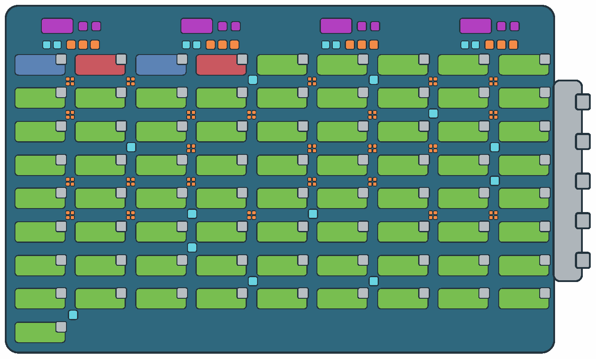

**图 5：完整规模的 secp256k1 设备。** 紫色块是生成 CCZ 态所需的魔法态工厂，绿色块是存储块，橙色块是猫态工厂，蓝色块是用于 LM2 测量的 Bell 态资源束。每组四个橙色块构成一对可移动的猫态资源束。每个魔法态工厂组内的两个青色位置是局部六量子比特 C6 Bell 态源。钴蓝色和绯红色块留给两个用于 Clifford 标架清除的逻辑 CliNR 实例。附接于各码块的小灰框是其局部离子储备区，而完整的装载储备区沿设备右边缘布置。

#### B. 交换丢失模型

（原文印刷页码／PDF 页序：22–25）

我们将 Walking Cat 架构 [1] 的移动量子比特噪声模型中的丢失传播规则替换为交换丢失（swap-loss）模型。在该模型中，当一个双量子比特门涉及恰好一个丢失量子比特时，它可以交换丢失与存活量子比特的位置，但不能使丢失扩散。由于量子比特丢失不再扩散，单次量子比特丢失事件所造成的丢失量子比特数量不再随电路深度指数增长。因此，无须在每个调度层之后用信标协议检查丢失；我们转而引入一种修改后的泄漏检测单元（leakage-detection unit，LDU），在交换丢失模型下同时检测泄漏和丢失。新的丢失传播规则见第 XII B 1 节；第 XII B 2 节给出 LDU 及相应的 SEC 流程；第 XII B 3 节报告 Q102 和 Q66 码块在该模型下的存储性能。

##### 1. 交换丢失模型

Walking Cat 架构 [1] 的移动量子比特噪声模型在电路级 Pauli 噪声之外，还加入独立的量子比特丢失与泄漏过程。记两者每个物理操作周期（physical operation cycle，POC）的发生率分别为 $p_{\mathrm{loss}}$ 和 $p_{\mathrm{leak}}$。在一个深度为 $\Delta$ 个 POC 的并行轮次之后，每个未丢失量子比特以概率 $\min\{1,\Delta p_{\mathrm{loss}}\}$ 被标记为丢失；在余下的量子比特中，每个位于计算子空间的量子比特以概率 $\min\{1,\Delta p_{\mathrm{leak}}\}$ 被标记为泄漏。我们保留 Walking Cat 的泄漏规则：涉及泄漏量子比特的单量子比特门或双量子比特门由恒等操作替代，但仍施加其关联的物理噪声；后续丢失会把该量子比特的状态从泄漏改为丢失。

在原有的移动量子比特噪声模型中，任何涉及丢失量子比特的非测量操作都会被替换为恒等操作，而任何涉及丢失量子比特的双量子比特门都会将丢失传播到参与该门的另一个量子比特。因此，如果每个丢失量子比特都参与一个双量子比特门，则丢失量子比特数可在相邻两个双量子比特门层之间翻倍。

交换丢失模型只改变这一丢失传播规则。设一个双量子比特门作用于位置 $i$ 和 $j$，其中恰好一个被标记为丢失。原定的双量子比特门由恒等操作替代。不过，两个位置的内容，包括其所跟踪的丢失与泄漏状态以及 tableau 条目，以概率 $p_{\mathrm{swap}}$ 交换；以概率 $1-p_{\mathrm{swap}}$ 保持不变。不失一般性，我们在模拟中取 $p_{\mathrm{swap}}=0.5$；采用抗交换 LDU 的存储性能敏感性分析表明，逻辑错误率对 $p_{\mathrm{swap}}$ 的精确取值不敏感，如图 22 所示。

在模拟中，该更新通过交换丢失和泄漏状态标志，并对底层 tableau 状态的对应条目施加 SWAP 门来实现。

原始 Walking Cat 架构的丢失传播规则描述的是一个有离子势阱与一个空势阱之间的 QCCD 合并／分裂操作；它可能使存活离子强烈升温，最终将其弹出。交换丢失模型则假设势阱足够深，能够留住受热的离子。

##### 2. 抗交换丢失检测与综合征提取

我们的目标是构造一个电路：即使丢失可以在数据线与辅助线上交换，也能以接近一的概率检测数据量子比特的丢失或泄漏。在没有丢失或泄漏的情况下，电路应保持被检测数据量子比特的状态。

Walking Cat 架构 [1] 中基于传态的泄漏检测单元（LDU）假设，数据和辅助量子比特被交换／传态到确定的位置。文献 [71] 中基于 SWAP 和基于传态的综合征提取方案也作出同样的假设。然而，在交换丢失模型下，丢失可以移到未被测量的位置，而存活的量子比特移到被测量的位置，从而可能漏检丢失。

因此，我们修改 Preskill 的泄漏检测电路 [72]。原始 LDU 的问题如下：如果丢失在两个纠缠门处都与存活的辅助量子比特交换，该量子比特就会以 $|1\rangle$ 态返回原位，而这一状态通常表示健康结果，因而产生假阴性。当 $p_{\mathrm{swap}}=1/2$ 时，这条两次交换轨迹的概率为 $p_{\mathrm{swap}}^2=1/4$，大到不可忽略。

图 6 所示的抗交换 LDU 在两个纠缠门之间增加一个 $X_A$ 门。辅助量子比特的计算态结果为 0 时接受数据量子比特；结果为 1、“丢失”或“泄漏”时则触发恢复。全文中我们都假设，增强读出能完美区分计算态、泄漏态和丢失态。

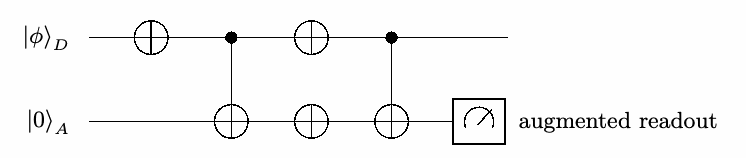

**图 6：用于数据量子比特 $D$ 及与其对齐的辅助量子比特 $A$ 的抗交换 LDU。** 最终测量增加了丢失和泄漏读出。图内 “augmented readout” 表示“增强读出”；输入为 $|\phi\rangle_D$ 和 $|0\rangle_A$。

**命题 1。** 在该构件内部没有额外故障时，对于所有可能的丢失交换模式，抗交换 LDU 都保持并接受每个计算态输入，并标记每个泄漏或丢失输入。

**证明。** 对于 $|\phi\rangle=\alpha|0\rangle+\beta|1\rangle$，电路的作用为

$$
\begin{aligned}
|\phi,0\rangle
&\xrightarrow{X_D}\alpha|1,0\rangle+\beta|0,0\rangle\\
&\xrightarrow{\mathrm{CNOT}_{D\to A}}\alpha|1,1\rangle+\beta|0,0\rangle\\
&\xrightarrow{X_DX_A}\alpha|0,0\rangle+\beta|1,1\rangle\\
&\xrightarrow{\mathrm{CNOT}_{D\to A}}|\phi,0\rangle,
\end{aligned}
$$

其中每个有序 ket 中 $D$ 都列在 $A$ 前面。特别地，数据态保持不变，而辅助量子比特结果为 0。

分别用 $\ell$ 和 $\varnothing$ 表示泄漏与丢失状态。若输入数据量子比特发生泄漏，所有涉及 $D$ 的门都会被抑制，仅留下

$$
(\ell,0)_{DA}\xrightarrow{X_A}(\ell,1)_{DA}.
$$

相同论证表明，当输入发生丢失且没有交换时，辅助量子比特结果也为 1。恰好发生一次交换时，存活的辅助量子比特会在 $D$ 线上替代丢失的数据量子比特，而丢失移至 $A$，因此增强读出总会报告“丢失”。

在发生两次交换的情况下，每个纠缠门都被抑制，且其丢失交换事件会交换两个位置。当丢失占据 $A$ 时，中间的 $X_A$ 被抑制，而 $X_D$ 翻转存活的量子比特：

$$
(\varnothing,0)_{DA}\xrightarrow{\mathrm{swap}_1}(0,\varnothing)_{DA}
\xrightarrow{X_D}(1,\varnothing)_{DA}
\xrightarrow{\mathrm{swap}_2}(\varnothing,1)_{DA}.
$$

因此，存活的量子比特以状态 1 返回辅助量子比特位置。于是，该构件标记每一种非计算态输入，结果汇总于表 V。$\square$

**表 V：理想抗交换 LDU 的结果，不计构件内部的额外故障。**

| $D$ 的输入状态 | 交换事件数 | 辅助量子比特读出 |
|---|---:|---|
| 计算态 | 0 | 0 |
| 泄漏 | — | 1 |
| 丢失 | 0 | 1 |
| 丢失 | 1 | “丢失” |
| 丢失 | 2 | 1 |

该构件的标称深度为三个 POC：两个纠缠门层和一个增强测量／复位层。单量子比特 $X$ 操作通过物理 Pauli 标架跟踪以虚拟方式实现，因此不计入 POC 深度。被标记的泄漏需要额外一个 POC 来执行泄漏复位；被标记的丢失还需要来自局部储备区的新离子。不过，这些事件很少发生，其发生率约为 $p_{\mathrm{leak}}\cdot n\cdot2$ 或 $p_{\mathrm{loss}}\cdot n\cdot2$，因此不会显著影响构件的标称深度。

我们修改文献 [1] 的 SEC 电路，以抗交换 LDU 替换信标协议和基于传态的 LDU，详见算法 3。

**算法 3：仅使用丢失和泄漏检测构件的综合征提取。**

**数据：** 数据寄存器 $D$、辅助寄存器 $A$，以及针对 $a=2$ 的三环码的一个有效最大并行调度

$$
\Sigma=\bigl((T_X^{(1)},T_Z^{(1)}),\ldots,
(T_X^{(w_{\mathrm{check}})},T_Z^{(w_{\mathrm{check}})})\bigr).
$$

| 行号 | 操作 |
|---:|---|
| 1 | 将辅助量子比特制备为 $\lvert0\rangle$。 |
| 2 | 在每个数据量子比特及与其对齐的辅助量子比特之间，并行施加图 6 的丢失和泄漏检测构件。 |
| 3 | 使用增强丢失／泄漏读出测量该构件的辅助量子比特。 |
| 4 | 令 $K_1$ 为构件辅助量子比特返回计算态结果 1 的指标集合。 |
| 5 | **对每个** $i\in K_1$ **执行：** |
| 6 | 　检查数据量子比特 $D_i$，判断其是否泄漏或丢失。 |
| 7 | 　**若** $D_i$ 丢失，**则：** |
| 8 | 　　用一个重新装载的量子比特替换 $D_i$。 |
| 9 | 　将 $D_i$ 复位为最大混合态 $I/2$。 |
| 10 | 令 $K_{\mathrm{lost}}$ 为构件辅助量子比特的读出报告“丢失”的指标集合。 |
| 11 | **对每个** $i\in K_{\mathrm{lost}}$ **执行：** |
| 12 | 　检查数据量子比特 $D_i$ 是否丢失。 |
| 13 | 　重新装载 $\{A_i,D_i\}$ 中每个丢失的量子比特。 |
| 14 | 　将 $D_i$ 复位为最大混合态 $I/2$。 |
| 15 | 将所有辅助量子比特制备为 $\lvert+\rangle$。 |
| 16 | 在软件中重新标记辅助量子比特，使初始对齐方式与 $\Sigma$ 中的第一对调度项相符。 |
| 17 | 对 $(T_X^{(1)},T_Z^{(1)})$ 施加调度好的并行门：从每个已对齐的 $X$ 校验辅助量子比特到其数据量子比特施加 CNOT 门，在每个已对齐的 $Z$ 校验辅助量子比特与其数据量子比特之间施加 CZ 门。 |
| 18 | **对每个** $\tau\in\{2,\ldots,w_{\mathrm{check}}\}$ **执行：** |
| 19 | 　根据第 $\tau-1$ 轮与第 $\tau$ 轮之间的族变更计算公共长环位移 $r$，并根据 $T_X^{(\tau-1)}$ 与 $T_X^{(\tau)}$ 计算 $(s_X,t_X)$，根据 $T_Z^{(\tau-1)}$ 与 $T_Z^{(\tau)}$ 计算 $(s_Z,t_Z)$。 |
| 20 | 　执行输运步骤：对所有辅助量子比特进行位移为 $r$ 的长环循环，同时在 $A_X$ 上执行中环／短环位移 $(s_X,t_X)$，在 $A_Z$ 上执行中环／短环位移 $(s_Z,t_Z)$。 |
| 21 | 　对 $(T_X^{(\tau)},T_Z^{(\tau)})$ 施加调度好的并行门：从每个已对齐的 $X$ 校验辅助量子比特到其数据量子比特施加 CNOT 门，在每个已对齐的 $Z$ 校验辅助量子比特与其数据量子比特之间施加 CZ 门。 |
| 22 | 使用增强丢失／泄漏读出，在 $X$ 基中测量所有辅助量子比特。 |
| 23 | 在下一轮综合征提取前，对最终读出报告“泄漏”或“丢失”的任何辅助量子比特进行复位。 |

##### 3. 码块的存储性能

我们模拟交换丢失模型，并在每个 SEC 后附加抗交换 LDU。LDU 增加三个 POC 的深度。模拟 LDU 时，使用与移动量子比特模型相同的 Pauli 门噪声，并对空闲量子比特加入相应的空闲噪声、泄漏和丢失信道。除非另有说明，我们取

$$
p_{\mathrm{loss}}=p/1000,\qquad p_{\mathrm{leak}}=p/10,\qquad p_{\mathrm{swap}}=0.5.
\tag{1}
$$

关于这些参数的物理依据，见文献 [1]。

存储模拟采用的广义自行车码实例和 SEC 调度列于表 VI。

**表 VI：存储模拟所用的广义自行车码实例及综合征提取调度。符号 $A_i$ 和 $B_i$ 分别按所列次序标记 $a(x)$ 和 $b(x)$ 的单项式；上标 $\mathrm T$ 表示转置相互作用。**

| 名称 | 码的规格 | 调度置换 $\Sigma$ |
|---|---|---|
| Q102 | $[[102,22,9]]$，$(l,m)=(51,1)$；$a(x)=x^{22}+x^{26}+x^{37}+x^{50}$；$b(x)=x^{19}+x^{28}+x^{29}+x^{35}$ | $\bigl((A_1,A_2^{\mathrm T}),(B_1,B_4^{\mathrm T}),(B_2,B_3^{\mathrm T}),(A_3,A_4^{\mathrm T}),(A_4,A_3^{\mathrm T}),(B_3,B_2^{\mathrm T}),(B_4,B_1^{\mathrm T}),(A_2,A_1^{\mathrm T})\bigr)$ |
| Q66 | $[[66,4,10]]$，$(l,m)=(33,1)$；$a(x)=1+x+x^3+x^{10}$；$b(x)=1+x+x^8$ | $\bigl((B_2,B_1^{\mathrm T}),(A_2,A_1^{\mathrm T}),(A_3,A_4^{\mathrm T}),(B_3,B_3^{\mathrm T}),(A_4,A_3^{\mathrm T}),(A_1,A_2^{\mathrm T}),(B_1,B_2^{\mathrm T})\bigr)$ |

我们在假定的物理噪声率 $p=10^{-4}$ 下，评估主要码块 Q102 和 Q66 在交换丢失模型中的性能。在该噪声率下直接模拟所需的样本次数大得难以承受，因此我们使用三参数拟合形式 $p_{\log}(p)=p^5\exp(a+bp+cp^2)$，将 $p\in\{5\times10^{-4},8\times10^{-4},10^{-3},2\times10^{-3}\}$ 的交换丢失数据，以及 $p\in\{10^{-3},2\times10^{-3},3\times10^{-3}\}$ 的仅 Pauli 噪声基准数据进行外推。

我们使用 Stim [73] 模拟仅有 Pauli 噪声的模型，使用原 Walking Cat 架构论文 [1] 所述的专用模拟器模拟加入丢失和泄漏的模型。对两组数据，我们都使用束搜索译码器 [74] 译码：束宽为 32，最多 10 个搜索轮次，初始迭代 40 次，此后每轮迭代 30 次。对于 Q102，拟合形式为

$$
p_{\log}(p)=p^5\exp\!\left(20.4344+2262.86p-5.13283\times10^5p^2\right),
$$

它给出在 $p=10^{-4}$ 时每个 SEC 的逻辑错误率为 $9.34\times10^{-12}$，如图 7 所示。

对于 Q66，交换丢失模型的拟合形式为

$$
p_{\log}(p)=p^5\exp\!\left(21.6356+574.572p-9.79513\times10^4p^2\right).
$$

它给出在 $p=10^{-4}$ 时每个 SEC 的逻辑错误率为 $2.63\times10^{-11}$；相应的仅 Pauli 噪声模型外推错误率为每个 SEC $2.47\times10^{-12}$。采样数据和两种拟合均见图 7。

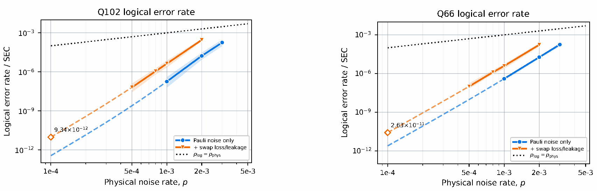

**图 7：$[[102,22,9]]$ Q102 码（左）和 $[[66,4,10]]$ Q66 码在交换丢失模型下的存储性能。** 对每种码，将仅有 Pauli 噪声的基准与相应的交换丢失模型比较，其中 $p_{\mathrm{leak}}=p/10$、$p_{\mathrm{loss}}=p/1000$、$p_{\mathrm{swap}}=0.5$。虚线使用三参数五阶拟合形式 $p_{\log}(p)=p^5\exp(a+bp+cp^2)$ 将各组数据外推至 $p=10^{-4}$。两幅图标题分别为“Q102 逻辑错误率”和“Q66 逻辑错误率”。图内横轴为“物理噪声率 $p$”，纵轴为“逻辑错误率／SEC”；图例分别为“仅 Pauli 噪声”“再加交换丢失／泄漏”及 $p_{\log}=p_{\mathrm{phys}}$。外推点标注分别为 $9.34\times10^{-12}$ 和 $2.63\times10^{-11}$。

#### C. 采用并行布局的可复用猫态工厂

（原文印刷页码／PDF 页序：24–28）

我们修改猫态工厂的布局，以支持深度为一的 CCZ 注入所需的三个并行测量。所得布局以比默认 Walking Cat 架构所需更少的物理量子比特提供这种并行度。

##### 1. 用于并行测量的沿边紧排猫态工厂

第 XII D 节所述 CCZ 门的深度为一注入需要三个并行逻辑测量。最简单的实现布局是在每个码块旁放置三个猫态工厂，但这样会放宽 Walking Cat 架构关于每个猫态工厂与关联码块距离固定的假设。较长的输运距离可能要求增加在途猫态副本，才能在不增加门延迟的条件下流水执行逻辑测量。因此，我们沿码块边缘布置工厂，并根据所得输运几何结构确定需要的猫态副本数。

在 Walking Cat 架构中，测量过的猫态量子比特通过一个遍及全设备的外环循环返回工厂，以复用其载体 [1]。我们引入一种使输运距离最小化的新环路设计：每个码块及其被分配的工厂共用一个局限于自身区域的局部环路。

令 $w_{\mathrm{cat}}\in\mathbb N$ 表示猫态的权重，即组成猫态的物理量子比特数。我们把用于保存一个权重为 $w_{\mathrm{cat}}$ 的猫态的一组可复用的 $w_{\mathrm{cat}}$ 个量子比特称为猫态寄存器。寄存器依次循环经历猫态制备、配送、测量和返回。验证辅助量子比特是工厂资源，不属于该寄存器。

考虑一个同时执行 $k$ 项逻辑测量的 $n$ 量子比特码块。我们用 $j\in\{1,\ldots,k\}$ 标记测量，并为测量 $j$ 分配工厂 $\mathcal F_j$。每个工厂以每个综合征提取周期（SEC）一个态的节奏供应权重为 $w_{\mathrm{cat}}$ 的猫态；一个 SEC 的时长为 $T_{\mathrm{SEC}}(n)$ 个 POC。令 $r$ 为每项并行逻辑测量预留的权重为 $w_{\mathrm{cat}}$ 的猫态寄存器数，$m$ 为验证轮数，并令 $\eta=\tau_{\mathrm{tr}}/\tau_{\mathrm{POC}}$ 表示以 POC 为单位的一步输运时长。

对于偶数 $w_{\mathrm{cat}}$，文献 [1] 的 Walking Cat 协议制备并验证一个猫态需要

$$
\begin{aligned}
T_{\mathrm{prep}}(w_{\mathrm{cat}},m)
={}&\underbrace{\lceil\log_2w_{\mathrm{cat}}\rceil+3m+3}_{\text{制备与验证}}\\
&+\underbrace{\eta\left(\frac{w_{\mathrm{cat}}}{2}+m-1\right)}_{\text{工厂内部输运}}
\end{aligned}
\tag{2}
$$

个 POC。

我们沿码块长边紧排工厂，如图 8 所示。在布置时，为权重为 $w_{\mathrm{cat}}$ 的工厂分配宽度为 $w_{\mathrm{cat}}$ 个载体位置的空间。因此，一条长边能够容纳

$$
s(n,w_{\mathrm{cat}})=\left\lfloor\frac{n}{w_{\mathrm{cat}}}\right\rfloor
\tag{3}
$$

个工厂。我们沿上边缘依次布置工厂 $\mathcal F_1,\ldots,\mathcal F_{\min\{k,s\}}$；当 $k>s$ 时，从 $\mathcal F_{s+1}$ 开始继续沿下边缘布置。只要 $k\leq2s(n,w_{\mathrm{cat}})$，两条长边就足够，而无须占用码块两侧的任何短边。文献 [1] 中的存储组件和猫态工厂组件各跨越四行物理量子比特。因此，在当前输运模型的粒度下，一个 $n$ 量子比特码块占据一个 $4\times n$ 的矩形，其紧邻外环的长度为

$$
P_{\mathrm{loop}}(n)=2n+8
\tag{4}
$$

个输运步骤。

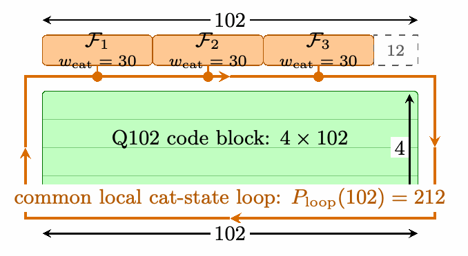

**图 8：Q102 的局部猫态循环。** 三个权重为 30 的工厂占据上边缘 102 个位置中的 90 个，剩余 12 个位置空置；不需要使用下边缘。一般而言，工厂首先沿上边缘紧排，直至达到式 (3) 的容量，然后继续沿下边缘布置。注意，每个工厂的循环距离都相同，均为 $2n+8$。图内标记为：$\mathcal F_1,\mathcal F_2,\mathcal F_3$ 的 $w_{\mathrm{cat}}=30$；“Q102 码块：$4\times102$”；“共用局部猫态环路：$P_{\mathrm{loop}}(102)=212$”。

这种路由策略也能容纳支撑在数据量子比特之间交错分布的代表元，因为各个猫态内部可互换的量子比特能够按支撑顺序暂存。现在我们确定维持该配送调度所需的寄存器数。

**命题 2。** 假设在 $T_{\mathrm{prep}}(w_{\mathrm{cat}},m)$ 个 POC 后能够获得成功制备的猫态，且局部环路能够无争用地输运全部 $k$ 项并行逻辑测量所需的猫态。再假设并行测量的物理代表元具有两两不相交的支撑。从当前轮次的猫态被消耗的时刻开始计时。假设直到一个 SEC 之后的下一次基于猫态的测量才需要下一个猫态，而且寄存器的返回、制备与验证，以及尝试再次配送，都可以与中间的 SEC 同时进行。要维持每个 SEC 一个权重为 $w_{\mathrm{cat}}$ 的猫态，每项测量所需的最小寄存器数为

$$
r=\left\lceil\frac{T_{\mathrm{prep}}(w_{\mathrm{cat}},m)+\eta P_{\mathrm{loop}}(n)}{T_{\mathrm{SEC}}(n)}\right\rceil.
\tag{5}
$$

**证明。** 设寄存器 $A$ 提供当前测量轮次的猫态。从该态被消耗开始，该寄存器在周转时间

$$
T_{\mathrm{prep}}(w_{\mathrm{cat}},m)+\eta P_{\mathrm{loop}}(n)
$$

内不可用；在此期间，它绕局部环路返回原来的猫态工厂，经历制备和验证，然后沿环路前往下一次测量位置。返回与下次配送的总长度为 $P_{\mathrm{loop}}(n)$。令

$$
q=\left\lceil\frac{T_{\mathrm{prep}}(w_{\mathrm{cat}},m)+\eta P_{\mathrm{loop}}(n)}{T_{\mathrm{SEC}}(n)}\right\rceil.
$$

在这段周转时间内，另外 $q-1$ 个寄存器供应时刻 $T_{\mathrm{SEC}}(n),\ldots,(q-1)T_{\mathrm{SEC}}(n)$ 的中间需求，而寄存器 $A$ 返回以满足时刻 $qT_{\mathrm{SEC}}(n)$ 的需求。因此 $r=q$ 个寄存器足够。例如，当 $q=2$ 时，寄存器 $B$ 在 $A$ 之后一个 SEC 被消耗，$A$ 则在两个 SEC 之后再次被消耗。若寄存器更少，$A$ 就会在就绪前被再次使用。$\square$

如果

$$
T_{\mathrm{prep}}(w_{\mathrm{cat}},m)+\eta(2n+8)\leq T_{\mathrm{SEC}}(n),
\tag{6}
$$

则每个工厂只需一个寄存器。在此条件下，命题 2 对每项测量都给出 $r=1$，总计需要 $k$ 个猫态寄存器。

组件占用中采用的 Q102 和 Q66 的具体寄存器数在第 E 1 节计算。

##### 2. 复用猫态

椭圆曲线电路的全局逻辑测量并行度有限，因此在默认 Walking Cat 架构按码块分配猫态的策略下，许多猫态资源会长时间空闲。这促使我们只配置足以满足电路峰值测量并行度的猫态，随后按需在整个设备中输运并复用。复用的基本单位，是围绕局部环路流水执行一次逻辑测量所需的完整资源集：$r$ 个权重为 $w_{\mathrm{cat}}$ 的猫态寄存器，其中 $r$ 由命题 2 给出，外加一组 $w_{\mathrm{cat}}$ 个验证辅助量子比特，用于连续的猫态制备。我们称之为猫态资源束（cat-state bundle）。

对于全局路由分析，我们将 $k$ 项并行逻辑测量中每项测量的目标排列成一个有序流。每个流由一组可复用的猫态资源束提供服务，这些资源束可以在码块之间移动。我们要确定，每个流需要多少资源束才能避免延迟逻辑测量。

如命题 2 所述，每个资源束内部的寄存器使一个猫态能在另一个被消耗时进行制备和验证；辅助量子比特组与寄存器一同移动，因此资源束能在任意存储块旁工作。抵达目标码块后，资源束停靠于该目标块边缘的一个猫态工厂，并执行第 XII C 1 节的制备与验证程序。在整个逻辑测量期间，始终有至少一个资源束留在活动块旁，但启动协议和完成协议的可以是不同的资源束。分配给各测量流的资源束遵循交接调度；图 9 展示了两个资源束的情形。先行资源束在当前目标处开始测量，同时跟随资源束前往同一个块，并在那里制备和验证。跟随资源束随后接管正在进行的测量，使先行资源束得以释放并前往下一个目标。重复这种交接，便能使资源束沿逻辑测量的有序流不断前进。

考虑 $M$ 个存储块紧排在一个 $R$ 行 $C$ 列的矩形中，其中 $M\leq RC$，若有未使用的位置则留空。与前文一样，每个块占据一个 $4\times n$ 的矩形。相邻两行码块之间额外留出一行水平路由行。因此，两个存储块的对应端口之间的最大曼哈顿距离为

$$
D_{\max}(R,C,n)=n(C-1)+5(R-1)
\tag{7}
$$

个输运步骤。令 $T_{\mathrm{LM}}$ 为工作负载中最短逻辑测量的时长，单位为 POC。

**命题 3。** 令 $L=\eta D_{\max}(R,C,n)+T_{\mathrm{prep}}(w_{\mathrm{cat}},m)$，并假设 $L\leq T_{\mathrm{LM}}$。再假设在第 XII D 2 节为空闲标架清除调度引入的衔尾蛇码块布局下，为同时进行的逻辑测量服务的输运路线互不交叉。对于最多同时进行 $k$ 项逻辑测量的计算，使用至多

$$
\begin{aligned}
&N_{\mathrm{bundle}}(k,R,C,n,w_{\mathrm{cat}},m)\\
&\quad=k\left(1+\left\lceil
\frac{2[\eta D_{\max}(R,C,n)+T_{\mathrm{prep}}(w_{\mathrm{cat}},m)]}{T_{\mathrm{LM}}}
\right\rceil\right)
\end{aligned}
\tag{8}
$$

个资源束，交接调度便能够执行任意测量位置序列，而没有输运延迟。特别地，只要

$$
2[\eta D_{\max}(R,C,n)+T_{\mathrm{prep}}(w_{\mathrm{cat}},m)]\leq T_{\mathrm{LM}},
\tag{9}
$$

每个测量流两个资源束就足够。

**证明。** 将资源束分配给 $k$ 个独立的测量流。每个流使用一个跟随资源束和 $p=\lceil2L/T_{\mathrm{LM}}\rceil$ 个先行资源束。逻辑测量开始时，下一个先行资源束已经在目标块处准备完毕，并启动测量。跟随资源束在前一次逻辑测量结束时被释放，前往同一目标，并在至多 $L$ 个 POC 内完成制备和验证。由于 $L\leq T_{\mathrm{LM}}$，它可以在当前测量结束前接管。

这次交接在测量开始后至多 $L$ 个 POC 释放活动的先行资源束。该资源束将在后面第 $p$ 项测量时再次被需要，因此它至少有 $pT_{\mathrm{LM}}-L\geq L$ 个 POC 前往下一个分配给它的目标并完成制备。于是，它会在该次测量开始前就绪。重复交接就能得到每条通道使用 $p+1$ 个资源束的无延迟流水线，从而得到式 (8)。当 $2L\leq T_{\mathrm{LM}}$ 时，$p=1$：先行资源束启动每个目标处的测量，跟随资源束接管，而被释放的先行资源束再次前进。$\square$

secp256k1 设备将其 69 个 Q102 存储块和 4 个 Q102 逻辑 CliNR 块紧排在一个九行九列网格中，如图 5 所示。因此，

$$
D_{\max}(9,9,102)=102(9-1)+5(9-1)=856
\tag{10}
$$

个输运步骤；在 $\eta=1/20$ 时，即为 $\eta D_{\max}=42.8$ 个 POC。随后进行的局部制备与验证需要 $T_{\mathrm{prep}}(30,2)=14.8$ 个 POC，因此总先行时间为 57.6 个 POC。连续两段流水操作——将跟随资源束送至活动块，然后将释放出的先行资源束送往下一处——至多需要 $2(57.6)=115.2$ 个 POC。在物理错误率 $p=10^{-4}$ 下，猫态权重 $w_{\mathrm{cat}}\geq16$、目标逻辑测量错误率 $\epsilon=10^{-10}$ 的 Viterbi 测量至少需要五个 SEC [1]，因此对于 Q102，$T_{\mathrm{LM}}\geq5T_{\mathrm{SEC}}=135$ 个 POC。所以

$$
\begin{aligned}
N_{\mathrm{bundle}}(k,9,9,102,30,2)
&=k\left(1+\left\lceil\frac{2(42.8+14.8)}{135}\right\rceil\right)\\
&=2k.
\end{aligned}
\tag{11}
$$

因此，每个 Q102 测量流两个资源束就足够。我们将这种流级资源配置称为猫态资源束对（cat-state bundle pair）。一组 $k$ 个资源束可以在当前目标块处启动测量，同时另一组抵达、制备、验证并接管；被释放的一组随后前往下 $k$ 个目标。对于深度为一的 CCZ 注入使用的 $k=3$ 项测量，需要三个可移动的猫态资源束对，即六个独立资源束，而默认 Walking Cat 架构需要 $73k=219$ 个块局部资源束。这使空间开销降低了 36.5 倍，同时不增加逻辑测量延迟。

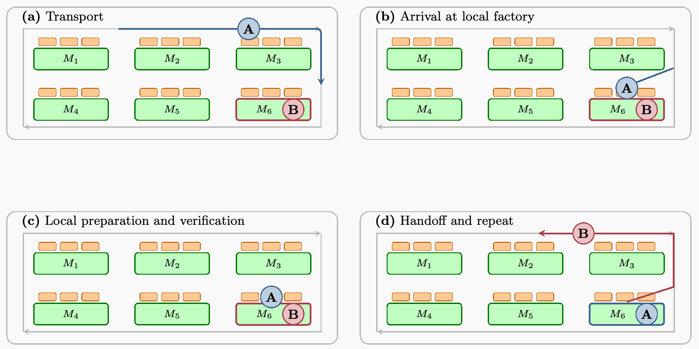

**图 9：在一个测量流中复用两个猫态资源束的设备级交接调度。** 每个存储块都有三个猫态工厂，以橙色表示。先行资源束 $B$ 在 $M_6$ 处开始逻辑测量，同时资源束 $A$ 沿高亮路线前往同一码块 (a)。$A$ 到达 $M_6$ 的一个局部工厂 (b)，并在 $B$ 继续测量时进行制备和验证 (c)。$A$ 随后接管 $M_6$ 处正在进行的测量，释放 $B$ 使其前往下一个目标 (d)。子图标题分别为：(a) 输运；(b) 抵达局部工厂；(c) 局部制备与验证；(d) 交接并重复。

上述基于先行调度的流水策略假设：每条通道的目标块在测量开始前至少 $L$ 个 POC 就已知。当一次测量结果决定下一步测量哪一个此前未活动的码块时，前馈可能破坏这一假设：在结果可用之前，被释放的先行资源束没有唯一的目的地。随后在选定码块上的测量可能停顿至多 $\eta D_{\max}+T_{\mathrm{prep}}(w_{\mathrm{cat}},m)=L$ 个 POC，以等待先行资源束输运、制备并验证。因此，如果不为备选目的地配置资源束，命题 3 的无延迟保证不能跨越这种目标码块的条件变化。

在 Walking Cat 架构中，标架跟踪不跨越码块边界。因此，被跟踪的条件 Clifford 门可以通过共轭可观测量改变后续逻辑测量，但不能改变其目标块。此外，我们观察到，实际编译的椭圆曲线点加法电路中没有其他条件操作会在多个备选目标块之间进行选择。

令 $w_{\max}$ 为经共轭后的逻辑可观测量的所有可能物理代表元中的最大权重。于是，在标架确定前，就可以在已知目标处制备一个权重为 $w_{\max}$ 的猫态。如果选定代表元的权重较小，我们用恒等因子将其补齐至权重 $w_{\max}$。因此，目的地和猫态大小都与条件结果无关，交接调度仍然适用，只需在 $w_{\mathrm{cat}}=w_{\max}$ 处计算其制备时间界限与资源束数量界限。

在这些限制下，$k$ 对猫态资源束，共计 $2k$ 个独立资源束，就足以流水执行深度为一的 CCZ 注入的 $k$ 项并行逻辑测量。

#### D. CLAW 指令集架构与深度为一的 CCZ 注入

（原文印刷页码／PDF 页序：28–33）

面向工作负载的 Clifford 标架与逻辑算符加速（Clifford-frame and Logical-operator Acceleration for Workloads，CLAW）指令集架构，以针对椭圆曲线点加法电路定制的操作扩展 Walking Cat 架构 [1] 的逻辑指令集。它针对编译后电路中的两个主要瓶颈。第一个是实现 Clifford 门的代价。在默认 Walking Cat 假设下，只能保证纯 $X$ 和纯 $Z$ 逻辑测量具有权重至多为 30 的物理代表元，因而可用权重为 30 的猫态访问。跟踪条件 CZ 等 Clifford 门可能将其共轭为更一般的 Pauli 测量，因此基准架构不能保证每个 Clifford 修正都能通过标架跟踪实现。CLAW 转而检查编译后的椭圆曲线点加法电路实际需要的具体逻辑测量的可访问性。我们在输入标架干净的假设下编译每个组件，并用蒙特卡洛采样检查其条件 Clifford 轨迹上的共轭后逻辑测量。遇到的每项测量都具有权重至多为 30 的可访问 Q102 物理代表元。第 XII D 2 节介绍的空闲标架清除在不引入额外运行延迟的情况下维持输入标架干净这一不变条件。这一扩展大幅减少了椭圆曲线点加法电路中实现 Clifford 门所需的逻辑测量数，使 Toffoli 门成为主要运行时间瓶颈。

为解决这一剩余瓶颈，我们扩展 CLAW 指令集，引入 LMP 操作：对于任何一组具有两两不相交物理代表元的逻辑算符，LMP 都能并行测量它们；相应测量协议见第 XII D 1 节。特别地，LMP 操作允许同时执行 CCZ 态注入所需的三个不相交逻辑测量，从而得到第 XII D 3 节所述的最优深度为一 Toffoli 门实现。

##### 1. 并行猫态测量

我们扩展 Walking Cat 架构 [1] 的猫态测量协议，以并行测量多个逻辑 Pauli 算符。令 $P_1,\ldots,P_k$ 为逻辑算符，其物理代表元 $\widetilde P_1,\ldots,\widetilde P_k$ 的支撑两两不相交。这里坚持要求不相交，是为了简化逻辑测量故障率分析：支撑重叠的代表元在一起测量时可能引入相关错误。此外，为简单起见，不失一般性，假设每个代表元的权重均为 $w_{\mathrm{cat}}$。我们制备并验证 $k$ 个不同的权重为 $w_{\mathrm{cat}}$ 的猫态，每个代表元对应一个。猫态 $C_j$ 的第 $a$ 个量子比特耦合到 $\widetilde P_j$ 支撑中的第 $a$ 个数据量子比特。由于数据支撑不相交，全部 $kw_{\mathrm{cat}}$ 次数据–猫态相互作用可以安排在同一个物理门层。

将这 $k$ 个经过验证的猫态并排放置，并作为一个整体资源束输运。将资源束平移，使其与 $k$ 个支撑的并集对齐，同时施加数据–猫态门，然后在同一读出轮次中于 $X$ 基测量全部猫态量子比特。取 $C_j$ 内部结果的奇偶性，就得到 $P_j$ 的测量比特；图 10 展示了两个并行逻辑测量的情况。于是，该协议允许在一个物理测量层中执行 $k$ 项逻辑测量。

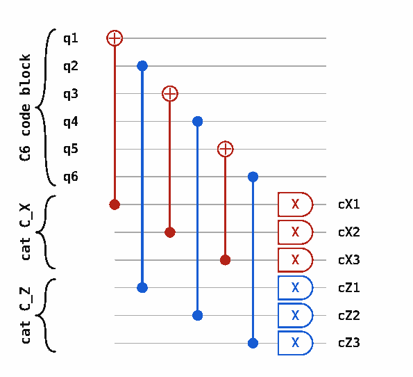

**图 10：对 $[[6,2,2]]$ “C6”码中的两个不相交逻辑代表元执行并行猫态测量。** 制备好的猫态 $C_X$ 和 $C_Z$ 分别控制作用于不相交代表元 $\overline X_0=\mathrm{XIXIXI}$ 和 $\overline Z_1=\mathrm{IZIZIZ}$ 的数据–猫态门。红色受控 $X$ 门属于逻辑 $X$ 测量，蓝色受控 $Z$ 门属于逻辑 $Z$ 测量。图内 “C6 code block” 表示“C6 码块”；“cat $C_X$”“cat $C_Z$”分别表示猫态 $C_X$、$C_Z$；$q_1,\ldots,q_6$ 为数据线，$cX1,cX2,cX3,cZ1,cZ2,cZ3$ 为对应猫态的读出结果。

由于物理代表元的支撑不相交，相应测量彼此对易。因此，在无噪声情形下，并行执行猫态测量等价于按任意顺序逐个执行。交换丢失模型中的故障具有局域性，所以这一保证仍然成立。每项逻辑测量使用不同的猫态，以及一组不相交的数据–猫态相互作用；每项物理操作的故障都在局部采样。因此，一个猫态测量内部发生的任何故障，包括钩形错误或丢失离子诱发的交换，都不能传播到另一个构件。于是，相对于在同一个物理层中单独执行该构件，并行执行不会改变各项逻辑测量的结果分布与错误概率。

##### 2. 空闲标架清除

与 Walking Cat 架构 [1] 一样，我们尽可能通过 Clifford 标架跟踪实现条件 Clifford 修正，而不是物理施加它们。编译器更新码块的 Clifford 标架 $U$，并将此后的每个目标逻辑 Pauli 算符 $P$ 替换为 $U^\dagger PU$。当后续非 Clifford 操作要求平凡 Clifford 标架时，可以通过逻辑 CliNR [51] 实现被跟踪的 Clifford 门，从而将编码态传态到一个 Clifford 标架已复位为 $U=I$ 的码块，如图 11 所示。我们称这种复位为清除 Clifford 标架。由于只有在码块的 Clifford 标架已知时才能施加逻辑 CliNR，标架清除通常受制于条件 Clifford 门关联的经典条件何时得到确定。这通常意味着，只有码块进入空闲状态后才能安全施加逻辑 CliNR，否则就必须主动暂停执行以清除标架。逻辑 CliNR 使用两个辅助存储块 $A$ 和 $B$ 作为资源块；它们采用与待清除标架的数据块相同的码进行编码。完成后，已清除码块的逻辑状态已被传态到 Clifford 标架平凡的 $B$ 中，而原数据块和 $A$ 可以复位并复用。

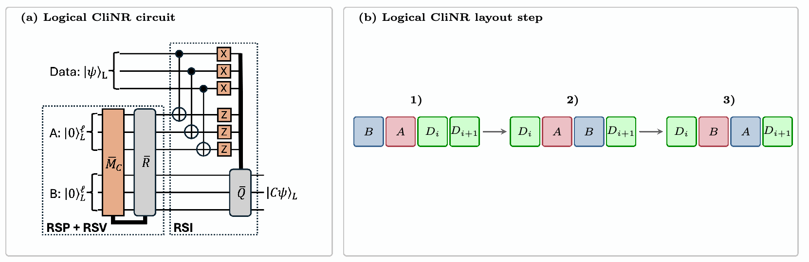

**图 11：逻辑 CliNR 及其编译器层面的移动原语。** (a) Webster 与 Delfosse [51] 的逻辑 CliNR 电路。联合稳定子测量和 Pauli 修正在辅助块 $A$、$B$ 上制备并验证一个逻辑资源态。从数据块到 $A$ 施加横向 CNOT 门，随后进行破坏性的 $X$ 基与 $Z$ 基测量并施加 Pauli 修正 $\overline Q$，将 $C|\psi\rangle_L$ 传态到块 $B$。(b) 一个向前步骤从相邻排列 $[B,A,D_i,D_{i+1}]$ 开始。交换 $B$ 的载体与 $D_i$，得到 $[D_i,A,B,D_{i+1}]$。此后保持物理载体固定，同时自由交换语义角色 $A$ 和 $B$，得到 $[D_i,B,A,D_{i+1}]$。更新后的三元组 $[B,A,D_{i+1}]$ 因而准备好执行下一次 CliNR 步骤。子图标题为“逻辑 CliNR 电路”和“逻辑 CliNR 布局步骤”；图中 Data 表示数据，RSP + RSV 表示资源态制备与验证，RSI 表示资源态注入；$\overline M_C$、$\overline R$、$\overline Q$ 保留原图记号。

针对椭圆曲线点加法电路优化 CLAW 指令集，需要确定各编译组件实际测量的逻辑 Pauli 算符的精确集合。为使这一问题可处理，我们在一个不变条件下独立编译各组件：组件支撑中的每个存储块，在首次用于非 Clifford 操作之前立即具有平凡 Clifford 标架。为维持这一不变条件，必须对组件支撑中的每个码块执行标架清除。

标架清除可以与其他码块上的逻辑测量并行运行。由于椭圆曲线点加法电路的大多数组件是串行的，每个码块都有足够长的空闲时间，可在不延长关键路径的情况下清除标架。更一般地，椭圆曲线电路由一系列组件组成，这些组件依次串行作用于有序的逻辑块集合：每个组件沿其码块向下执行，然后按相反次序反计算；组件之间偶尔出现较浅的并行门层，见图 12。我们称这些组件为串行组件。

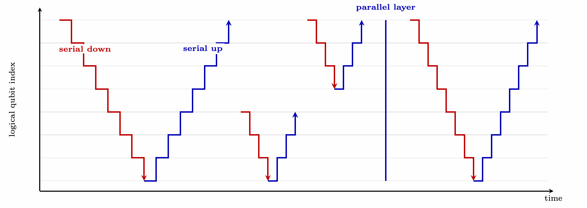

**图 12：编译后的椭圆曲线点加法电路的时间结构示意。** 时间从左向右流动，每行表示一个逻辑量子比特指标。串行组件，例如加法器，首先按指标下降次序访问其支撑（红色），然后按上升次序返回（蓝色）。组件之间可能有全部并行执行的浅层操作，例如用于条件求逆的大型受控多目标门，和／或在单个码块上的稠密操作层，例如查表的深度优先选择器遍历。图中 serial down、serial up、parallel layer 分别表示“串行向下”“串行向上”“并行层”；纵轴为“逻辑量子比特指标”，横轴为“时间”。

因此，我们在各串行组件执行之前流水开展标架清除，如图 13 所示。

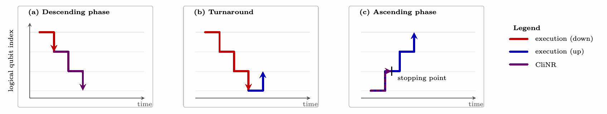

**图 13：围绕一个串行组件进行空闲标架清除。** 时间从左向右流动，竖直位置表示逻辑量子比特指标。(a) CliNR 清除串行组件中尚待执行的码块的标架。(b) 串行组件的执行到达码块末端，随后必须以反向次序迭代，对它们进行反计算。(c) CliNR 清除已完成反计算的码块的标架，直到下一个串行组件的第一个码块。子图标题依次为“下降阶段”“折返”“上升阶段”；图例为“执行（向下）”“执行（向上）”“CliNR”，stopping point 表示“停止点”；横轴为时间，纵轴为逻辑量子比特指标。

不过，要跟上串行执行，必须保证逻辑 CliNR 清除一个码块所用的时间，小于串行执行处理该码块全部测量所用的时间。为此，我们在 MECM 阶段满足并行猫态测量兼容规则时并行测量这些阶段，从而优化逻辑 CliNR。在每个 MECM 阶段内，如果两个输出的物理代表元可选成在两个 CliNR 资源块上均具有不相交支撑且权重至多为 30，我们就在兼容性图中将两者连边，然后寻找最大匹配；未匹配的阶段单独测量。通过从编译后椭圆曲线点加法电路模拟中遇到的 Clifford 标架均匀采样，我们发现，一次标架清除经过优化的 MECM 部分需要 $41.242\pm0.276$ 个 Q102 SEC 层。横向 CNOT 门之后还要额外进行一个 Q102 SEC 用于译码，因此完整的标架清除需要 $42.242\pm0.276$ 个 Q102 SEC。使用式 (26) 推导的约 5.46 个 Q102 SEC 的联合 CCZ 注入时长，清除一个码块相当于约 7.73 个逻辑测量间隔。串行组件大约每 7.5 个这样的间隔就暴露一个新码块，因此至少需要两个逻辑 CliNR 实例才能跟上串行执行。

由于我们只对串行组件应用逻辑 CliNR，编译器可以按照这些组件的串行遍历顺序，将它们使用的数据块布置为一个有序寄存器。上述时间估计表明，为保证标架总是在串行执行之前清除，需要两个逻辑 CliNR 实例。我们将寄存器中的码块交替分配给两个实例：一个实例清除偶数位置的码块，另一个清除奇数位置的码块。因此，每个实例只需隔一个块清除一个。椭圆曲线点加法电路的串行组件通常每 7.5 个逻辑测量间隔到达一个新块，故每个 CliNR 实例在再次被需要之前有 $2\times7.5=15$ 个间隔，足以在约 7.73 个间隔内清除一个码块。

逻辑 CliNR 的横向 CNOT 门要求将数据量子比特输运到彼此靠近的位置，以成对执行物理 CNOT 门。因此，在注入期间，我们使逻辑 CliNR 协议中的 $A$ 资源块始终紧邻数据块。每个数据量子比特随后至多移动一个 Q102 块的宽度，即可与对应的资源量子比特相互作用，从而尽量减少输运期间空闲、丢失和泄漏造成的错误。

第 XII A 节引入的 secp256k1 设备具有一个含 69 个数据块的寄存器。将交替的码块分配给两个逻辑 CliNR 实例，就将这个寄存器分成 35 个和 34 个数据块两组。每组增加一对 $A/B$ 资源块，即两个块后，分别得到 37 个和 36 个块。每组都能放入一个穿过 $4\times10$ 矩形的闭合最近邻路径中，该矩形提供 40 个单元。因此，两个矩形分别留下三个和四个空单元。将两者叠放，得到一个 $8\times10$ 的布局，其中包含 69 个数据块、4 个资源块和 7 个空单元。我们将这种把交替码块子序列及其资源块对分配到闭合最近邻路径的方式称为衔尾蛇码块布局（ouroboros block layout）。随着应用继续处理后续串行组件，编译器可以把每次新遍历追加到当前执行路径末端；该路径以环形模式绕数据块循环，因此得名“衔尾蛇”。

在衔尾蛇码块布局下，还需证明：每个逻辑 CliNR 实例都能沿其数据块的串行执行路径前进，同时与下一个目标保持最近邻局域性；有了这一条件，就能以最小开销执行横向 CNOT 门。一次逻辑 CliNR 的应用会交换 $B$ 块与数据块，使 $A$ 仍紧邻下一个数据块。如果 $D_i$ 没有需要清除的标架，可以简单地将这些码块循环移位，其实现方式是交换码块间对应的物理量子比特。对这些局部置换作归纳可知，在整个提前清除串行应用组件的序列中，资源块对始终与其下一个目标相邻。图 14 展示了用于清除三个部分重叠串行组件的衔尾蛇码块布局。

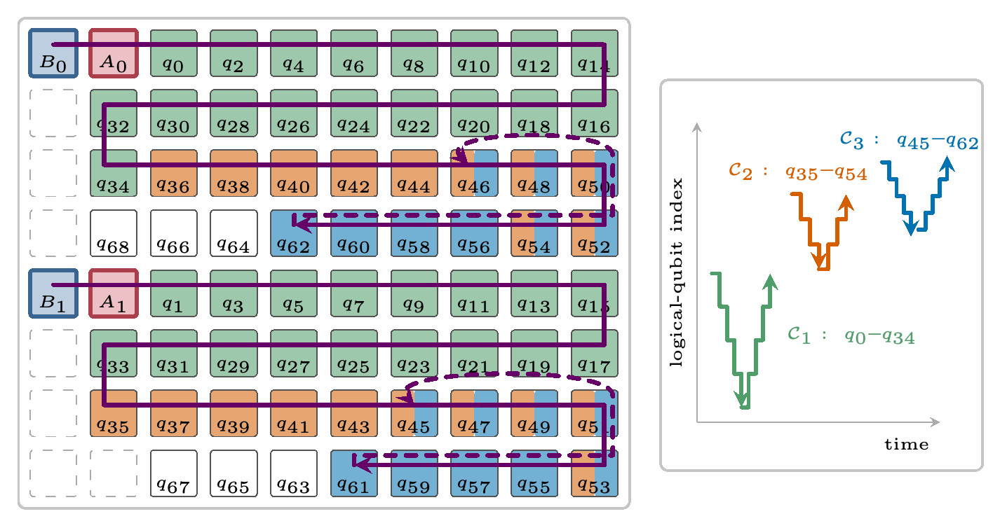

**图 14：支撑部分重叠的三个串行组件的逻辑 CliNR。** 每一对 $(B_i,A_i)$ 为一个 CliNR 实例提供两个资源块。图中画出全部 69 个数据块 $q_0,\ldots,q_{68}$；白色块 $q_{63},\ldots,q_{68}$ 未被使用。右图显示三个串行组件按应用顺序依次执行。第一个组件作用于 $q_0,\ldots,q_{34}$。第二个作用于 $q_{35},\ldots,q_{54}$，第三个作用于 $q_{45},\ldots,q_{62}$，与第二个在 $q_{45},\ldots,q_{54}$ 上重叠。两个 CliNR 实例从每个支撑的第一个偶数指标块和奇数指标块开始，随后沿紫色实电路径在执行之前清除标架。由于第三个组件与第二个重叠，资源块对必须先回退到重叠区域起点，才能开始清除第三个组件；紫色虚电路径表示这种回退。右图标注为 $C_1:q_0$–$q_{34}$、$C_2:q_{35}$–$q_{54}$、$C_3:q_{45}$–$q_{62}$；横轴为时间，纵轴为逻辑量子比特指标。

衔尾蛇码块布局也能容纳起点位于前一组件支撑内部的组件。在这种情况下，逻辑 CliNR 实例沿着前一组件逻辑测量的“上升”执行过程前进，清除具有非平凡标架的码块，并对中间标架已经干净的码块简单执行整块交换。一旦到达后一组件的第一个目标，它们就可以停止，见图 15。最坏情况下，前一组件最后释放的码块恰好也是后一组件首先需要的码块。其清除无法隐藏在此前的执行之中，因此切换会停顿一次逻辑 CliNR 操作，即约 7.73 个逻辑测量间隔。

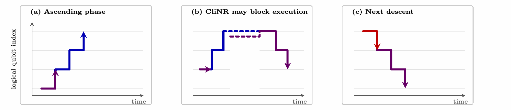

**图 15：在支撑重叠的连续串行组件上执行逻辑 CliNR。** 时间从左向右流动，竖直位置表示逻辑量子比特指标。(a) 串行组件的执行开始反计算结果，按相反次序遍历码块。(b) 如果一个串行组件的最后一个码块恰好对应下一个组件的起点，则处理第一个组件的逻辑 CliNR 实例必须阻塞执行。切换到不相交或已经准备好的支撑可避免这一情况。(c) 下一个执行过程在其第一个目标清除完成后开始，而逻辑 CliNR 继续刚好赶在它之前进行。子图标题依次为“上升阶段”“CliNR 可能阻塞执行”“下一次下降”；横轴为时间，纵轴为逻辑量子比特指标。

##### 3. 深度为一的 CCZ 注入

如图 16 所示，Toffoli 门就是在目标量子比特上以 Hadamard 门共轭的 CCZ 门。CCZ 门可以通过单比特门传态 [75,76] 注入：测量 CCZ 资源态的各个量子比特与对应数据量子比特之间的联合逻辑 $Z$ 算符，随后破坏性地在 $X$ 基测量资源量子比特，并施加依赖于结果的修正。三个联合逻辑 $Z$ 测量的支撑不相交，因此可以并行执行，使注入只需一个逻辑测量层。此后的 $X$ 基结果只引发 Pauli 修正，可以在 Pauli 标架中跟踪，无须在下一个门完成之前就已知。这些结果的读出通常快于联合逻辑测量所需的 5.46 个 Q102 SEC，因此不会在关键路径上增加另一层。最后，如第 X 节所述，编译器保证每个条件 CZ 修正的两个操作数位于同一存储块内，因此每项修正都能吸收入该块的 Clifford 标架，而不增加逻辑测量层。

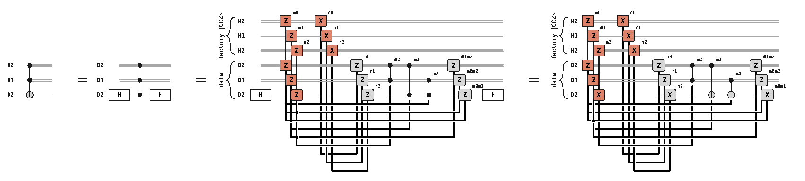

**图 16：以下电路之间的等价关系：Toffoli 门；在目标量子比特上用 Hadamard 门共轭的 CCZ 门；在目标量子比特上用 Hadamard 门共轭的 CCZ 注入电路；以及将 Hadamard 门通过共轭 CCZ 注入电路的逻辑测量来实现所得的同一电路。** 图中 factory $|CCZ\rangle$ 表示工厂提供的 $|CCZ\rangle$ 资源态，data 表示数据；$M_0,M_1,M_2$ 为资源量子比特，$D_0,D_1,D_2$ 为数据量子比特；$m_0,m_1,m_2$ 和 $n_0,n_1,n_2$ 保留为图中的测量结果，单个结果或结果乘积控制所示修正。

我们使用蒙特卡洛模拟量化编译后的测量深度。对于每个独立编译的电路组件，我们为条件 Clifford 修正抽取 10,000 组随机结果。每个样本开始时，各输入块均具有平凡 Clifford 标架，满足编译不变条件；第 XII D 2 节的空闲标架清除程序在执行期间保证了这一点。传播采样的 Clifford 标架并调度所得逻辑测量后，我们发现每个采样到的经共轭逻辑算符都具有可访问的物理代表元。因此，每个组件的经验频率分辨率为 $10^{-4}$；在独立采样下，没有观察到不可访问轨迹，这对每个组件给出“某条轨迹含有不可访问逻辑算符”的概率的单侧 95% 置信上界 $3\times10^{-4}$。通过对全部应用组件进行这种模拟，我们发现 93.6% 的 Toffoli 门测量深度为一。其余门需要深度二，因此平均测量深度为 1.07。

#### E. Eastinthillation CCZ 工厂

（原文印刷页码／PDF 页序：33–41）

我们设计了一种专用的“Eastinthillation”工厂，名称由 Eastin 与 synthillation 组合而成，可直接在三环码块内产生 CCZ 态。我们指出，在不太正式的语境中也可以使用别名“East Mode”，例如粉丝创作的关于本文的歌曲。Eastinthillation 工厂的资源总量和性能估计汇总如下。

该工厂对 $[[6,2,2]]$ 码零级蒸馏产生的八个 $T$ 态应用 Eastin 的 Toffoli 态合成蒸馏（synthillation）协议 [77,78]，下文将该码称为 C6 码。这一 $T$ 态蒸馏程序详见第 XII E 1 节。当协议接受时，输出一个 Toffoli 态。对其目标量子比特施加 Hadamard 门，将其转换为 CCZ 资源态。Eastinthillation 工厂电路及其物理测量调度见第 XII E 2 节，第 XII E 3 节分析工厂的逻辑错误率、拒绝率、深度和物理量子比特占用。最后，第 XII E 4 节说明如何调整 Eastinthillation 工厂，以产生 Shor 算法 QFT 阶段所需的 $T$ 态。

**表 VII：单个 Eastinthillation 工厂的资源与性能汇总。**

| 指标 | 数值 |
|---|---:|
| CCZ 注入深度 | 147.48 POC |
| 每次尝试的重启率 | $\lesssim15.94\%$ |
| 每个被接受态的平均深度 | 555.75 POC |
| 维持连续供应所需的工厂数 | 4 |
| 每个工厂的物理量子比特占用 | 319 |
| 逻辑错误率 | $\lesssim9.36\times10^{-10}$ |

##### 1. 零级 T 态蒸馏

我们使用 Dasu 等人 [79] 的协议制备每一对 $|H\rangle$ 态。该协议先用 Goto 的任意态编码器 [80] 将这些态编码到 C6 码中，再进行联合逻辑 Hadamard 验证和综合征提取。两个验证后的 $|H\rangle$ 态保持编码，并通过 Walking Cat 架构 [1] 的双 $T$ 态注入电路被消耗。联合验证使用一个双量子比特 Bell 态测量 $H_{L,0}H_{L,1}$。带标志的读出再接上 C6 综合征提取，使这项测量具有容错性。

在 C6 码中制备两个逻辑 $|H\rangle$ 态的电路如图 17 所示。作为三环码，C6 码的 SEC 电路可以用循环移位实现，但编码电路的连接关系无法仅用循环移位实现。因此，我们提议使用一小段列交换序列实现编码电路。对于这个检错码块，无须单独进行丢失与泄漏检查，因为在态制备或消耗过程中，每个量子比特都将接受包含丢失与泄漏检测的破坏性测量。

我们使用 Qiskit Aer 的态矢量方法模拟态制备、验证和 SEC 电路。表 VIII 中的逻辑错误率与拒绝率是在 $p=10^{-4}$ 的交换丢失噪声模型下，以 $10^9$ 次试验得到的蒙特卡洛估计。模拟器在末尾添加对两个逻辑 Hadamard 算符 $H_{L,0}$ 和 $H_{L,1}$ 的理想破坏性测量，以估计逻辑保真度。模拟结果包含在表 VIII 中，该表还给出电路深度与物理量子比特占用。

**表 VIII：在 $p=10^{-4}$ 的交换丢失噪声模型下，对编码 $\lvert H\rangle^{\otimes2}$ 态对进行一次零级制备的性能估计与资源总量。**

| 量 | 符号 | 数值 |
|---|---|---:|
| 每个被接受态对的逻辑错误率 | $p_L^{(0)}$ | $1.30\times10^{-8}$ |
| 拒绝率 | $r_{\mathrm{rej}}^{(0)}$ | $0.358\%$ |
| C6 SEC 拒绝率 | $r_{\mathrm{SEC}}^{\mathrm{C6}}$ | $0.323\%$ |
| 态对制备与验证深度 | $T_{H^2}^{(0)}$ | 6.6 POC |
| SEC 深度 | $T_{\mathrm{SEC}}^{(0)}$ | 5.4 POC |
| 总深度 | $T_{\mathrm{dist}}^{(0)}$ | 12.0 POC |
| 物理量子比特占用 | $n_{\mathrm{phys}}^{(0)}$ | 12 |

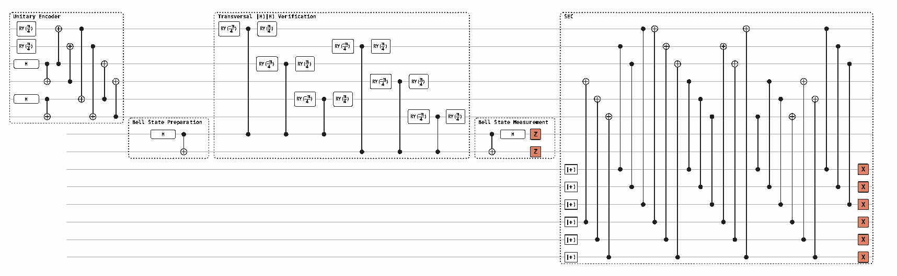

**图 17：在 C6 码中制备两个逻辑 $|H\rangle$ 态。** 图内各阶段分别为“酉编码器”（Unitary Encoder）、“横向 $|H\rangle|H\rangle$ 验证”（Transversal $|H\rangle|H\rangle$ Verification）、“Bell 态制备”（Bell State Preparation）、“Bell 态测量”（Bell State Measurement）和“综合征提取周期”（SEC）；旋转门 $R_Y(\pi/4)$、$R_Y(-\pi/4)$、Hadamard 门、$X$／$Z$ 测量及 $|+\rangle$ 制备标记保留原样。

##### 2. Eastinthillation 工厂电路

基于 Eastin Toffoli 态合成蒸馏协议 [77] 的 Eastinthillation 工厂电路如图 18 所示。该协议使用基于 C6 码的零级工厂产生的八个 $|H\rangle$ 态，实现两个共享控制端、目标端不同的 Margolus–Toffoli 门。令 $p_{Y,\mathrm{inj}}$ 表示每次用于实现逻辑 $R_Y(\pi/4)$ 旋转的 $|H\rangle$ 态注入的随机逻辑 $Y$ 故障概率。最终在目标端进行的“接受”奇偶校验能够检测任何单个随机 $Y$ 输入故障，并产生错误概率为 $p_{Y,\mathrm{inj}}^2$ 量级的 Toffoli 态。我们对被接受的 Toffoli 态的目标量子比特施加 Hadamard 门。这个最终的 Clifford 操作将其转化为兼容第 XII D 节深度为一 CCZ 门的 CCZ 资源态。

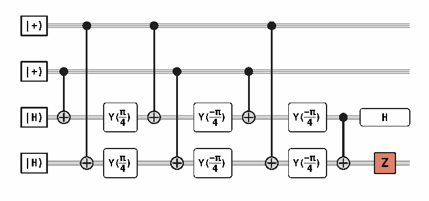

**图 18：Eastinthillation 工厂电路。** 输入为两个 $|+\rangle$ 态和两个 $|H\rangle$ 态；图中的 $Y(\pi/4)$、$Y(-\pi/4)$、Hadamard 门以及末端 $Z$ 测量按原图保留。

我们在一个 Q66 码块中按照图 19 的测量层序列实现 Eastinthillation 工厂电路。测量使用 Walking Cat 指令集 [1] 的 LM1、LM2 和 DM 操作，由 EDM（error-detecting measurement，检错测量）及 Viterbi 测量方案来实现。我们扩展这些方案，加入 Webster 与 Delfosse [51] 引入的多 Pauli 纠错测量操作（Multi-Pauli error-corrected measurement，MECM）。

图 19 中每个由猫态辅助的测量层都具有物理代表元，它们在 GB66 块上的支撑两两不相交，且每个代表元的权重至多为 16。完整的代表元证书见第 G 节。这些代表元相对较小的宽度，使每次双 $R_Y(\pi/4)$ 注入仅需 3 轮 EDM，就能在物理错误率 $p=10^{-4}$ 下达到 $10^{-8}$ 量级的 $p_H$。类似地，只需 5 轮 Viterbi 测量即可达到 $10^{-13}$ 量级的逻辑错误率。每次双 $R_Y(\pi/4)$ 注入都以 DMX 结束，即对 H6 块的全部数据量子比特进行破坏性读出；无论宽度如何，该操作只需 1 个 POC。

> [!note] 译注
> 原文在此段分别写作“GB66 block”和“H6 block”，同一小节其余位置使用“Q66”和“C6”。这里保留原文记号，不静默改写。

**$R_Y(\pi/4)$ 注入。** 每对 $R_Y(\pi/4)$ 旋转用 Walking Cat 架构 [1] 的双 $R_Y(\pi/4)$ 注入构件实现，它包含一次联合 $YY$ 测量，随后对 C6 块施加 DMX 操作。为避免相关输入错误，每个 Q66 块配置两个专用 C6 源块。一个双 $R_Y(\pi/4)$ 层从每个 C6 块分别取一个制备为 $|H\rangle$ 的逻辑量子比特，而不是从同一个编码 $|H\rangle^{\otimes2}$ 态对中取得两个输入。末端 DMX 消耗两个 C6 块，包括每个块中未被使用的逻辑量子比特。随后重新初始化这两个块，并为同一个 Q66 块并行制备和验证下一对编码 $|H\rangle^{\otimes2}$ 态。我们使用专用 C6 块，而不在多个 Q66 块之间共享它们。这一选择消除了共享资源争用，从而简化工厂分析。

在任一个源 C6 块中，两个逻辑 $Y$ 算符具有代表元

$$
\overline Y_0=\mathrm{YIYIYI},\qquad \overline Y_1=\mathrm{IYIYIY}.
\tag{12}
$$

这些代表元的支撑不相交，权重为三。尽管如此，通过让一个猫态量子比特复用于两次数据相互作用，任一个算符都可以用双量子比特猫态片段，即 Bell 态来测量。这种复用不会降低测量距离。复用的猫态量子比特上的一个故障可能传播到两个 C6 数据量子比特。我们为每个猫态量子比特选择其数据量子比特支撑，使产生的任何钩形错误都不是非平凡 C6 逻辑算符。每个这样的错误都具有非零综合征，并会被随后的 SEC 拒绝。

将双量子比特 C6 片段与权重至多为 16 的 Q66 代表元组合，就得到一个权重为 18 的猫态，用于双 $R_Y(\pi/4)$ 注入中的联合 $Y_{\mathrm{C6}}Y_{\mathrm{Q66}}$ 可观测量。

每个 Q66 猫态工厂包含两个猫态寄存器和一组验证量子比特，均按宽度 16 配置。因此，将一个工厂的宽度增加到 18，需要增加 $3(18-16)=6$ 个量子比特。我们在每个 C6 块旁放置一个六量子比特 C6 Bell 态源。验证 C6 态时，其中两个量子比特形成上述 Bell 态。但在联合 $Y_{\mathrm{C6}}Y_{\mathrm{Q66}}$ 测量期间，全部六个量子比特都借给权重为 16 的 Q66 猫态工厂，使其能够产生权重为 18 的猫态。这两项操作的时间不重叠，因此同一个 C6 Bell 态源可同时支持两种用途。

该逻辑测量仍包含 19 次数据–猫态相互作用，因此下文的逻辑测量错误估计使用有效宽度 $w_{\mathrm{eff}}=19$。

在 $w_{\mathrm{eff}}=19$、$p=10^{-4}$ 时，文献 [1] 中拟合的 EDM 模型给出单轮结果翻转概率

$$
p_{\mathrm{flip}}\simeq2.1w_{\mathrm{eff}}p=3.99\times10^{-3}.
\tag{13}
$$

需要三轮 EDM 才能将测量导致的错误压低到与态制备错误 $p_{H^2}$ 相同的量级，因为 $p_{\mathrm{flip}}^2=1.59\times10^{-5}$，而 $p_{\mathrm{flip}}^3=6.35\times10^{-8}$。因此，我们对每次 $R_Y(\pi/4)$ 注入使用 EDM-3。其逻辑结果错误率为

$$
p_{\mathrm{EDM3}}\simeq p_{\mathrm{flip}}^3=6.35\times10^{-8}.
\tag{14}
$$

当一个 EDM-3 结果序列的三个结果全部正确或全部翻转时，该序列被接受。一次双注入的两个输入来自同一个 Eastinthillation 工厂的两个专用 C6 块。每个输入经历三个 C6 SEC，且只有两个 C6 块都接受全部三个 SEC 时，工厂才接受。使用共同的 C6 SEC 拒绝率 $r_{\mathrm{SEC}}^{\mathrm{C6}}=0.323\%$，每次注入的接受因子因此为

$$
a_{RY}=\bigl[(1-p_{\mathrm{flip}})^3+p_{\mathrm{flip}}^3\bigr]
(1-r_{\mathrm{SEC}}^{\mathrm{C6}})^3=0.978534.
\tag{15}
$$

相应拒绝率为 $r_{RY}=1-a_{RY}=2.147\%$。因子 $a_{RY}^8$ 计入一次 CCZ 制备尝试所需的八个 EDM-3 结果序列和 24 个 C6 SEC。

Eastinthillation 工厂末端的奇偶校验只能检测单逻辑量子比特的 $Y$ 或 $X$ 错误；而合成蒸馏协议中的所有错误实际上都可以追溯到 $R_Y(\pi/4)$ 注入。因此，我们希望保证 $R_Y(\pi/4)$ 注入错误只有 $Y$ 型或 $X$ 型。我们采用 Walking Cat 架构 [1] 的注入 $Y$ 噪声模型：在 EDM 和 SEC 接受测试通过的条件下，注入故障被表示为对应 Q66 量子比特上的随机逻辑 $Y$。这一点来自对 $R_Y(\pi/4)$ 注入所涉及逻辑测量的条件修正的分析。错误的末端 DMX 结果会错误施加一个 $Y$ 修正。错误的 EDM 结果会施加一个 $Z_{\mathrm{C6}}R_Y(\pi/2)_{\mathrm{Q66}}$ 错误；额外的 $Z_{\mathrm{C6}}$ 会触发后续 C6 的 $X$ 读出，因而也通过 DMX 的 $Y$ 修正施加一个 $Y$ 错误，所以至少总与一个 $Y$ 错误相关。剩余的 Q66 操作为 $R_Y(\pi/2)Y\mathrel{\dot=}R_Y(-\pi/2)$，即逆旋转。源 $|H\rangle$ 态的 $Y$ 期望值为零。联合 $Y_{\mathrm{C6}}Y_{\mathrm{Q66}}$ 测量的两个结果等概率，因此两种剩余旋转也等概率。将相应信道平均，得到

$$
\frac12\mathcal R_{Y,\pi/2}+\frac12\mathcal R_{Y,-\pi/2}
=\frac12\mathcal I+\frac12\mathcal Y,
\tag{16}
$$

其中 $\mathcal R_{Y,\theta}$ 是 $R_Y(\theta)$ 诱导的信道，$\mathcal Y$ 是逻辑 $Y$ 共轭。因此，我们用完整的 EDM-3 逻辑结果错误概率来上界随机逻辑 $Y$ 故障率。

各注入层的两个输入态来自不同 C6 块，因此其制备错误独立。由于这些位置的故障独立采样，制备错误也相互独立。因此，对于一次注入，边缘随机逻辑 $Y$ 概率可由制备错误概率与 EDM-3 错误概率之和上界：

$$
p_{Y,\mathrm{inj}}\lesssim p_{H^2}+p_{\mathrm{EDM3}}=7.65\times10^{-8}.
\tag{17}
$$

**接受测量。** 接受测量采用由 Viterbi 测量实现的 LM1 操作。其代表元权重为 16，所以 $w_{\mathrm{cat}}=16$，见表 XVI。在 $p=10^{-4}$ 时，文献 [1] 的单轮比特翻转模型给出

$$
p_{\mathrm{flip},16}=2.1w_{\mathrm{cat}}p=2.1\times16\times10^{-4}=3.36\times10^{-3}.
\tag{18}
$$

对于目标错误率 $\varepsilon=10^{-11}$，Viterbi 停止条件要求票差为

$$
d_{16}=\left\lceil\frac{\log[(1-\varepsilon)/\varepsilon]}{\log[(1-p_{\mathrm{flip},16})/p_{\mathrm{flip},16}]}\right\rceil=5.
\tag{19}
$$

因此逻辑错误率为

$$
p_{\mathrm{Vit},16}=\left[1+\left(\frac{1-p_{\mathrm{flip},16}}{p_{\mathrm{flip},16}}\right)^5\right]^{-1}=4.36\times10^{-13}.
\tag{20}
$$

文献 [1] 的猫态拒绝模型给出 $p_{\mathrm{miss},16}=5w_{\mathrm{cat}}p=8.0\times10^{-3}$。记 $\rho_{16}=p_{\mathrm{flip},16}/(1-p_{\mathrm{flip},16})$，平均时长为

$$
\tau_{\mathrm{Vit},16}^{\mathrm{avg}}
=\frac{1}{1-p_{\mathrm{miss},16}}
\frac{d_{16}}{1-2p_{\mathrm{flip},16}}
\frac{1-\rho_{16}^{d_{16}}}{1+\rho_{16}^{d_{16}}}
=5.07\ \mathrm{SEC}.
\tag{21}
$$

**CCZ 注入。** 三个 CCZ 注入测量遵循第 XII D 节的协议。最大的联合代表元权重为 36，其中 Q102 逻辑 $Z$ 算符贡献权重 20，Q66 逻辑 $Z$ 算符贡献权重 16。因此，我们对三项测量都取 $w_{\mathrm{cat}}=36$，以推得其逻辑错误率的上界。在 $p=10^{-4}$ 时，单轮比特翻转概率为

$$
p_{\mathrm{flip},36}=2.1\times36\times10^{-4}=7.56\times10^{-3}.
\tag{22}
$$

对于目标错误率 $\varepsilon=10^{-10}$，Viterbi 停止条件要求票差为

$$
d_{36}=\left\lceil\frac{\log[(1-\varepsilon)/\varepsilon]}{\log[(1-p_{\mathrm{flip},36})/p_{\mathrm{flip},36}]}\right\rceil=5.
\tag{23}
$$

因此每项测量的逻辑错误率为

$$
p_{\mathrm{Vit},36}=\left[1+\left(\frac{1-p_{\mathrm{flip},36}}{p_{\mathrm{flip},36}}\right)^5\right]^{-1}=2.57\times10^{-11}.
\tag{24}
$$

文献 [1] 的猫态拒绝模型给出 $p_{\mathrm{miss},36}=5w_{\mathrm{cat}}p=1.8\times10^{-2}$。记 $\rho_{36}=p_{\mathrm{flip},36}/(1-p_{\mathrm{flip},36})$，一次 Viterbi 测量的平均时长为

$$
\tau_{\mathrm{Vit},36}^{\mathrm{avg}}
=\frac{1}{1-p_{\mathrm{miss},36}}
\frac{d_{36}}{1-2p_{\mathrm{flip},36}}
\frac{1-\rho_{36}^{d_{36}}}{1+\rho_{36}^{d_{36}}}
=5.16982\ \mathrm{SEC}.
\tag{25}
$$

三项测量并行运行，因此其时长取决于最慢的测量。令 $F(t)$ 为一个权重为 36 的 Viterbi 测量在第 $t$ 个 SEC 时已经停止的概率。我们通过迭代上述相同票差过程得到 $F(t)$。一次猫态尝试以概率 $p_{\mathrm{miss},36}$ 被拒绝；此时不产生测量结果，所以该 SEC 的票差不变。由于三项测量使用独立的猫态，三者在第 $t$ 个 SEC 时均已停止的概率为 $F(t)^3$。对“第 $t$ 个 SEC 之后至少一项测量仍在运行”的概率求和，得到

$$
\tau_{\mathrm{CCZ}}^{\mathrm{avg}}=\sum_{t=0}^{\infty}\bigl[1-F(t)^3\bigr]=5.46218\ \mathrm{SEC}.
\tag{26}
$$

这仅比单项测量的平均时长多 0.29 个 SEC。由并集界，三项测量对逻辑错误率的贡献至多为 $3p_{\mathrm{Vit},36}=7.70\times10^{-11}$。

**相位修正。** 在三个 CCZ 注入测量之后，我们测量资源块上的三个对易可观测量 $P_0,P_1,P_2$，它们由被跟踪的 Clifford 标架共轭逻辑 $X$ 算符得到。该标架包含来自八次 $R_Y(\pi/4)$ 注入的各一个条件 Clifford 修正，因此我们分析全部 $2^8=256$ 个标架分支。

我们将每个物理数据量子比特各自在独立选择的 Pauli 基中进行的破坏性读出称为广义破坏性测量（generalized destructive measurement，DMG）。单次 DMG 可以并行测量具有两两不相交物理代表元的逻辑 Pauli 可观测量：在各代表元的支撑上，物理量子比特在相应的单量子比特 Pauli 基中测量。一次 DMG 仅需一个 POC，小于一个完整 SEC。

并非每个分支都能找到全部三个 $P_i$ 的两两不相交代表元。能够找到时，单次 DMG 并行测量三个 $P_i$。如果恰有一对重叠，就用一次 Viterbi 测量测量这一对中的一个成员。随后用单次 DMG 并行测量另外两个具有不相交代表元的可观测量。如果每一对都重叠，就测量能够具有不相交代表元的 $P_i$ 乘积。在两种需要非破坏性逻辑测量层的情况下，都只需在末端 DMG 前加入一个这样的层。因此，相位修正至多需要一个测量层。

我们使用文献 [51] 的调度矩阵约定描述 MECM 与 Viterbi 两种情况：对于 $G\in\mathbb F_2^{3\times3}$，第 $j$ 列指定可观测量

$$
Q_j=\prod_{i=0}^{2}P_i^{G_{ij}}.
\tag{27}
$$

若 $P_i$ 和 $Q_j$ 的本征值分别为 $(-1)^{u_i}$ 和 $(-1)^{v_j}$，则

$$
v=uG,\qquad u=vG^{-1}.
\tag{28}
$$

因此，可逆的 $G$ 将 $P_i$ 替换为一组等价的逻辑可观测量 $Q_j$。测量 $Q_j$ 给出同样的逻辑信息，因为可以从 $v$ 恢复 $u$，而且不需要额外测量层。

只需要两种调度矩阵：

$$
G_{\mathrm{id}}=\begin{pmatrix}1&0&0\\0&1&0\\0&0&1\end{pmatrix},
\qquad
G_{\mathrm{prod}}=\begin{pmatrix}1&0&1\\0&1&0\\0&0&1\end{pmatrix}.
\tag{29}
$$

$G_{\mathrm{id}}$ 测量 $Q_i=P_i$，与普通 Viterbi 测量并无区别。在原始生成元通常需要三个测量层的 32 个分支上，$G_{\mathrm{prod}}$ 用等价生成元 $P_0P_2$ 替换 $P_2$，因此测量

$$
(Q_0,Q_1,Q_2)=(P_0,P_1,P_0P_2).
\tag{30}
$$

由于 $G_{\mathrm{prod}}^{-1}=G_{\mathrm{prod}}$，原始结果为

$$
u_0=v_0,\qquad u_1=v_1,\qquad u_2=v_0+v_2\pmod2.
\tag{31}
$$

表 IX 给出全部 256 个标架分支所得的调度。在 32 个分支上，三个 $Q_j$ 共享一个物理乘积基，可由单次 DMG 并行获得。在其余 224 个分支上，先通过一次 Viterbi 测量测得一个 $Q_j$，再通过单次 DMG 并行获得剩余一对。在使用 $Q_2=P_0P_2$ 的分支上，$Q_1$ 和 $Q_2$ 具有兼容且不相交的物理代表元，尽管三个原始生成元无法划分为少于三个兼容层。全部 $Q_j$ 都对易，因此 Viterbi 测量层可以安排在 DMG 层之前。MECM 与 DMG 层的物理代表元见表 XVIII–XX。

**表 IX：全部 256 个标架分支的最终 $X$ 测量调度器及按时间顺序的层划分。破折号表示没有 MECM 层。**

| 分支类别 | 数量 | 调度器 | Viterbi 层 | DMG 层 |
|---|---:|---|---|---|
| 单层 | 32 | $G_{\mathrm{id}}$ | — | $Q_0,Q_1,Q_2$ |
| 配对 01 | 76 | $G_{\mathrm{id}}$ | $Q_2$ | $Q_0,Q_1$ |
| 配对 02 | 68 | $G_{\mathrm{id}}$ | $Q_1$ | $Q_0,Q_2$ |
| 配对 12 | 48 | $G_{\mathrm{id}}$ | $Q_0$ | $Q_1,Q_2$ |
| $Q_2=P_0P_2$ | 32 | $G_{\mathrm{prod}}$ | $Q_0$ | $Q_1,Q_2$ |

由于每个两层分支上只有一个 $Q_j$ 通过 MECM 测量，其译码器退化为单比特 Viterbi 停止规则。第 G 节证明物理代表元的权重至多为 16，因此结果翻转概率为 $p_{\mathrm{flip},16}=3.36\times10^{-3}$。对于目标错误率 $\varepsilon=10^{-10}$，所需票差为

$$
d_{\mathrm{MECM}}=\left\lceil\frac{\log[(1-\varepsilon)/\varepsilon]}{\log[(1-p_{\mathrm{flip},16})/p_{\mathrm{flip},16}]}\right\rceil=5.
\tag{32}
$$

MECM 的逻辑结果错误贡献为

$$
p_{\mathrm{MECM},16}=\left[1+\left(\frac{1-p_{\mathrm{flip},16}}{p_{\mathrm{flip},16}}\right)^5\right]^{-1}=4.36\times10^{-13}.
\tag{33}
$$

取 $p_{\mathrm{miss},16}=8.0\times10^{-3}$、$\rho_{16}=p_{\mathrm{flip},16}/(1-p_{\mathrm{flip},16})$，需要 MECM 的分支上的平均 SEC 数为

$$
N_{\mathrm{SEC}}^{\mathrm{MECM}}
=\frac{1}{1-p_{\mathrm{miss},16}}
\frac{d_{\mathrm{MECM}}}{1-2p_{\mathrm{flip},16}}
\frac{1-\rho_{16}^{d_{\mathrm{MECM}}}}{1+\rho_{16}^{d_{\mathrm{MECM}}}}
=5.07.
\tag{34}
$$

对标架分支取平均，得到

$$
\overline N_{\mathrm{SEC}}^{\mathrm{phase}}
=\frac{256-32}{256}N_{\mathrm{SEC}}^{\mathrm{MECM}}=4.44.
\tag{35}
$$

相应的分支平均 MECM 错误贡献为 $(224/256)p_{\mathrm{MECM},16}=3.81\times10^{-13}$。

##### 3. 分析

**每次尝试的失败率。** 一次 CCZ 制备尝试只有在其八次 $R_Y(\pi/4)$ 注入及最终输入奇偶校验全部接受时才接受。根据式 (15)，一次注入的拒绝概率为 $r_{RY}=1-a_{RY}=2.147\%$。最终奇偶校验拒绝奇数个注入故障，其概率为

$$
r_{\mathrm{par}}=\sum_{j\ \mathrm{odd}}\binom8j p_{Y,\mathrm{inj}}^j(1-p_{Y,\mathrm{inj}})^{8-j}
\tag{36}
$$

$$
=\frac{1-(1-2p_{Y,\mathrm{inj}})^8}{2}\lesssim6.12\times10^{-7}.
\tag{37}
$$

因此，每次尝试的接受概率与失败概率满足

$$
\begin{aligned}
1-p_{\mathrm{fail}}^{\mathrm{Eastin}}&\gtrsim(1-r_{RY})^8(1-r_{\mathrm{par}})=84.06\%,\\
p_{\mathrm{fail}}^{\mathrm{Eastin}}&\lesssim15.94\%.
\end{aligned}
\tag{38}
$$

**工厂深度。** 首先计算 $T_{\mathrm{prep}}^{(0)}$，即一次尝试未检测到失败、工厂不重启时，制备一个 CCZ 态所需的 POC 深度。上标 $(0)$ 表示这种无重启情形。我们通过统计制备调度中的 Q66 SEC 数并将其换算为 POC 来得到这一深度。

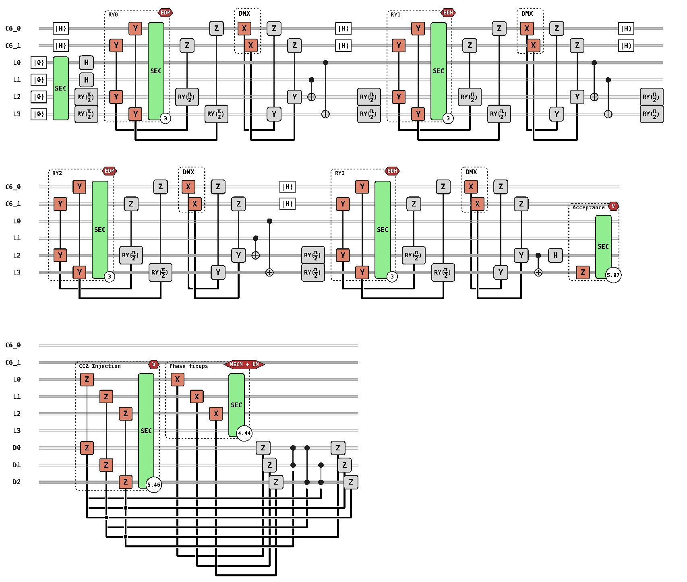

**图 19：Eastinthillation 工厂的物理测量调度。** $\mathrm{C6}_0$ 和 $\mathrm{C6}_1$ 是分别取自两个不同 C6 码块的逻辑量子比特；这两个 C6 码块专供本工厂的 Q66 块使用。图内 RY0、RY1、RY2、RY3 标记四个旋转注入层，EDM 表示检错测量，DMX 表示 $X$ 基破坏性测量，SEC 表示综合征提取周期，Acceptance 表示接受测量，V 表示 Viterbi 测量，CCZ Injection 表示 CCZ 注入，Phase fixups 表示相位修正，MECM + DM 表示多 Pauli 纠错测量加破坏性测量。$L_0,\ldots,L_3$ 为资源块逻辑线，$D_0,D_1,D_2$ 为数据线；圆圈内的 3、5.07、5.46、4.44 保留其原图 SEC 时长标注。

制备 Q66 资源块需要 Walking Cat 指令集 [1] 中定义的一次逻辑零态制备（LZ）、依次进行的四对 $R_Y(\pi/4)$ 注入，以及最终接受测量。LZ 需要一个 Q66 SEC。每对旋转通过 EDM-3 并行执行，因此需要三个 Q66 SEC。最后一个 C6 SEC 完成后，我们在最后一个 Q66 SEC 进行的同时，为下一对 $R_Y(\pi/4)$ 注入制备输入态。这一制备只需 12.0 个 POC，因此会在下一个 Q66 SEC 开始前完成。加上接受测量的 $\tau_{\mathrm{Vit},16}^{\mathrm{avg}}=5.07$ 个 SEC，制备期间 Q66 块平均被占用 18.07 个 Q66 SEC。最后，由于一个 Q66 SEC 的 POC 深度为 $T_{\mathrm{SEC}}^{\mathrm{Q66}}=17$，有

$$
\begin{aligned}
N_{\mathrm{SEC}}^{\mathrm{prep}}&=1+4\times3+5.07=18.07,\\
T_{\mathrm{prep}}^{(0)}&=N_{\mathrm{SEC}}^{\mathrm{prep}}T_{\mathrm{SEC}}^{\mathrm{Q66}}\\
&=18.07\ \mathrm{SEC}\times17\frac{\mathrm{POC}}{\mathrm{SEC}}\\
&=307.19\ \mathrm{POC}.
\end{aligned}
\tag{39}
$$

三个 CCZ 注入测量并行执行。由式 (26)，其联合平均时长为 $\tau_{\mathrm{CCZ}}^{\mathrm{avg}}\approx5.46$ 个 Q102 SEC。

$$
T_{\mathrm{inj}}=\tau_{\mathrm{CCZ}}^{\mathrm{avg}}T_{\mathrm{SEC}}^{\mathrm{Q102}}=147.48\ \mathrm{POC}.
\tag{40}
$$

相位修正调度平均使用 4.44 个 Q66 SEC，随后进行一个 POC 的末端 DMG。其平均深度为

$$
T_{\mathrm{phase}}=\overline N_{\mathrm{SEC}}^{\mathrm{phase}}T_{\mathrm{SEC}}^{\mathrm{Q66}}+1
=4.44\times17+1=76.48\ \mathrm{POC}.
\tag{41}
$$

因此，在没有重启的假设下，从 LZ 开始到释放 Q66 块的深度为

$$
T_{\mathrm{factory}}^{(0)}=T_{\mathrm{prep}}^{(0)}+T_{\mathrm{inj}}+T_{\mathrm{phase}}=531.15\ \mathrm{POC}.
\tag{42}
$$

接下来计入检测到错误时重启协议增加的深度。四个 $R_Y(\pi/4)$ 注入层中的每一层都并行执行两项 EDM-3 测量。每个关联的三个 SEC 之后，或最终接受测量之后，都可能检测到错误。用 $k\in\{1,2,3,4\}$ 标记注入层，用 $j\in\{1,2,3\}$ 标记该层的 SEC。第 $k$ 层第 $j$ 个 SEC 后的累计深度为

$$
d_{k,j}=1+3(k-1)+j.
\tag{43}
$$

因此，第 1 至第 4 层的三个注入检查点分别位于 $(2,3,4)$、$(5,6,7)$、$(8,9,10)$ 和 $(11,12,13)$ 个 Q66 SEC 的深度处。最终接受测量在深度

$$
d_{\mathrm{par}}=1+4\times3+\tau_{\mathrm{Vit},16}^{\mathrm{avg}}=18.07\ \mathrm{SEC}
\tag{44}
$$

处报告失败。

随后，我们计算一个 $R_Y(\pi/4)$ 注入层中两项并行 EDM-3 测量每个 SEC 之后的错误检测概率。第一个 SEC 之后，只有任一 C6 SEC 报告错误才会重启。第二个和第三个 SEC 之后，如果任一 C6 SEC 报告错误，或者 EDM 结果的奇偶性不一致，都会重启。我们将后两种情况写为不相交事件：

$$
\begin{aligned}
\Pr(\text{在该 SEC 处重启})
={}&\Pr(\text{C6 SEC 错误})\\
&+\Pr(\text{C6 SEC 均接受})\,\Pr(\text{EDM 结果不一致}).
\end{aligned}
\tag{45}
$$

在第一个 SEC 之后不能检测 EDM 不一致，因为此时每个 EDM-3 序列都只有一个结果。第二个和第三个 SEC 可以检测累计结果之间的不一致。

令 $f=p_{\mathrm{flip}}=3.99\times10^{-3}$。一个 EDM-3 序列在经过 $m$ 个 SEC 后仍一致，当且仅当全部 $m$ 个结果都正确或全部都翻转。两个并行 EDM-3 序列在 $m\in\{2,3\}$ 个 SEC 内各自保持一致的概率为

$$
\begin{aligned}
u_m&=\bigl[(1-f)^m+f^m\bigr]^2,\\
u_2&=0.984167,\qquad u_3=0.976298.
\end{aligned}
\tag{46}
$$

一轮中两个 C6 SEC 均接受的概率为

$$
c=(1-r_{\mathrm{SEC}}^{\mathrm{C6}})^2=0.993550,\qquad1-c=0.00644957.
\tag{47}
$$

其中 $1-c$ 是至少一个 C6 SEC 报告错误的概率。以已经到达某个 SEC 为条件，第一个、第二个和第三个 SEC 之后的重启概率分别为

$$
\begin{aligned}
e_1&=1-c,\\
e_2&=(1-c)+c(1-u_2)=1-cu_2,\\
e_3&=(1-c)+c\left(1-\frac{u_3}{u_2}\right)=1-c\frac{u_3}{u_2}.
\end{aligned}
\tag{48}
$$

每个表达式的第一项都是 C6 SEC 拒绝概率。$e_2$ 和 $e_3$ 的第二项是两个 C6 SEC 均接受、但 EDM 结果不一致的概率。

每个注入层需要两次零级输入态对制备。两次制备均接受的概率为 $h=(1-r_{\mathrm{rej}}^{(0)})^2$。如果任何一次制备拒绝，就重复这一并行制备批次。第一批的深度为 $T_{\mathrm{dist}}^{(0)}=12$ 个 POC，隐藏于 17 个 POC 的 Q66 调度窗口内。每增加一批，就增加 $12/17$ 个 Q66 SEC。批次数服从几何分布，因此每个已到达的注入层所增加的平均关键路径深度为

$$
\delta_{H^2}=\frac{12}{17}\left(\frac1h-1\right)=0.00508\ \text{个 Q66 SEC}.
\tag{49}
$$

所以，C6 拒绝会延迟注入层，但不要求完整重启工厂。当两个输入都可用后，一个并行注入层完成的概率为

$$
a=c^3u_3=a_{RY}^2=0.957529.
\tag{50}
$$

以开始并行 EDM-3 测量为条件，尝试分别在第一个、第二个和第三个 SEC 之后终止的概率为

$$
\begin{aligned}
g_1&=e_1,\\
g_2&=ce_2,\\
g_3&=c^2u_2e_3.
\end{aligned}
\tag{51}
$$

这些概率满足 $\sum_{j=1}^3g_j=1-a$。到达第 $k$ 层的概率为 $a^{k-1}$，因此在该层第 $j$ 个检查点无条件重启的概率为 $a^{k-1}g_j$。

接受测量以概率 $a^4$ 被执行，并以概率 $r_{\mathrm{par}}$ 检测到注入故障。其无条件重启概率为

$$
q_{\mathrm{par}}=a^4r_{\mathrm{par}}=5.14\times10^{-7}.
\tag{52}
$$

一次尝试的成功概率为

$$
A=a^4(1-r_{\mathrm{par}})=0.840636.
\tag{53}
$$

每个被接受态在各检查点的期望失败次数，等于该检查点的无条件概率除以 $A$。因此，平均制备深度为

$$
\begin{aligned}
\overline N_{\mathrm{SEC}}^{\mathrm{prep}}
={}&N_{\mathrm{SEC}}^{\mathrm{prep}}+\frac1A\left[
\sum_{k=1}^{4}a^{k-1}\left(\delta_{H^2}+\sum_{j=1}^{3}g_jd_{k,j}\right)
+q_{\mathrm{par}}d_{\mathrm{par}}\right]\\
={}&18.07+1.44730=19.5173\ \mathrm{SEC},\\
\overline T_{\mathrm{prep}}
={}&\overline N_{\mathrm{SEC}}^{\mathrm{prep}}T_{\mathrm{SEC}}^{\mathrm{Q66}}=331.79\ \mathrm{POC}.
\end{aligned}
\tag{54}
$$

CCZ 注入和相位修正阶段只在奇偶校验接受后执行。其 Viterbi 重复代价已经计入式 (40) 和式 (41)。因此，每个被接受并消耗的 CCZ 态的完整平均深度为

$$
\overline T_{\mathrm{factory}}=\overline T_{\mathrm{prep}}+T_{\mathrm{inj}}+T_{\mathrm{phase}}=555.75\ \mathrm{POC}.
\tag{55}
$$

**工厂占用。** 如果一组工厂合在一起生成一个魔法态的平均时间短于每次态注入的平均时间，我们就称这一工厂数量足以连续供应 CCZ 态。点加法电路一次至多执行一个 Toffoli 门。一个 Q102 存储块占用 CCZ 注入接口 $\tau_{\mathrm{CCZ}}^{\mathrm{avg}}\approx5.46$ 个 Q102 SEC，因此至多每 $T_{\mathrm{inj}}=147.48$ 个 POC 消耗一个 CCZ 态。由于一个工厂平均每 555.75 个 POC 提供一个被接受态，维持这一消耗率所需的工厂数为

$$
N_{\mathrm{CCZ}}=
\left\lceil\frac{\overline T_{\mathrm{factory}}}{\tau_{\mathrm{CCZ}}^{\mathrm{avg}}T_{\mathrm{SEC}}^{\mathrm{Q102}}}\right\rceil
=\left\lceil\frac{555.75}{147.48}\right\rceil=4.
\tag{56}
$$

每个 Eastinthillation 工厂使用一个 Q66 块、三个权重为 16 的猫态工厂、两个专用零级 C6 源块，以及为每个 C6 块配备的一个六量子比特 C6 Bell 态源。根据第 E 1 节的推导，这对应每个工厂 319 个物理量子比特，四个工厂共 1,276 个物理量子比特。所得布局如图 20 所示。

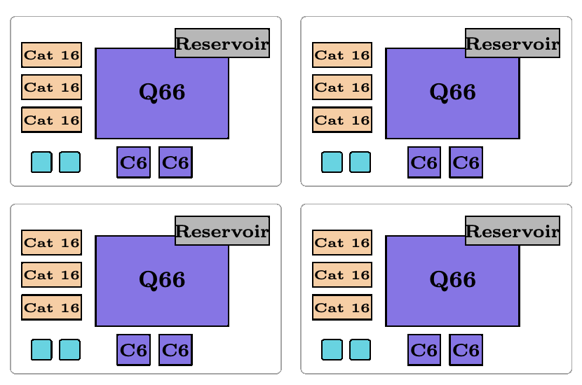

**图 20：维持应用消耗率所需的四个 Eastinthillation 工厂的布局。** 每个 Q66 块紧邻三个权重为 16 的猫态工厂，并有两个专用零级 C6 $T$ 态工厂。每个工厂左下角的两个青色位置是其局部六量子比特 C6 Bell 态源。图内 Reservoir 表示“储备区”，Cat 16 表示“权重为 16 的猫态工厂”，Q66 和 C6 保留为码块名称。

**逻辑错误率。** Eastin 的精确输出错误公式，在假设 $R_Y(\pi/4)$ 注入只产生 $Y$ 型或 $X$ 型错误时，给出 $28p_{Y,\mathrm{inj}}^2$。使用式 (17)，得到

$$
p_{L,\mathrm{in}}^{\mathrm{Eastin}}\lesssim28p_{Y,\mathrm{inj}}^2
\lesssim28(7.65\times10^{-8})^2=1.64\times10^{-13}.
\tag{57}
$$

Q66 每个 SEC 的逻辑错误率为 $p_{L,\mathrm{SEC}}^{\mathrm{Q66}}=2.63\times10^{-11}$。制备期间，Q66 块经历 $\overline N_{\mathrm{SEC}}^{\mathrm{prep}}$ 个 Q66 SEC。CCZ 注入期间，一个 Q102 SEC 的时长相当于 $T_{\mathrm{SEC}}^{\mathrm{Q102}}/T_{\mathrm{SEC}}^{\mathrm{Q66}}=27/17$ 个 Q66 SEC，而相位修正调度增加 $\overline N_{\mathrm{SEC}}^{\mathrm{phase}}$ 个 Q66 SEC。对输入错误、接受测量、CCZ 注入、相位修正和 Q66 SEC 的各项贡献使用并集界，得到

$$
\begin{aligned}
p_L^{\mathrm{Eastin}}\lesssim{}&p_{L,\mathrm{in}}^{\mathrm{Eastin}}+p_{\mathrm{Vit},16}
+3p_{\mathrm{Vit},36}+\frac{224}{256}p_{\mathrm{MECM},16}\\
&+\left(\overline N_{\mathrm{SEC}}^{\mathrm{prep}}
+\tau_{\mathrm{CCZ}}^{\mathrm{avg}}\frac{T_{\mathrm{SEC}}^{\mathrm{Q102}}}{T_{\mathrm{SEC}}^{\mathrm{Q66}}}
+\overline N_{\mathrm{SEC}}^{\mathrm{phase}}\right)p_{L,\mathrm{SEC}}^{\mathrm{Q66}}
\end{aligned}
\tag{58}
$$

$$
\begin{aligned}
={}&7.80\times10^{-11}
+\left(19.5173+\tau_{\mathrm{CCZ}}^{\mathrm{avg}}\frac{27}{17}+4.44\right)(2.63\times10^{-11})\\
={}&9.36\times10^{-10}.
\end{aligned}
\tag{59}
$$

在上述错误模型下，逻辑错误率满足

$$
p_L^{\mathrm{Eastin}}\lesssim9.36\times10^{-10}.
\tag{60}
$$

Q66 存储错误对这一界限的贡献最大，比其他贡献大两个数量级；除此以外，该方案能够产生逻辑错误率为 $10^{-13}$ 量级的 CCZ 门。使用距离更大的码，或使用丢失与泄漏信息的译码器，例如文献 [81]，可以达到这一低限。也可以利用译码器中的软信息：工厂能够在输出被使用之前，拒绝并重启置信度较低的尝试 [82,83]。

##### 4. 转换为 T 态工厂

原文定位：印刷页码 40–41；PDF 页序 40–41。

分窗口的半经典逆量子傅里叶变换（iQFT）需要任意角度的 $Z$ 旋转，这些旋转可使用混合与回退（mixing+fallback）方法 [84]，通过 $T$ 门近似综合。如果依次执行这些旋转、前馈测量结果，并根据累计测量结果计算角度，那么每个窗口只需 16 次 $Z$ 旋转。所有 iQFT 总计需要 464 次 $Z$ 旋转，每次旋转使用 $0.57\log_2(1/\varepsilon)+8.83$ 个 $T$ 门，其中 $\varepsilon$ 是每次旋转的近似误差。

然而，Eastinthillation 工厂只能制备 CCZ 态。我们可以改变其组件的用途，使之转为生产 $T$ 态。本地 C6 $T$ 态工厂将所需 $T$ 态注入 Q66 码块，使这些态能够安全地存储在存储器中。随后按需将它们传态到 Q102 码块。采用测得的每个被接受态对 $1.30\times10^{-8}$ 的逻辑错误率，并以最小化总钻石范数距离为目标，我们得到最优值 $\varepsilon=5.30\times10^{-9}$ 和平均 $T$ 门序列长度 24.5。由此，需要的 $T$ 态对总数的期望值为 5,684。

于是，由并集界可知，整个 iQFT 阶段的失败概率至多为

$$
\begin{aligned}
p_{\mathrm{iQFT}}
&\le 5{,}684\left(1.30\times10^{-8}\right)+464\left(5.30\times10^{-9}\right)\\
&=7.64\times10^{-5}.
\end{aligned}
\tag{61}
$$

## 第 VI 部分：结论

原文定位：印刷页码 41；PDF 页序 41。

我们给出了利用 Shor 算法求解 `secp256k1` 上 ECDLP 的优化量子电路，为该实现的成功概率推导了严格的界——其中考虑了近似算术带来的相位误差和输出误差——并使用自己的编译工具链，将实现编译到针对该应用扩展的 Walking Cat 架构 [1]，从而能够准确计入布局和路由所带来的开销。通过结合量子电路、编译和架构方面的改进，我们说明：一台拥有 20,000 个量子比特的囚禁离子量子计算机应当能够在 26 天内求解 `secp256k1` 上的 ECDLP。由于我们有意优先选择简单、统一的实现，而没有穷尽各种协同优化，我们预期未来工作能够进一步改善本文报告的运行时间、物理量子比特占用和成功概率。

在资源估计中，我们考虑了文献中通常忽略的硬件细节。这使我们能够对运行时间和占用估计更有把握。例如，囚禁离子架构的一项主要问题是丢失级联；我们在最初的 Walking Cat 架构中曾着重处理这一问题。当一个离子丢失后，如果为执行双量子比特门而将它所在的势阱与另一个离子所在的势阱合并，那么电极配置将不再适合最优俘获条件。这可能使剩余离子显著升温，进而从阱中逸出。该架构中开发的泄漏与丢失抑制单元（leakage and loss reduction units，LLRU）假定这种逸出以 100% 的概率发生。然而，当势阱足够深时，情况可能并非如此。本文采用另一种丢失传播模型：离子不会逸出，但在势阱分离后的最终位置随机化；我们开发了一种新的 LLRU 来处理这一丢失传播模型。我们预计实际物理情形更加细致，需要结合详细的微架构来考虑升温和逸出，但将其留作未来工作。

我们的若干技术也可以减少其他容错量子算法的资源需求，例如化学、凝聚态物理和优化算法 [9, 14]。特别是，利用逻辑 CliNR 清除 Clifford 标架的方法，以及我们的集成路由，都可纳入通用 Walking Cat 架构，而无需任何额外的硬件要求。通过互不重叠的基于猫态的测量来提高逻辑测量并行度，也很容易加入 Walking Cat 架构，代价是调整码块分配，以便在目标码块附近提供更高的猫态吞吐量。最后，与将 CCZ 编译为 Clifford 门和 $T$ 门的做法相比，我们的快速 CCZ 实现提供了 $31\times$ 的加速。我们将定量研究这些优化对 ECDLP 以外量子计算应用的影响留作未来工作。

### 致谢

作者感谢 Chris Ballance、Tom Harty 和 Matt Keesan 的讨论与支持。MR 感谢 Christof Zalka 的友谊与启发，并感谢 Franziska Burkhalter 的讨论。

作者声明曾使用生成式 AI 工具辅助代码与图形生成、探索不同证明策略，以及审查和校对稿件。稿件完全由作者撰写，作者对其内容承担全部责任。

### 参考文献

> [!note] 译注
> 本节完整保留原文参考文献 [1]–[87] 的英文条目、编号与书目信息；仅合并原版跨栏、跨页及行末断词。

[1] F. Tripier, W. C. Chung, J. Young, S. Alam, B. Bjork, A. Brodutch, F. L. Buessen, N. J. Coble, T. Dellaert, D. Maslov, M. Roetteler, E. Tham, M. Webster, M. Ye, J. Gamble, A. Maksymov, J. P. Marceaux, and N. Delfosse, Fault-tolerant quantum computing with trapped ions: The walking cat architecture, arXiv preprint arXiv:2604.19481 (2026).

[2] A. Schrottenloher, Optimized point addition circuits for elliptic curve discrete logarithms, arXiv preprint arXiv:2606.02235 (2026).

[3] P. W. Shor, Polynomial-time algorithms for prime factorization and discrete logarithms on a quantum computer, SIAM Journal on Computing 26, 1484 (1997).

[4] V. von Burg, G. H. Low, T. Häner, D. S. Steiger, M. Reiher, M. Roetteler, and M. Troyer, Quantum computing enhanced computational catalysis, Physical Review Research 3, 033055 (2021).

[5] J. Lee, D. W. Berry, C. Gidney, W. J. Huggins, J. R. McClean, N. Wiebe, and R. Babbush, Even more efficient quantum computations of chemistry through tensor hypercontraction, PRX Quantum 2, 030305 (2021).

[6] L. Zhao, J. J. Goings, W. Aboumrad, A. Arrasmith, L. Calderin, S. Churchill, D. Gabay, T. Harvey-Brown, M. Hiles, M. Kaja, M. Keesan, K. Kulesz, A. Maksymov, M. Maruo, M. Muñoz, B. Nijholt, R. Schiller, Y. de Sereville, A. Smidutz, F. Tripier, G. Yao, T. Zaveri, C. Collins, M. Roetteler, E. Epifanovsky, A. Kovyrshin, L. Tornberg, A. Broo, J. R. Hammond, Z. Chandani, P. Khalate, E. Kyoseva, Y.-T. Chen, E. M. Kessler, C. Y.-Y. Lin, G. Ramu, R. Shaffer, M. Brett, B. Huang, M. R. Hugues, and T. Y. Takeshita, Quantum-classical Auxiliary Field Quantum Monte Carlo with matchgate shadows on trapped ion quantum computers, Physical Review Research 8, 033061 (2026), see also arxiv.org preprint https://arxiv.org/abs/2506.22408.

[7] H. Liu, G. H. Low, D. S. Steiger, T. Häner, M. Reiher, and M. Troyer, Prospects of quantum computing for molecular sciences, Materials Theory 6, 11 (2022).

[8] M. E. Beverland, P. Murali, M. Troyer, K. M. Svore, T. Hoefler, V. Kliuchnikov, G. H. Low, M. Soeken, A. Sundaram, and A. Vaschillo, Assessing requirements to scale to practical quantum advantage, arXiv preprint arXiv:2211.07629 (2022).

[9] A. M. Dalzell, S. McArdle, M. Berta, P. Bienias, C.-F. Chen, A. Gilyén, C. T. Hann, M. J. Kastoryano, E. T. Khabiboulline, A. Kubica, G. Salton, S. Wang, and F. G. S. L. Brandão, Quantum algorithms: A survey of applications and end-to-end complexities (Cambridge University Press, 2025).

[10] J. Iaconis, S. Ray, S. Sekwao, C. Girotto, and M. Roetteler, Practical Quantum Topological Data Analysis with applications to high-dimensional feature extraction and time series analysis (2026), arXiv:2607.27206.

[11] S. Ray, J. Jojo, J. Iaconis, A. Gnanasekaran, A. Tiwari, M. Roetteler, C. Hill, and J. Pathak, Quantum Lattice Boltzmann solutions for transport under 3D spatially varying advection on trapped ion hardware, in Proceedings IEEE Quantum Week (QCE’26) (2026) accepted for publication. See also arxiv.org preprint https://arxiv.org/abs/2604.28121.

[12] J. Chen and G. K. Chan, A framework for robust quantum speedups in practical correlated electronic structure and dynamics, arXiv preprint arXiv:2508.15765 (2025).

[13] D. Zhu, M. A. Lopez-Ruiz, F.-H. Rouet, C. Girotto, W. Aboumrad, R. Lucas, A. Kaushik, and M. Roetteler, End-to-end performance of quantum-accelerated large-scale linear algebra workflows, in Proceedings IEEE Quantum Week (QCE’26) (2026) accepted for publication. See also arxiv.org preprint https://arxiv.org/abs/2603.15515.

[14] R. Babbush, R. King, S. Boixo, W. Huggins, T. Khattar, G. H. Low, J. R. McClean, T. O’Brien, and N. C. Rubin, The grand challenge of quantum applications, arXiv preprint arXiv:2511.09124 (2025).

[15] Y. Alexeev, D. Bacon, K. R. Brown, R. Calderbank, L. D. Carr, F. T. Chong, B. DeMarco, D. Englund, E. Farhi, B. Fefferman, A. V. Gorshkov, A. Houck, J. Kim, S. Kimmel, M. Lange, S. Lloyd, M. D. Lukin, D. Maslov, P. Maunz, C. Monroe, J. Preskill, M. Roetteler, M. Savage, and J. Thompson, Quantum computer systems for scientific discovery, PRX Quantum 2, 017001 (2021).

[16] M. Ekerå and J. Håstad, Quantum algorithms for computing short discrete logarithms and factoring rsa integers, in International Workshop on Post-Quantum Cryptography (Springer, 2017) pp. 347–363.

[17] A. May and L. Schlieper, Quantum period finding is compression robust, arXiv preprint arXiv:1905.10074 (2019).

[18] C. Gidney and M. Ekerå, How to factor 2048 bit rsa integers in 8 hours using 20 million noisy qubits, Quantum 5, 433 (2021).

[19] C. Chevignard, P.-A. Fouque, and A. Schrottenloher, Reducing the number of qubits in quantum factoring, in Annual International Cryptology Conference (Springer, 2025) pp. 384–415.

[20] N. C. Jones, R. Van Meter, A. G. Fowler, P. L. McMahon, J. Kim, T. D. Ladd, and Y. Yamamoto, Layered architecture for quantum computing, Physical Review X 2, 031007 (2012).

[21] A. G. Fowler, M. Mariantoni, J. M. Martinis, and A. N. Cleland, Surface codes: Towards practical large-scale quantum computation, Physical Review A 86, 032324 (2012).

[22] C. Gidney, How to factor 2048 bit RSA integers with less than a million noisy qubits, arXiv preprint arXiv:2505.15917 (2025).

[23] P. Webster, L. Berent, O. Chandra, E. T. Hockings, N. Baspin, F. Thomsen, S. C. Smith, and L. Z. Cohen, The pinnacle architecture: Reducing the cost of breaking RSA-2048 to 100 000 physical qubits using quantum LDPC codes, arXiv preprint arXiv:2602.11457 (2026).

[24] J. Proos and C. Zalka, Shor’s discrete logarithm quantum algorithm for elliptic curves, arXiv preprint quantph/0301141 (2003).

[25] M. Roetteler, M. Naehrig, K. M. Svore, and K. Lauter, Quantum resource estimates for computing elliptic curve discrete logarithms, in Asiacrypt 2017 (Springer, 2017) pp. 241–270.

[26] T. Häner, S. Jaques, M. Naehrig, M. Roetteler, and M. Soeken, Improved quantum circuits for elliptic curve discrete logarithms, in PQCrypto 2020 (Springer, 2020) pp. 425–444.

[27] D. Litinski, How to compute a 256-bit elliptic curve private key with only 50 million Toffoli gates, arXiv preprint arXiv:2306.08585 (2023).

[28] R. Babbush, A. Zalcman, C. Gidney, M. Broughton, T. Khattar, H. Neven, T. Bergamaschi, J. Drake, and D. Boneh, Securing elliptic curve cryptocurrencies against quantum vulnerabilities: Resource estimates and mitigations, arXiv preprint arXiv:2603.28846 (2026).

[29] S. A. Cuccaro, T. G. Draper, S. A. Kutin, and D. P. Moulton, A new quantum ripple-carry addition circuit (2004) arXiv:quant-ph/0410184.

[30] Y. Takahashi, S. Tani, and N. Kunihiro, Quantum addition circuits and unbounded fan-out, Quantum Information and Computation 10, 872 (2010), arXiv:0910.2530.

[31] C. Chevignard, P.-A. Fouque, and A. Schrottenloher, Reducing the number of qubits in quantum discrete logarithms on elliptic curves, in Annual International Conference on the Theory and Applications of Cryptographic Techniques (Springer, 2026) pp. 371–401.

[32] H. Luo, Z. Yang, J. Luo, Z. Wang, Y. Su, X. Sun, L. Li, and T. Li, Quantum algorithm for elliptic curve discrete logarithms with space-efficient point addition, arXiv preprint arXiv:2607.13816 (2026).

[33] M. Cain, Q. Xu, R. King, L. R. Picard, H. Levine, M. Endres, J. Preskill, H.-Y. Huang, and D. Bluvstein, Shor’s algorithm is possible with as few as 10,000 reconfigurable atomic qubits, arXiv preprint arXiv:2603.28627 (2026).

[34] S. Baek, S.-H. Lee, D. Min, and J. Kim, Sdqc: Distributed quantum computing architecture utilizing entangled ion qubit shuttling, arXiv preprint arXiv:2512.02890 (2025).

[35] É. Gouzien, D. Ruiz, F.-M. Le Régent, J. Guillaud, and N. Sangouard, Performance analysis of a repetition cat code architecture: Computing 256-bit elliptic curve logarithm in 9 hours with 126 133 cat qubits, Physical Review Letters 131, 040602 (2023).

[36] C. Gidney, Halving the cost of quantum addition, Quantum 2, 74 (2018).

[37] M. Ekerå, Revisiting Shor’s quantum algorithm for computing general discrete logarithms, arXiv preprint arXiv:1905.09084 (2019).

[38] J. I. Cirac and P. Zoller, Quantum computations with cold trapped ions, Physical review letters 74, 4091 (1995).

[39] C. Monroe, D. M. Meekhof, B. E. King, W. M. Itano, and D. J. Wineland, Demonstration of a fundamental quantum logic gate, Physical review letters 75, 4714 (1995).

[40] D. Kielpinski, C. Monroe, and D. J. Wineland, Architecture for a large-scale ion-trap quantum computer, Nature 417, 709 (2002).

[41] C. Monroe, R. Raussendorf, A. Ruthven, K. R. Brown, P. Maunz, L.-M. Duan, and J. Kim, Large-scale modular quantum-computer architecture with atomic memory and photonic interconnects, Physical Review A 89, 022317 (2014).

[42] C. D. Bruzewicz, J. Chiaverini, R. McConnell, and J. M. Sage, Trapped-ion quantum computing: Progress and challenges, Applied physics reviews 6 (2019).

[43] M. Malinowski, D. Allcock, and C. Ballance, How to wire a 1000-qubit trapped-ion quantum computer, PRX quantum 4, 040313 (2023).

[44] N. P. Breuckmann and J. N. Eberhardt, Quantum low-density parity-check codes, PRX quantum 2, 040101 (2021).

[45] E. Dennis, A. Kitaev, A. Landahl, and J. Preskill, Topological quantum memory, Journal of Mathematical Physics 43, 4452 (2002).

[46] A. C. Hughes, R. Srinivas, C. Löschnauer, H. Knaack, R. Matt, C. Ballance, M. Malinowski, T. Harty, and R. Sutherland, Trapped-ion two-qubit gates with¿ 99.99% fidelity without ground-state cooling, arXiv preprint arXiv:2510.17286 (2025).

> [!note] 译注
> 原文参考文献 [46] 的题名中出现字符“¿”；此处按原样保留。

[47] C. Löschnauer, J. Mosca Toba, A. Hughes, S. King, M. Weber, R. Srinivas, R. Matt, R. Nourshargh, D. Allcock, C. Ballance, et al., Scalable, high-fidelity all-electronic control of trapped-ion qubits, PRX Quantum 6, 040313 (2025).

[48] P. Selinger, Quantum circuits of t-depth one, Physical Review A—Atomic, Molecular, and Optical Physics 87, 042302 (2013).

[49] C. Jones, Low-overhead constructions for the fault-tolerant Toffoli gate, Physical Review A 87, 022328 (2013).

[50] D. Maslov, On the advantages of using relative phase Toffolis with an application to multiple control Toffoli optimization, Physical Review A 93, 022311 (2016).

[51] M. Webster and N. Delfosse, Fast logical operations in quantum LDPC codes using simple resource states, arXiv preprint arXiv:2607.16166 (2026).

[52] T. Khattar, N. Shutty, C. Gidney, A. Zalcman, N. Yosri, D. Maslov, R. Babbush, and S. P. Jordan, Verifiable quantum advantage via optimized DQI circuits, arXiv preprint arXiv:2510.10967 (2025).

[53] A. A. Karatsuba and Y. P. Ofman, Multiplication of many-digital numbers by automatic computers, in Doklady Akademii Nauk, Vol. 145 (Russian Academy of Sciences, 1962) pp. 293–294.

[54] D. Litinski, Quantum schoolbook multiplication with fewer Toffoli gates, arXiv preprint arXiv:2410.00899 (2024).

[55] E. Bernstein and U. Vazirani, Quantum complexity theory, in Proceedings of the twenty-fifth annual ACM symposium on Theory of computing (1993) pp. 11–20.

[56] M. Mosca, Quantum computer algorithms, Ph.D. thesis, University of Oxford. 1999. (1999).

[57] R. B. Griffiths and C.-S. Niu, Semiclassical Fourier transform for quantum computation, Physical Review Letters 76, 3228 (1996).

[58] Y. R. Sanders, D. W. Berry, P. C. Costa, L. W. Tessler, N. Wiebe, C. Gidney, H. Neven, and R. Babbush, Compilation of fault-tolerant quantum heuristics for combinatorial optimization, PRX Quantum 1, 020312 (2020).

[59] D. Wecker, M. B. Hastings, N. Wiebe, B. K. Clark, C. Nayak, and M. Troyer, Solving strongly correlated electron models on a quantum computer, Physical Review A 92, 062318 (2015).

[60] M. P. Harrigan, T. Khattar, C. Yuan, A. Peduri, N. Yosri, F. D. Malone, R. Babbush, and N. C. Rubin, Expressing and analyzing quantum algorithms with Qualtran (2024), arXiv:2409.04643 [quant-ph].

[61] M. P. Harrigan, T. Khattar, C. Yuan, A. Peduri, N. Yosri, F. D. Malone, R. Babbush, and N. C. Rubin, Qualtran (2026).

[62] PsiQuantum, Quantum resource estimation format (QREF) (2024), open format for representing quantum algorithms for resource estimation.

[63] PsiQuantum, QREF: Quantum resource estimation format, https://psiq.github.io/qref/ (2024), JSON-based domain-specific format for representing quantum algorithms and resource estimation workflows.

[64] D. S. Steiger, T. Häner, and M. Troyer, ProjectQ: An open source software framework for quantum computing, Quantum 2, 49 (2018).

[65] C. Lattner, M. Amini, U. Bondhugula, A. Cohen, A. Davis, J. Pienaar, R. Riddle, T. Shpeisman, N. Vasilache, and O. Zinenko, MLIR: Scaling compiler infrastructure for domain specific computation, in 2021 IEEE/ACM International Symposium on Code Generation and Optimization (CGO) (IEEE, 2021) pp. 2–14, arXiv:2002.11054.

[66] T. G. Draper, S. A. Kutin, E. M. Rains, and K. M. Svore, A logarithmic-depth quantum carry-lookahead adder (2004), arXiv:quant-ph/0406142.

[67] M. Remaud and V. Vandaele, Ancilla-free quantum adder with sublinear depth, in Reversible Computation (RC 2025), Lecture Notes in Computer Science, Vol. 15716 (Springer, 2025) pp. 137–154, arXiv:2501.16802.

[68] T. Häner, V. Kliuchnikov, M. Roetteler, and M. Soeken, Space-time optimized table lookup (2022), arXiv:2211.01133 [quant-ph].

[69] T. Häner, D. S. Steiger, M. Smelyanskiy, and M. Troyer, High performance emulation of quantum circuits, in Proceedings of the International Conference for High Performance Computing, Networking, Storage and Analysis (2016).

[70] E. Knill, Quantum computing with realistically noisy devices, Nature 434, 39 (2005), arXiv:quant-ph/0410199.

[71] G. Baranes, M. Cain, J. P. Bonilla Ataides, D. Bluvstein, J. Sinclair, V. Vuletic, H. Zhou, and M. D. Lukin, Leveraging qubit loss detection in fault tolerant quantum algorithms, Physical Review X 16, 011002 (2026).

[72] J. Preskill, Reliable quantum computers, Proceedings of the Royal Society of London. Series A: Mathematical, Physical and Engineering Sciences 454, 385 (1998).

[73] C. Gidney, Stim: a fast stabilizer circuit simulator, Quantum 5, 497 (2021).

[74] M. Ye, D. Wecker, and N. Delfosse, Beam search decoder for quantum low-density parity-check codes, PRX Quantum 7, 033002 (2026).

[75] P. W. Shor, Fault-tolerant quantum computation, in Proceedings of the 37th Annual Symposium on Foundations of Computer Science (IEEE, 1996) pp. 56–65, arXiv:quant-ph/9605011.

[76] X. Zhou, D. W. Leung, and I. L. Chuang, Methodology for quantum logic gate construction, Physical Review A 62, 052316 (2000), arXiv:quant-ph/0002039.

[77] B. Eastin, Distilling one-qubit magic states into Toffoli states, Physical Review A 87, 032321 (2013).

[78] E. T. Campbell and M. Howard, Unified framework for magic state distillation and multiqubit gate synthesis with reduced resource cost, Physical Review A 95, 022316 (2017).

[79] S. Dasu, S. Burton, K. Mayer, D. Amaro, J. A. Gerber, K. Gilmore, D. Gresh, D. DelVento, A. C. Potter, and D. Hayes, Breaking even with magic: Demonstration of a high-fidelity logical non-Clifford gate, arXiv preprint arXiv:2506.14688 (2025).

[80] H. Goto, Step-by-step magic state encoding for efficient fault-tolerant quantum computation, Scientific Reports 4, 7501 (2014).

[81] P. Liu, S. J. S. Tan, E. Huang, U. A. Acar, H. Zhou, and C. Zhao, Achieving optimal-distance atom-loss correction via Pauli envelope, arXiv preprint arXiv:2603.04156 (2026).

[82] H. Bombín, M. Pant, S. Roberts, and K. I. Seetharam, Fault-tolerant postselection for low-overhead magic state preparation, PRX Quantum 5, 010302 (2024).

[83] S. C. Smith, B. J. Brown, and S. D. Bartlett, Mitigating errors in logical qubits, Communications Physics 7, 386 (2024).

[84] V. Kliuchnikov, K. Lauter, R. Minko, A. Paetznick, and C. Petit, Shorter quantum circuits via single-qubit gate approximation, Quantum 7, 1208 (2023).

[85] C. J. Clopper and E. S. Pearson, The use of confidence or fiducial limits illustrated in the case of the binomial, Biometrika 26, 404 (1934).

[86] Z. J. Wall, J. D. Piel, S. R. Vizvary, M. Bareian, S. Diaz, E. Mossman, A. Ransford, C. H. Greene, E. R. Hudson, and W. C. Campbell, Barium autoionization for efficient ion trap loading, Physical Review A 114, 013102 (2026).

[87] N.-C. Chiu, E. C. Trapp, J. Guo, M. H. Abobeih, L. M. Stewart, S. Hollerith, P. L. Stroganov, M. Kalinowski, A. A. Geim, S. J. Evered, S. H. Li, X. Lyu, L. M. Peters, D. Bluvstein, T. T. Wang, M. Greiner, V. Vuletić, and M. D. Lukin, Continuous operation of a coherent 3,000-qubit system, Nature 646, 1075 (2025).

## 第 VII 部分：附录

### 附录 A：算法

#### A.1 仿射椭圆曲线点加法

（印刷页码 / PDF 页序：45–46。）

本节给出构成我们实现中的仿射椭圆曲线点加法电路的各个算法的整数值表示。算法 4 展示了初始累加点，以及算法 5 所示点加法循环中每个窗口的查找表的经典预计算。共有 $L=\lceil n/w\rceil$ 个大小为 $w$ 的窗口，最高窗口可能不足 $w$ 位。算法 4 通过均匀随机抽取 $a\in\mathbb Z_r^*$ 来抽取随机初始点 $[a]P$，然后先计算包含基点 $P$ 的倍点的 $L$ 张表，再计算包含点 $Q$ 的倍点的 $L$ 张表；我们要求的是 $Q$ 相对于基点 $P$ 的离散对数。它还为表中所有点的 $x$ 坐标计算并保存 $3\cdot x$。

**算法 4：随机化窗口设置**

输入：素数阶为 $r$ 的 $P,Q\in E(\mathbb F_p)$；宽度 $w\ge1$，且 $2^w<r$。

输出：累加器 $A_0$ 和经典增广表 $(T_i)_{i=0}^{2L-1}$。

| 行 | 操作 |
|---:|---|
| 1 | $a_0\xleftarrow{\$}\mathbb Z_r^*;\quad A_0\leftarrow[a_0]P$ |
| 2 | 对 $i=0,\ldots,L-1$： |
| 3 | $\quad\mu_i\xleftarrow{\$}\mathbb Z_r\setminus\{-j2^{iw}\bmod r:0\le j<2^w\}$ |
| 4 | $\quad$对 $j=0,\ldots,2^w-1$： |
| 5 | $\qquad(x_{i,j},y_{i,j})\leftarrow[j2^{iw}+\mu_i]P$ |
| 6 | $\qquad T_i[j]\leftarrow(x_{i,j},y_{i,j},3x_{i,j})$ |
| 7 | 对 $i=L,\ldots,2L-1$： |
| 8 | $\quad\mu_i\xleftarrow{\$}\mathbb Z_r\setminus\{-j2^{(i-L)w}\bmod r:0\le j<2^w\}$ |
| 9 | $\quad$对 $j=0,\ldots,2^w-1$： |
| 10 | $\qquad(x_{i,j},y_{i,j})\leftarrow[j2^{(i-L)w}+\mu_i]Q$ |
| 11 | $\qquad T_i[j]\leftarrow(x_{i,j},y_{i,j},3x_{i,j})$ |
| 12 | 返回 $A_0,(T_i)_{i=0}^{2L-1}$。 |

算法 5 只是遍历全部 $2L$ 个窗口的简单循环，逐次加上相应的表中点。注意，标量 $k$ 和 $l$ 被分解为按窗口划分的 $2^w$ 进制表示：

$$
k=\sum_{i=0}^{L-1}k_i2^{iw},\qquad
l=\sum_{i=0}^{L-1}l_i2^{iw},
$$

各数位 $k_i$ 和 $l_i$ 用来查找正确的表中点，再将其传给算法 6 所示的仿射加法 `AffineAdd`。实际中我们采用 $w=16$，并按照文献 [27] 的方法，仅执行 32 次点加法中的 28 次：以一次查表取代第一次点加法，并舍弃最后 3 次窗口化点加法，改用扩展的经典后处理 [37]。我们从第一个标量的最高 $w$ 位开始，每一步向最低位方向推进，以大小为 $w$ 的分块实现半经典量子傅里叶变换 [57]。

**算法 5：窗口化双标量乘法**

输入：寄存器 $k,l$；累加器 $A=A_0$，以及算法 4 给出的表 $(T_i)_{i=0}^{2L-1}$。

输出：$k,l$ 不变；更新后的累加器 $A$。

| 行 | 操作 |
|---:|---|
| 1 | 对 $i=0,\ldots,L-1$： |
| 2 | $\quad A\leftarrow\operatorname{AffineAdd}(A;k_i,T_i)$ |
| 3 | 对 $i=L,\ldots,2L-1$： |
| 4 | $\quad A\leftarrow\operatorname{AffineAdd}(A;l_{i-L},T_i)$ |
| 5 | 返回 $k,l,A$。 |

仿射加法算法 `AffineAdd` 使用下列子程序。`BinaryGCDRecord` 消耗其输入，保留压缩的 Dialog / 加减记录。`BinaryGCDInvMul` 和 `BinaryGCDMul` 重放这一记录，分别执行原位除法和原位乘法；`BinaryGCDUnrecord` 则恢复输入并清除所有用于记录的工作空间。两种重放分别使用模减半和模倍增。

记号 $\operatorname{Lookup}_{(x,y)}$ 或 $\operatorname{Lookup}_{3x}$ 表示载入指定坐标，而 $m\leftarrow\operatorname{XClear}(u)$ 表示测量并清除查表寄存器，同时记录其 $X$ 基测量结果。最后的 `LookupPhaseFix` 应用延迟执行的查表修正。这里显示的模加法、减法和平方减法都使用近似电路。平方减法电路采用针对 secp256k1 的一次分裂 Karatsuba 版本。注意，在查找 $x$ 坐标的倍数之前，我们先经典地抽取均匀随机掩码 $R\in\mathbb F_p$，再以近似量子—经典加法器将其加到 $x$ 寄存器。这使平方减法电路中的累加器寄存器随机化。在减去平方之后，通过近似加上 $-R\bmod p$ 移除掩码。如果在算法 4 生成查找表时，为第 $i$ 个窗口抽取一个新的偏移量 $R_i$，则可以省去单独的加法步骤 $x\leftarrow(x+R)\bmod p$。此时表中保存 $3x_{i,j}+R_i$，而非 $3x_{i,j}$；查表直接得到加掩码后的值，因此无需单独相加。

**算法 6：AffineAdd：使用直接值二进制 gcd 算术的仿射加法**

输入：累加器 $(x,y)=P_1$；选择值 $j$；表 $T$，其中 $T[j]=(x_2,y_2,3x_2)$，且 $P_2=(x_2,y_2)\ne\mathcal O$。

输出：执行成功时，$(x,y)=P_1+P_2$；$j$ 不变。

| 行 | 操作 |
|---:|---|
| 1 | $(x_2,y_2)\leftarrow\operatorname{Lookup}_{(x,y)}(T,j)$ |
| 2 | $x\leftarrow(x-x_2)\bmod p$ |
| 3 | $m_x^{(1)}\leftarrow\operatorname{XClear}(x_2)$ |
| 4 | $y\leftarrow(y-y_2)\bmod p$ |
| 5 | $m_y^{(1)}\leftarrow\operatorname{XClear}(y_2)$ |
| 6 | $\rho\leftarrow\operatorname{BinaryGCDRecord}(x)$ |
| 7 | $y\leftarrow\operatorname{BinaryGCDInvMul}(\rho,y)$ |
| 8 | $x\leftarrow\operatorname{BinaryGCDUnrecord}(\rho)$ |
| 9 | $R\xleftarrow{\$}\mathbb F_p$ |
| 10 | $x\leftarrow(x+R)\bmod p$ |
| 11 | $x_2\leftarrow\operatorname{Lookup}_{3x}(T,j)$ |
| 12 | $x\leftarrow(x+x_2)\bmod p$ |
| 13 | $m_x^{(2)}\leftarrow\operatorname{XClear}(x_2)$ |
| 14 | $x\leftarrow(x-y^2)\bmod p$ |
| 15 | $x\leftarrow(x+(-R\bmod p))\bmod p$ |
| 16 | $\rho\leftarrow\operatorname{BinaryGCDRecord}(x)$ |
| 17 | $y\leftarrow\operatorname{BinaryGCDMul}(\rho,y)$ |
| 18 | $x\leftarrow\operatorname{BinaryGCDUnrecord}(\rho)$ |
| 19 | $(x_2,y_2)\leftarrow\operatorname{Lookup}_{(x,y)}(T,j)$ |
| 20 | $y\leftarrow(y-y_2)\bmod p$ |
| 21 | $x\leftarrow(x-x_2)\bmod p$ |
| 22 | $x\leftarrow-x\bmod p$ |
| 23 | $m_x^{(3)}\leftarrow\operatorname{XClear}(x_2)$ |
| 24 | $m_y^{(3)}\leftarrow\operatorname{XClear}(y_2)$ |
| 25 | $(m_x,m_y)\leftarrow(m_x^{(1)}\oplus m_x^{(3)},m_y^{(1)}\oplus m_y^{(3)})$ |
| 26 | $\operatorname{LookupPhaseFix}(T,j;m_x,m_y,m_x^{(2)})$ |
| 27 | 返回 $x,y,j$。 |

#### A.2 模平方减法

（印刷页码 / PDF 页序：45–47。）

本节用明确的整数值算法描述模 $p$ 减去平方的操作，即把 $|x\rangle|y\rangle$ 映射为 $|x\rangle|(y-x^2)\bmod p\rangle$。主算法是算法 7。它使用 $\operatorname{AddBMultiple}_{\pm}^{q}$（算法 10）、$\operatorname{AddCMultiple}_{-}^{q}$（算法 11）和 $\operatorname{AddSlice}_{\sigma}^{q}$（算法 8）；后者使用 $\operatorname{PhaseGE}^{q}$（算法 9），并且自身也是 `AddBMultiple` 和 `AddCMultiple` 的组成部分。

我们将输入值视为小于 $2^n$ 的整数，它们未必是小于 $p$ 的规范代表元。中间结果也都是由各自位宽表示的整数值。除 `PhaseGE` 显式显示相位 $\phi$ 外，所有算法签名中都隐含相位。对 $\phi$ 的赋值记录当前计算基分支获得的相位。

对于曲线 secp256k1 的具体参数，$\operatorname{AddBMultiple}_{\pm}^{q}$ 和 $\operatorname{AddCMultiple}_{-}^{q}$ 使用由下列列表给出的 $c$ 的带符号二进制表示：

$$
T_c=((32,+1),(10,+1),(6,-1),(4,+1),(0,+1)),
$$
$$
c=\sum_{(d,\epsilon)\in T_c}\epsilon2^d
=2^{32}+2^{10}-2^6+2^4+1.
$$

除给定的曲线参数 $n,c$ 外，进位传播宽度 $\kappa$、局部进位填充宽度 $\rho$ 和相位比较宽度 $\delta$ 都是正整数，可选择不同的值以作不同取舍。我们假设 $\rho\ge0$、$1\le\delta\le n/2$、$\kappa\ge1$、$2c\le2^\kappa\le2^n$、$32+n/2+2+\rho<n$、$\kappa+\rho<n$，从而确保这些操作中的所有切片和窗口调用均有良好定义。

**算法 7：单层 Karatsuba 平方减法**

输入：$x,y\in\mathbb Z$，$0\le x,y<p$，控制位 $q\in\{0,1\}$；所需相位比较宽度 $\delta\in\mathbb Z_{\ge1}$，$\delta\le n/2$。

输出：$x,y\leftarrow x,y'$，其中 $y'\in[0,p)$，$y'\equiv y-qx^2\pmod p$（在无失败执行下）。

| 行 | 操作 | 注释 |
|---:|---|---|
| 1 | $x_L\equiv x_{[0,n/2)};\ x_H\equiv x_{[n/2,n)}$ | 寄存器视图；$x=Bx_H+x_L$。 |
| 2 | $v\leftarrow x_L^2$ | 在 $n$ 位工作寄存器中精确计算整数平方。 |
| 3 | $(v,y)\leftarrow\operatorname{AddBMultiple}_{+}^{q}(v,y;n;\delta)$ | 加上 $Bx_L^2$。 |
| 4 | $(v,y)\leftarrow\operatorname{AddSlice}_{-}^{q}(v,y;n,0,n,0;\delta)$ | 加上 $-x_L^2$。 |
| 5 | $v\leftarrow0$ | 反计算 $x_L^2$。 |
| 6 | $v\leftarrow x_H^2$ | 在 $n$ 位工作寄存器中精确计算整数平方。 |
| 7 | $(v,y)\leftarrow\operatorname{AddBMultiple}_{+}^{q}(v,y;n;\delta)$ | 加上 $Bx_H^2$。 |
| 8 | $(v,y)\leftarrow\operatorname{AddCMultiple}_{-}^{q}(v,y;\delta)$ | 加上 $-cx_H^2$。 |
| 9 | $v\leftarrow0$ | 反计算 $x_H^2$。 |
| 10 | $u\leftarrow0;\ \widehat x_H\equiv x_H+uB$ | 附加一个干净比特；不复制 $x_H$。 |
| 11 | $\widehat x_H\leftarrow\widehat x_H+x_L$ | 原位覆盖 $x$ 的高半部分。 |
| 12 | $v\leftarrow\widehat x_H^2$ | 在 $(n+2)$ 位工作寄存器中精确计算整数平方。 |
| 13 | $(v,y)\leftarrow\operatorname{AddBMultiple}_{-}^{q}(v,y;n+2;\delta)$ | 加上 $-B\widehat x_H^2$。 |
| 14 | $v\leftarrow0$ | 反计算 $\widehat x_H^2$。 |
| 15 | $\widehat x_H\leftarrow\widehat x_H-x_L$ | 恢复 $x_H$ 并清除 $u$。 |
| 16 | 释放干净比特 $u$。 | |
| 17 | 返回 $x,y$。 | |

**算法 8：$\operatorname{AddSlice}_{\sigma}^{q}(s,v;n_s,o,w,t;\delta)$**

输入：$s,v\in\mathbb Z$，$0\le s<2^{n_s}$，$n_s\in\mathbb Z_{\ge1}$，$0\le v<2^n$；$0\le o<n_s$；$1\le w\le n_s-o$；$0\le t\le n-w$；符号 $\sigma\in\{+1,-1\}$；所需相位比较宽度 $\delta\in\mathbb Z_{\ge1}$；或者 $t+w+\rho<n$，或者 $t+w=n$ 且 $\delta\le w$；控制位 $q\in\{0,1\}$。

输出：$s,v\leftarrow s,v'$，其中 $v'\in[0,2^n)$，$v'\equiv v+q\sigma2^t s_{[o,o+w)}\pmod p$（在无失败执行下）。

| 行 | 操作 | 注释 |
|---:|---|---|
| 1 | $a\equiv s_{[o,o+w)}$ | |
| 2 | 若 $\sigma=-1$： | |
| 3 | $\quad v_{[0,\kappa)}\leftarrow v_{[0,\kappa)}+c\pmod{2^\kappa}$ | 在低位修正窗口中加上 $c$。 |
| 4 | $\quad v\leftarrow(2^n-1)-v$ | 进入取补后的表示方向。 |
| 5 | 若 $t+w+\rho<n$： | |
| 6 | $\quad v_{[t,t+w+\rho)}\leftarrow v_{[t,t+w+\rho)}+qa\pmod{2^{w+\rho}}$ | 为 $a$ 补 $\rho$ 个零位。 |
| 7 | 否则： | |
| 8 | $\quad(v_{[t,n)},h)\leftarrow v_{[t,n)}+qa$ | 此时 $t+w=n$。 |
| 9 | $\quad v_{[0,\kappa)}\leftarrow v_{[0,\kappa)}+hc\pmod{2^\kappa}$ | 将 $h2^n$ 折回为 $hc$。 |
| 10 | $\quad m\leftarrow\operatorname{Measure}_X(h)$ | 测量并清除进位。 |
| 11 | $\quad$若 $m=1$： | |
| 12 | $\qquad\phi\leftarrow(-1)^q\phi$ | 精确的测量进位相位。 |
| 13 | $\qquad\operatorname{PhaseGE}^{q}(v_{[n-\delta,n)},a_{[w-\delta,w)};\delta)$ | 修复比较相位。 |
| 14 | 若 $\sigma=-1$： | |
| 15 | $\quad v_{[0,\kappa)}\leftarrow v_{[0,\kappa)}+c\pmod{2^\kappa}$ | 在低位修正窗口中加上 $c$。 |
| 16 | $\quad v\leftarrow(2^n-1)-v$ | 离开取补后的表示方向。 |
| 17 | 返回 $s,v$。 | |

**算法 9：$\operatorname{PhaseGE}^{q}(x,y;\delta)$**

输入：$x,y\in\mathbb Z$，$0\le x,y<2^\delta$，$\delta\in\mathbb Z_{\ge1}$；控制位 $q\in\{0,1\}$，相位 $\phi\in\{+1,-1\}$。

输出：$x,y,\phi\leftarrow x,y,(-1)^{q\mathbf1[x\ge y]}\phi$（在无失败执行下）。

| 行 | 操作 |
|---:|---|
| 1 | 在干净的工作量子比特中计算 $\chi\leftarrow\mathbf1[x\ge y]$。 |
| 2 | $\phi\leftarrow(-1)^{q\chi}\phi$ |
| 3 | $\chi\leftarrow0$；反计算精确比较。 |
| 4 | 返回 $x,y,\phi$。 |

**算法 10：$\operatorname{AddBMultiple}_{\sigma}^{q}(s,v;n_s;\delta)$**

输入：$s,v\in\mathbb Z$，$0\le s<2^{n_s}$，$n_s\in\{n,n+2\}$，$0\le v<2^n$；符号 $\sigma\in\{+1,-1\}$；控制位 $q\in\{0,1\}$；所需相位比较宽度 $\delta\in\mathbb Z_{\ge1}$，$\delta\le n/2$。

输出：$s,v\leftarrow s,v'$，其中 $v'\in[0,2^n)$，$v'\equiv v+q\sigma Bs\pmod p$（在无失败执行下）。

| 行 | 操作 | 注释 |
|---:|---|---|
| 1 | $s_L\equiv s_{[0,n/2)};\ s_H\equiv s_{[n/2,n_s)}$ | $s$ 的低位和高位寄存器视图。 |
| 2 | $w_h\leftarrow n_s-n/2$ | |
| 3 | $(s,v)\leftarrow\operatorname{AddSlice}_{\sigma}^{q}(s,v;n_s,0,n/2,n/2;\delta)$ | 加上 $\sigma Bs_L$；回绕。 |
| 4 | 对每个 $(d,\epsilon)\in T_c$： | |
| 5 | $\quad(s,v)\leftarrow\operatorname{AddSlice}_{\sigma\epsilon}^{q}(s,v;n_s,n/2,w_h,d;\delta)$ | 加上 $\sigma\epsilon2^d s_H$；局部操作。 |
| 6 | 返回 $s,v$。 | |

**算法 11：$\operatorname{AddCMultiple}_{\sigma}^{q}(s,v;\delta)$**

输入：$s,v\in\mathbb Z$，$0\le s,v<2^n$；符号 $\sigma\in\{+1,-1\}$；控制位 $q\in\{0,1\}$；所需相位比较宽度 $\delta\in\mathbb Z_{\ge1}$，$\delta\le n/2$。

输出：$s,v\leftarrow s,v'$，其中 $v'\in[0,2^n)$，$v'\equiv v+q\sigma cs\pmod p$（在无失败执行下）。

| 行 | 操作 | 注释 |
|---:|---|---|
| 1 | 对每个 $(d,\epsilon)\in T_c$： | |
| 2 | $\quad(s,v)\leftarrow\operatorname{AddSlice}_{\sigma\epsilon}^{q}(s,v;n,0,n-d,d;\delta)$ | 直接处理低位部分；回绕。 |
| 3 | 在干净的 65 位寄存器中计算 $g\leftarrow ch_s$。 | |
| 4 | $(g,v)\leftarrow\operatorname{AddSlice}_{\sigma}^{q}(g,v;65,0,65,0;\delta)$ | 被略去的高位部分；局部操作。 |
| 5 | $g\leftarrow0$ | 反计算 $ch_s$。 |
| 6 | 返回 $s,v$。 | |

### 附录 B：失败情形分析

（印刷页码 / PDF 页序：46–56。）

与几乎所有先前工作一样（例如参见 [2, 24–28, 35]），本文所述的椭圆曲线点加法电路是近似的，也就是说，对于某些输入，电路会由于两类不同原因而无法算出正确结果。第一类失败发生于输入椭圆曲线点构成例外情形、使底层加法公式失效时。第二类失败则来自近似模算术组件未能产生精确的预期结果。本节说明，在我们提出的随机化仿射点加法电路中，失败情形的总数足够少，使完整 Shor 算法能够以高概率成功。具体而言，我们证明，对于每一对标量 $(k,l)$，其导致失败情形的概率都以一个与 $k,l$ 无关的常数 $p_f$ 为上界。

#### B.1 椭圆曲线点加法的例外情形

与大多数先前工作一样，我们使用短 Weierstrass 模型 $E:y^2=x^3+ax+b$ 的仿射点加法公式。给定 $P_1=(x_1,y_1)$ 和 $P_2=(x_2,y_2)$，点 $P_3=(x_3,y_3)=P_1+P_2$ 按下式计算：$x_3=\lambda^2-x_1-x_2$，$y_3=(x_2-x_3)\lambda-y_2$，其中 $\lambda=(y_2-y_1)/(x_2-x_1)$。这一公式存在例外情形。当 $x_2=x_1$，即 $P_1=\pm P_2$ 时，或者其中一点为无穷远点 $\mathcal O$ 时，都不能使用它。由于量子电路只能实现可逆操作，通常会从结果重新计算 $\lambda=(y_2+y_3)/(x_2-x_3)$，以反计算斜率值 $\lambda$。这又引入了由条件 $x_3=x_2$ 导致的例外情形。由此可知 $y_3=\pm y_2$，因此这发生在和等于 $\pm P_2$ 时，也就是 $P_1=\mathcal O$ 或 $P_1=-[2]P_2$。总之，在要加上点 $P_2$ 时，点 $P_1$ 有四种例外情形，即 $P_1\in\{\mathcal O,P_2,-P_2,-[2]P_2\}$。注意，Roetteler 等人在 [25, 第 4.2 节] 对例外情形数量的分析中漏掉了第四种情形。

设 $A$ 为量子寄存器所表示的累加点，计算结束后，该寄存器将保存 $f(k,l)=[k]P+[l]Q$ 关于 $(k,l)$ 的近似叠加。如文献 [24] 已经建议的那样，我们将其初始化为经典预计算的均匀随机点 $[a_0]P$，其中 $a_0$ 从 $\mathbb Z_r^*=\mathbb Z_r\setminus\{0\}$ 中均匀随机抽取。使用这一随机偏移，可以避免向 $\mathcal O$ 加点的例外情形，并让我们能够对均匀随机起点上的概率进行论证。在量子双标量乘法之后，累加器寄存器保存 $f(k,l)+[a_0]P$ 关于 $k,l$ 的近似叠加。由于 $a_0$ 与 $(k,l)$ 无关，这一常数平移不影响随后的傅里叶基测量，因此无需从 $A$ 中减去。

如前所述，双标量乘法通过窗口化加点来计算，所加的点从经典椭圆曲线点的预计算表中查得。固定窗口大小 $w>0$。将标量分解为大小为 $w$ 的窗口：$k=\sum_{i=0}^{L-1}k_i2^{i\cdot w}$，$l=\sum_{i=0}^{L-1}l_i2^{i\cdot w}$，其中 $k_i,l_i\in\{0,1,\ldots,2^w-1\}$。共有 $2L$ 张独立的、大小为 $2^w$ 的表，每个窗口索引 $0\le i<2L$ 对应一张表；当 $0\le i<L$ 时，表内包含所有 $j\in\{0,1,\ldots,2^w-1\}$ 对应的预计算经典倍点 $[j2^{iw}]P$；当 $L\le i<2L$ 时，包含 $[j2^{(i-L)w}]Q$。所有表中都包含点 $\mathcal O$，对应于某个 $k_i=0$ 或 $l_i=0$ 的情形。通常需要单独处理查表点为 $\mathcal O$ 的特殊情形，确保点加法电路不改变累加器；这会引入以条件 $k_i=0$（或 $l_i=0$）控制的操作。为避免这些受控操作，我们给第 $i$ 张表中的所有点加上一个固定的经典掩码点 $M_i$。经典生成表时，通过均匀随机抽取 $\mu_i\in\mathbb Z_r$ 并计算 $M_i=[\mu_i]P$（当 $0\le i<L$）或 $M_i=[\mu_i]Q$（当 $L\le i<2L$），均匀随机选出该点，同时要求所有 $[j2^{iw}]P+M_i$（或 $[j2^{(i-L)w}]Q+M_i$）均不等于 $\mathcal O$；即从 $\mathbb Z_r\setminus\{-2^{iw}j\mid j\in\{0,1,\ldots,2^w-1\}\}$（或 $\mathbb Z_r\setminus\{-2^{(i-L)w}j\mid j\in\{0,1,\ldots,2^w-1\}\}$）中抽取 $\mu_i$。由于假设 $2^w<r$，每张表都存在一个 $M_i$，使平移后的所有点均非 $\mathcal O$。因此，为第 $i$ 个窗口查找待加到累加器中的点的经典表 $T_i$ 为

$$
T_i=\begin{cases}
\{[j2^{iw}+\mu_i]P\mid j\in[0,2^w)\},&0\le i<L,\\
\{[j2^{(i-L)w}+\mu_i]Q\mid j\in[0,2^w)\},&L\le i<2L.
\end{cases}
$$

使用这些表又给预言机计算带来一次加法平移。由于随机初始化和表掩码，双标量乘法之后，累加器寄存器保存对所有 $(k,l)$ 的下列叠加的近似：

$$
A=[k]P+[l]Q+([a_0+\mu_P]P+[\mu_Q]Q),
$$
$$
\mu_P=\sum_{i=0}^{L-1}\mu_i,\qquad
\mu_Q=\sum_{i=L}^{2L-1}\mu_i.
$$

平移 $[a_0+\mu_P]P+[\mu_Q]Q$ 与 $k,l$ 无关，不影响 Shor 算法中随后的相位估计步骤。因此，无需将其减去或反计算。令 $\mu=(\mu_0,\mu_1,\ldots,\mu_{2L-1})$，并定义

$$
\begin{aligned}
f_{a_0,\mu}(k,l)
&=f(k,l)+[a_0+\mu_P]P+[\mu_Q]Q\\
&=[k]P+[l]Q+[a_0+\mu_P]P+[\mu_Q]Q.
\end{aligned}
$$

这些操作的详细整数值伪代码表示见算法 4、5 和 6。

接下来，我们分析一对 $(k,l)$ 何时会在窗口化点加法中导致例外情形。设 $A_i$ 表示理想、正确的计算在第 $i$ 次窗口化点加法之前的累加点状态，即 $A_0=[a_0]P$、$A_1=[a_0+k_0+\mu_0]P$、$A_L=[a_0+k+\mu_P]P$、$A_{L+1}=[a_0+k+\mu_P]P+[l_0+\mu_L]Q$，依此类推。注意，对于 $i>0$，在正确计算中，累加器 $A_i$ 只有在前一步的 $A_{i-1}$ 等于所加表中点的负点时才可能等于 $\mathcal O$；而这一情况已经被计入前一步的例外情形。此外，随机偏移保证 $A_0\ne\mathcal O$。这意味着，在将表中点 $C_i$ 加到 $A_i$ 的步骤中，例外点只来自三种情形之一：$A_i\in\{C_i,-C_i,-[2]C_i\}$。

一对 $(k,l)$ 会导致例外点加法，当且仅当存在索引 $0\le i<2L$，使 $A_i\in\{C_i,-C_i,-[2]C_i\}$；其中，当 $0\le i<L$ 时 $C_i=[k_i2^{iw}+\mu_i]P$，当 $L\le i<2L$ 时 $C_i=[l_{i-L}2^{(i-L)w}+\mu_i]Q$。对给定 $(k,l)$，定义导致例外情形的所有 $a_0\in\mathbb Z_r^*$ 组成的集合：

$$
\mathcal X_{w,\mu}(k,l)=
\{a_0\in\mathbb Z_r^*\mid\exists i<2L,\ A_i\in\{C_i,-C_i,-[2]C_i\}\}.
$$

因为映射 $a_0\mapsto[a_0]P$ 是 $\mathbb Z_r\to\langle P\rangle$ 的双射，对于固定 $(k,l)$，$A_i$ 只能分别从一个 $a_0$ 的值出发到达 $C_i,-C_i,-[2]C_i$ 中的每一点。因此，

$$
|\mathcal X_{w,\mu}(k,l)|\le3(2L)=6L.
$$

设 $\bar f_{w,a_0,\mu}(k,l)$ 表示在每个模算术子程序均精确时，用 $w$ 窗口仿射加法电路计算 $f_{a_0,\mu}(k,l)$ 的输出。如果 $a_0\notin\mathcal X_{w,\mu}(k,l)$，则理想轨迹上的每次加法都不是例外情形。由仿射加法电路对非例外输入的正确性，并对 $2L$ 次加法作归纳，可得 $\bar f_{w,a_0,\mu}(k,l)=f_{a_0,\mu}(k,l)$。因此，

$$
\{a_0\in\mathbb Z_r^*\mid\bar f_{w,a_0,\mu}(k,l)\ne f_{a_0,\mu}(k,l)\}
\subseteq\mathcal X_{w,\mu}(k,l).
$$

**引理 1。** 设 $n,w\in\mathbb N$，$1\le w<n$，$2^w<r$，$L=\lceil n/w\rceil$，$\mu=(\mu_0,\ldots,\mu_{2L-1})\in\mathbb Z_r^{2L}$ 为按上述方法选取的固定掩码向量。设 $(k,l)\in[0,2^n)\times[0,2^n)$，并令 $\mathcal X_{w,\mu}(k,l)$ 为所有导致例外情形的 $a_0\in\mathbb Z_r^*$ 的集合；这里，计算 $f_{a_0,\mu}(k,l)$ 的量子电路采用上述带掩码预计算表和非零初始点 $[a_0]P$ 的窗口化点加法。那么，对均匀随机的 $a_0\in\mathbb Z_r^*$，有

$$
\begin{aligned}
\Pr_{a_0\in\mathbb Z_r^*}\!\left(\bar f_{w,a_0,\mu}(k,l)\ne f_{a_0,\mu}(k,l)\right)
&\le\Pr_{a_0\in\mathbb Z_r^*}\!\left(a_0\in\mathcal X_{w,\mu}(k,l)\right)\\
&=\frac{|\mathcal X_{w,\mu}(k,l)|}{r-1}\le\frac{6L}{r-1}.
\end{aligned}
$$

对于 secp256k1 的具体参数，该界小到可以忽略，低于 $2^{-248}$。

实际中，我们只实现 $29<2L=32$ 个窗口（第一个使用简单查表，28 个使用窗口化点加法），但上式仍是由例外情形导致的失败概率的保守上界。

#### B.2 近似模算术失败

第二类失败源于仿射点加法电路使用的模算术运算本身也是近似运算 [2]。同样，对于某些输入，电路无法得到预期结果。

本文给出的模算术电路利用了伪梅森 基域素数 $p$ 的特殊形状。若干简化使模算术电路更高效，但也可能导致失败。例如，模约减中与 $p$ 的整数比较被替换为最高有效位的比较，而根据比较结果执行的修正加法截断了进位传播。这些优化用于模加法、减法、倍增和减半电路中的模约减运算 [2]。类似地，在基于测量的进位反计算之后，相位修正中的截断比较即使在结果值正确时也可能导致相位失败。此外，基于 Dialog 的原位乘法 [2, 52] 对迭代次数，以及算法推进时使用的寄存器大小，都采用了非最坏情形的界 [24]。我们先讨论模约减中的优化。

##### B.2.a 近似模约减

$\mathbb F_p$ 中的元素通常由其在 $\{0,1,\ldots,p-1\}$ 中唯一的代表元表示，我们称其为最小非负代表元或规范代表元。对这些代表元执行整数算术运算，可能产生超出此范围的值，因此需要进行模约减，将该值约减回规范表示。例如，从 $\mathbb F_p$ 取两个输入操作数，将其标准整数代表元相加，得到 $0\le u<2p-1$。随后，若 $u\ge p$，模约减就减去 $p$；也就是说，$u<p$ 时 $u\bmod p=u$，$u\ge p$ 时 $u\bmod p=u-p$。因此，计算由两个部分组成：计算整数比较 $u<p$，以及根据结果执行整数减法 $u-p$。

我们讨论位长为 $n$ 的伪梅森 素数 $p$ 这一特定设置。设 $c\in\mathbb N$ 为奇数，$c\ll2^n$，且 $p=2^n-c$。$p$ 有 $n$ 位意味着 $2c\le2^n$。对曲线 secp256k1，有 $n=256$，$c=2^{32}+2^9+2^8+2^7+2^6+2^4+1=2^{32}+977$。减去这样的 $p$ 得到 $u-p=u-(2^n-c)=u+c-2^n$，可通过计算加法 $u+c$ 并丢弃第 $(n+1)$ 位来实现。注意，如果 $u\ge p$，则 $u+c\ge2^n$，其第 $(n+1)$ 位总为 1。

上述两种优化也曾用于先前工作 [2]，它们得到近似模约减电路，我们在电路中的不同情形下使用它们。第一，将完整整数比较 $u<p$ 替换为比较 $u<2^n$，后者只需观察 $u$ 的第 $(n+1)$ 位。无需先将整数比较的结果计算到一个比特中，再由其控制模减法，而是直接让第 $(n+1)$ 位充当控制位。当

$$
u\in[p,2^n)
$$

时，这一操作与精确整数比较不同。

这意味着，对加法的 $c$ 个可能结果，优化后的约减无法产生规范代表元。注意，结果仍可用 $n$ 位表示，并且模 $p$ 意义下正确，但比规范代表元大 $p$。这种行为未必直接导致算术失败；然而，当较大的结果用于后续计算时，可能引起失败情形。因此，我们将任何操作输出的非规范代表元都视为失败情形。

第二，对于加法 $u+c$，如文献 [2] 那样，在 $\kappa\le n$ 位之后截断进位传播，且 $c<2^\kappa$。当进位传播超过 $\kappa$ 位时，该操作不同于具有完整进位传播的精确加法，即

$$
u\bmod2^\kappa\in[2^\kappa-c,2^\kappa).
$$

这一失败情形使结果在模 $p$ 意义下也不正确，发生于比例为 $c/2^\kappa$ 的输入值；此时约减后的结果比正确值小 $2^\kappa$。

由于比较被简化，并且电路作用于 $n$ 位量子寄存器，我们允许模 $p$ 的中间值由 $[0,2^n)$ 中的整数表示。始终假设 $2c\le2^\kappa\le2^n$。对非负整数 $u$，定义

$$
q_u=\lfloor u/2^n\rfloor,\qquad r_u=u-q_u2^n\in[0,2^n),
$$
$$
w_u=\begin{cases}
1,&(r_u\bmod2^\kappa)\ge2^\kappa-c,\\
0,&\text{其他情形}.
\end{cases}
$$

若 $u\in[0,2^{n+1})$，则 $q_u\in\{0,1\}$ 是单个比特，上述近似约减返回

$$
\operatorname{red}_{\kappa}(u)=r_u+q_uc-q_uw_u2^\kappa,
$$

其中 $q_u$ 是第 $(n+1)$ 位；该位为 1 时触发修正，在 $u$ 的前 $n$ 位中加上 $c$；如果加上 $c$ 时的进位传播超出前 $\kappa$ 位，结果就比正确值小 $2^\kappa$。由于第 $(n+1)$ 位被丢弃，而进位从不传播到第 $\kappa$ 位以外，因此 $\operatorname{red}_{\kappa}(u)\in[0,2^n)$。利用 $2^n\equiv c\pmod p$，再对 $p$ 取模可得

$$
\operatorname{red}_{\kappa}(u)\equiv u-q_uw_u2^\kappa\pmod p.
\tag{B1}
$$

这意味着，近似约减 $\operatorname{red}_{\kappa}$ 返回 $u$ 的正确整数代表元，当且仅当没有发生修正（$q_u=0$），或者加上 $c$ 的进位没有传播超过 $\kappa$ 位（$w_u=0$）。上述两种失败情形意味着结果值不正确。另一类失败会导致相位不正确。

##### B.2.b 近似相位修复

为反计算电路中算出的某些比特，例如依赖寄存器 $|x\rangle$ 的进位位 $b$，我们采用 $X$ 基测量；这会给相位乘上因子 $(-1)^{mb}$，其中 $m$ 为测量结果。这意味着，若 $m=1$ 且 $b=1$，就需要作相位修正。我们的电路近似地重新计算比特 $b$，例如截断进位传播，或仅比较高位。如果近似不正确，就会发生相位失败，因为电路未能修正相位翻转。

现在，我们推导近似仿射点加法电路各组件的失败概率界。先讨论加法、减法和取负等较简单的模运算，再讨论模平方减法，最后讨论原位模除法和乘法电路。

##### B.2.c 加法、减法和取负

**加法。** 我们使用的模加法电路 [2] 是操作 $|u\rangle|v\rangle\mapsto|u\rangle|(u+v)\bmod p\rangle$ 的近似。输入 $u,v\in[0,p)$ 是有限域元素的规范整数代表元。设其整数和为 $s=u+v\in[0,2p-1)\subseteq[0,2^{n+1})$。电路应用上述近似约减，返回

$$
\operatorname{red}_{\kappa}(s)=r_s+q_sc-q_sw_s2^\kappa
=s-q_sp-q_sw_s2^\kappa.
$$

由于所用近似，电路可能以两种不同方式无法产生正确结果值。第一种是简化比较导致的失败，其中最高有效位直接充当比较位。如果 $p\le s<2^n$，就不作修正。结果模 $p$ 正确，但仍大于 $p$。第二种失败发生于简化比较正确、并触发修正，但截断进位传播因为进位超过 $\kappa$ 位而改变了结果。这发生在 $q_sw_s=1$ 时，结果小了 $2^\kappa$。

为计算失败输入对 $(u,v)\in[0,p)^2$ 的数量，即导致上述两种失败的输入对数量，固定整数值 $s\in[p,2p-1)$（$s\in[0,p)$ 时不发生失败）。对这样的 $s$，满足 $s=u+v$ 的 $(u,v)$ 数量为 $2p-1-s$。对所有导致简化比较失败的相关 $s$ 求和，其总数为

$$
\sum_{s=p}^{2^n-1}(2p-1-s)=\frac{c(2p-c-1)}2.
$$

截断进位传播导致的失败发生于 $q_sw_s=1$ 且 $r_s\bmod2^\kappa\in[2^\kappa-c,2^\kappa)$ 时。相关的和具有形式 $s=2^n+j2^\kappa-1-b$，$1\le j\le2^{n-\kappa}-1$，$0\le b<c$。此时，对固定 $s$，满足 $u+v=s$ 的 $(u,v)\in[0,p)^2$ 的数量为 $2p-1-s=2^n-2c-j2^\kappa+b$。再次对相关值求和，得到总数

$$
\begin{aligned}
&\sum_{j=1}^{2^{n-\kappa}-1}\sum_{b=0}^{c-1}(2^n-2c-j2^\kappa+b)\\
&=(2^{n-\kappa}-1)c(2^n-2c)
-c2^\kappa\frac{2^{n-\kappa}}2(2^{n-\kappa}-1)
+(2^{n-\kappa}-1)\frac{c(c-1)}2\\
&=c(2^{n-\kappa}-1)\frac{2^n-3c-1}2
=c(2^{n-\kappa}-1)\frac{p-2c-1}2.
\end{aligned}
$$

这两种情形对应不相交事件，因为第一种情形中简化比较不触发修正（$q_s=0$），第二种则触发修正（$q_s=1$）。

第三种失败情形是 $X$ 测量后对比特 $q_s$ 的近似重计算失败，导致 $(-1)$ 相位未被修正。即使代表元的值计算正确，也可能出现这种情况。我们只关心这种情形，因为它与前两类不相交，所有值失败已在前两类中计入。这意味着 $w_s=0$，即 $\operatorname{red}_{\kappa}(s)=s-q_sp=r_s+q_sc$，而且约减得到了规范代表元。

利用 $q_s=0$ 当且仅当 $\operatorname{red}_{\kappa}(s)\ge u$，可以精确恢复比特 $q_s$。这里采用的比较是近似的，只考虑 $\operatorname{red}_{\kappa}(s)$ 和 $u$ 的最高 $\delta$ 位。因此，如果 $q_s=1$，且 $\operatorname{red}_{\kappa}(s)=s-p<u$，但两者的最高 $\delta$ 位相同，就可能发生比较计算失败。为计算出现这种失败的 $(u,v)\in[0,p)^2$ 数量，注意 $s-p=u+v-p\in[c,p)$，且 $\lfloor(s-p)/2^{n-\delta}\rfloor=\lfloor u/2^{n-\delta}\rfloor$。忽略条件 $w_s=0$ 即可得到上界。对于满足 $c\le u+v-p<u<p$ 的失败对 $(u,v)$，我们改为计算 $[c,p)$ 中最高 $n-\delta$ 位相同的有序对 $(z=u+v-p,u)$ 的数量，即落在同一区间 $I_j=[j2^{n-\delta},(j+1)2^{n-\delta})\cap[c,p)$ 中的有序对。令 $|I_j|=c_j$。$I_j$ 将 $[c,p)$ 划分，因此 $\sum_jc_j=p-c$，且每个 $c_j\le2^{n-\delta}$。$I_j$ 中有序对的数量为 $\binom{c_j}{2}$，求和得到

> [!note] 译注
> 原文此处写“最高 $n-\delta$ 位”，但同段前文和区间 $I_j$ 的定义对应最高 $\delta$ 位相同。此处保留原文表述及公式。

$$
\sum_j\binom{c_j}{2}
=\sum_j\frac{c_j(c_j-1)}2
\le(2^{n-\delta}-1)\frac{p-c}2.
$$

因此，覆盖全部三种情形的失败输入对总数满足

$$
\begin{aligned}
N_{\mathrm{add}}
&\le\frac{c(2p-c-1)}2
+c(2^{n-\kappa}-1)\frac{p-2c-1}2
+(2^{n-\delta}-1)\frac{p-c}2\\
&=2^{n-1}c\left(1+\frac{p-2c-1}{2^\kappa}\right)
+(2^{n-\delta}-1)\frac{p-c}2.
\end{aligned}
$$

对于均匀分布的 $(u,v)\in\mathbb F_p\times\mathbb F_p$，简化比较、截断进位传播或截断相位修正导致的失败概率为

$$
\frac{N_{\mathrm{add}}}{p^2}
<\frac cp+\frac{c}{2^{\kappa+1}}+\frac{1+c/p}{2^{\delta+1}}.
$$

**仿射点加法过程中的输入。** 椭圆曲线点加法中近似加法的输入并非均匀随机，而是椭圆曲线点加法的中间结果。

设 $(k,l)$ 是固定标量对，$0\le i\le2L-1$。假设电路在第 $i$ 次点加法步骤之前没有失败。设 $A=(x_1,y_1)$ 为累加点，$T=(x_2,y_2)$ 为第 $i$ 个查表点。点加法电路中使用三次近似加法：计算 $(x_1-x_2)+R\bmod p$、$3x_2+(x_1-x_2+R)\bmod p$ 和 $(R+x_2-x_3)+(-R)\bmod p$，其中 $R$ 是每次点加法步骤中新抽取的均匀随机掩码。

注意，每次双标量乘法运行时都均匀随机抽取 $a_0\in\mathbb Z_r^*$；对于第 $i$ 次窗口化点加法，$\mu_i\in\mathbb Z_r\setminus\{-j2^{iw}:0\le j<2^w\}$ 和 $R\in\mathbb F_p$ 也是均匀随机样本，它们与 $a_0$ 及彼此独立。三元组 $(a_0,\mu_i,R)$ 的样本空间大小为 $(r-1)(r-2^w)p$。

由于假设此前无失败，在固定之前的随机掩码值后，映射 $(a_0,\mu_i)\mapsto(A,T)$ 是单射。因此，可按如下方式计算导致某一给定输入对的三元组数量。

若第一次加法的输入 $(R,x_1-x_2)$ 等于固定对 $(u,v)\in\mathbb F_p\times\mathbb F_p$，则必须满足 $R=u$ 和 $x_1-x_2=v$，这给出 $p$ 个可能的三元组。每个 $x$ 坐标至多属于两个椭圆曲线点，因此对应给定加法输入对的 $(A,T)$ 至多有 $4p$ 对。第三次加法也适用相同的界。对于输入为 $3x_2$ 和 $x_1-x_2+R$ 的加法，$3x_2=u$ 固定了 $x_2$，从而给出至多两个曲线点。点 $A$ 至多有 $r-1$ 种可能，每个 $A$ 都进一步固定 $x_1$，从而固定 $R$。这意味着每个加法输入至多对应 $2(r-1)$ 个点对。

将这三个计数相加，再乘以加法失败输入对的数量 $N_{\mathrm{add}}$，就得到导致两种近似失败之一的三元组 $(a_0,\mu_i,R)$ 数量的界。除以三元组总数，得到单次椭圆曲线点加法中加法失败概率 $p_{\mathrm{add}}$ 的上界：

$$
p_{\mathrm{add}}
\le\frac{(8p+2(r-1))N_{\mathrm{add}}}{p(r-1)(r-2^w)}
\le\frac{10N_{\mathrm{add}}}{(r-1)(r-2^w)}.
$$

注意，这里使用了 $r-1<p$，它对一般椭圆曲线未必成立，但对 secp256k1 成立。

**引理 2。** 设 $n,w,p,c,r,\kappa,\delta$ 为本节所述参数。设 $a_0,\mu_i,R$ 为上述随机掩码值。对于随机 $(a_0,\mu_i,R)$，第 $i$ 次点加法步骤的三次近似加法之一发生简化比较失败或进位传播失败的概率 $p_{\mathrm{add}}$ 满足

$$
p_{\mathrm{add}}
<\frac{10\cdot2^{n-1}}{(r-1)(r-2^w)}
\left(c\left(1+\frac{p-2c}{2^\kappa}\right)+\frac{p-c}{2^\delta}\right).
$$

> [!note] 译注
> 原文在上述计数小结和引理 2 的文字中仅列“两种”值失败，但前面的 $N_{\mathrm{add}}$ 定义及最终公式还计入了截断相位修正失败。译文保留原文表述。

对于 secp256k1 的具体参数，$n=256$，$c=2^{32}+977$。我们的电路采用 $\kappa=65$、$w=16$ 和 $\delta=32$，于是

$$
p_{\mathrm{add}}<1.7463\cdot10^{-9}\approx2^{-29.0931}<2^{-29.093}.
$$

**减法。** 我们的模减法电路近似实现 $|u\rangle|v\rangle\mapsto|u\rangle|(v-u)\bmod p\rangle$，其中 $u,v\in[0,p)$。其实现是在近似加法两侧各加一次模补运算，后者实现 $|x\rangle\mapsto|p-1-x\rangle$。更准确地说，电路实现

$$
\begin{aligned}
|u\rangle|v\rangle
&\mapsto|u\rangle|p-1-v\rangle\\
&\mapsto|u\rangle|((p-1-v)+u)\bmod p\rangle\\
&\mapsto|u\rangle|p-1-((p-1-v+u)\bmod p)\rangle\\
&=|u\rangle|(v-u)\bmod p\rangle.
\end{aligned}
$$

既然已经得到近似加法所致失败概率的界，只需再对近似模补运算所致失败概率求界。操作 $|x\rangle\mapsto|p-1-x\rangle$ 由按位取补，再以截断到 $\kappa$ 位的加法加上 $2^\kappa-c$ 来实现。也可先以截断加法将 $c$ 加到 $x$，再按位取补，得到相同结果。无失败时，这计算的正是模补，因为 $p-1-x=2^n-c-1-x=((2^n-1)-x)-c=(2^n-1)-(x+c)$，这里再次使用了 $p$ 的伪梅森 形状。唯一额外的失败源是截断进位传播：若 $x\bmod2^\kappa\ge2^\kappa-c$，就得到错误值。与模加法的对应情形类似地计数失败输入，得到导致模补失败的输入数为

$$
N_{\mathrm{cmpl}}=c(2^{n-\kappa}-1),
$$

因此，对于均匀输入，模补运算中截断进位传播的失败概率为 $N_{\mathrm{cmpl}}/p<c/2^\kappa$。

**仿射点加法过程中的输入。** 与近似加法分析相同，固定标量 $(k,l)$ 和 $0\le i\le2L-1$。近似减法出现四次，分别计算 $x_1-x_2$、$y_1-y_2$、$(y_3+y_2)-y_2$ 和 $(x_2-x_3)-x_2$。

论证与加法情形十分相似。给定 $x_1,x_2$，每个 $x$ 坐标至多对应 2 个椭圆曲线点，因此最多有 4 个点对。对于一对 $y$ 坐标，由于相应 $x$ 坐标满足三次方程，每个 $y$ 坐标可能对应 3 个点，总共至多有 9 个点对。再次，由于点加法前后点对之间，以及理想减法前后值对之间的映射均为双射，最后两次调用也分别适用与前两次相同的界。

因此，单次椭圆曲线点加法中发生模减法近似失败的概率 $p_{\mathrm{sub}}$ 满足

$$
p_{\mathrm{sub}}\le
\frac{(4+9+9+4)N_{\mathrm{sub}}}{(r-1)(r-2^w)}.
$$

这里，$N_{\mathrm{sub}}\le N_{\mathrm{add}}+2pN_{\mathrm{cmpl}}$ 是导致近似减法电路失败的输入对数量。

**引理 3。** 设 $n,w,p,c,r,\kappa,\delta$ 为本节所述参数。设 $a_0,\mu_i$ 为上述随机掩码值。对于随机 $(a_0,\mu_i)$，第 $i$ 次点加法步骤的四次近似减法之一发生借位传播失败或相位失败的概率 $p_{\mathrm{sub}}$ 满足

$$
p_{\mathrm{sub}}\le\frac{13}{5}p_{\mathrm{add}}
+\frac{52pc(2^{n-\kappa}-1)}{(r-1)(r-2^w)}.
$$

代入 secp256k1 的具体参数，以及实现参数 $\kappa=65$、$w=16$、$\delta=32$，得到

$$
p_{\mathrm{sub}}<1.0593796008\times10^{-8}
\approx2^{-26.4922}<2^{-26.492}.
$$

**取负。** 最后，分析 $|u\rangle\mapsto|(-u)\bmod p\rangle$ 的近似。模取负先按位取补，得到 $2^n-1-u$，再减去 $c-1$，得到 $2^n-c-u=p-u$。减法通过截断到 $\kappa$ 位而近似实现。若 $u\bmod2^\kappa\ge2^\kappa-c+1$，就得到错误值。除 $u=0$ 外，整数值 $p-u$ 都是 $u$ 的模负值的正确规范代表元。因此，电路最后交换 $0$ 和 $p$ 的值，其他值保持不变。

同样存在两种失败情形。第一种来自将减去 $c-1$ 的减法截断到 $\kappa$ 位，发生条件为 $u\bmod2^\kappa\ge2^\kappa-c+1$；因此有 $(2^{n-\kappa}-1)(c-1)$ 个规范输入会导致这种失败。

第二种失败来自在交换 $0$ 与 $p$ 时，将比较窗口缩短到寄存器的最高 $\tau$ 位。当这些比特全部等于最低有效位时，就触发交换。电路假设 $\kappa\le n-\tau$ 且 $\tau\ge2$，否则执行精确取负。显然，这一比较实现会产生假阳性，即小于 $2^{n-\tau}$ 的非零偶数，以及区间 $[2^n-2^{n-\tau},p)$ 中的奇数。这些失败情形的总数为

$$
(2^{n-\tau-1}-1)+\frac{2^{n-\tau}-c-1}{2}
=2^{n-\tau}-\frac{c+3}{2}.
$$

不过，其中有些已经被计为失败情形，即形如 $u=j2^\kappa+2^\kappa-c+h$ 的输入，其中 $0\le j<2^{n-\kappa}-1$、$1\le h<c$；其预期中间值为 $(2^{n-\kappa}-j-1)2^\kappa-h$。计算这些区间中的块数，得到重叠部分大小为

$$
(2^{n-\tau-\kappa+1}-1)\frac{c-1}{2}.
$$

由于截断减法造成的失败不能被短窗口交换失败纠正，近似取负的失败输入总数为

$$
\begin{aligned}
N_{\mathrm{neg}}
&=(2^{n-\kappa}-1)(c-1)+2^{n-\tau}-\frac{c+3}{2}
-(2^{n-\tau-\kappa+1}-1)\frac{c-1}{2}\\
&=2^{n-\tau}+(c-1)(2^{n-\kappa}-2^{n-\tau-\kappa})-c-1.
\end{aligned}
$$

因此，均匀输入下的失败概率满足

$$
\frac{N_{\mathrm{neg}}}{p}<\frac{c-1}{2^\kappa}+\frac{1+c/p}{2^\tau}.
$$

**仿射点加法过程中的输入。** 模取负只出现一次，用于计算 $-x_3\bmod p$。因此固定输入 $u$ 就固定了 $x_3$，从而至多有 2 个椭圆曲线点给出这个 $x$ 坐标。查表点仍可取其 $r-2^w$ 个可能值中的任意一个，因此至多有 $2(r-2^w)$ 个曲线点对给出输入 $x_3$。由于可能的点对共有 $(r-1)(r-2^w)$ 个，单次椭圆曲线点加法中近似取负导致的失败概率 $p_{\mathrm{neg}}$ 满足

$$
p_{\mathrm{neg}}\le\frac{2N_{\mathrm{neg}}}{r-1}.
$$

**引理 4。** 设 $n,w,p,c,r,\kappa$ 为本节所述参数。设 $a_0,\mu_i$ 为上述随机掩码值。对于随机 $(a_0,\mu_i)$，第 $i$ 次点加法步骤的近似取负中发生截断减法失败或缩短比较失败的概率 $p_{\mathrm{neg}}$ 满足

$$
p_{\mathrm{neg}}\le
\frac{2(2^{n-\tau}+(c-1)(2^{n-\kappa}-2^{n-\tau-\kappa})-c-1)}{r-1}.
$$

代入我们针对 secp256k1 的实现中采用的具体参数 $\tau=32$，得到

$$
p_{\mathrm{neg}}<6.9850\cdot10^{-10}\approx2^{-30.4150}<2^{-30.415}.
$$

##### B.2.d 减去平方

考虑第 VII 节所述的平方减法。它作用于两个寄存器，从第二个寄存器的值中减去第一个寄存器的值的平方，再模 $p$。它将 $|x\rangle|y\rangle$ 映射为 $|x\rangle|(y-x^2)\bmod p\rangle$。我们将均匀随机掩码 $R\in\mathbb F_p$ 加到目标寄存器中，该寄存器同时也充当算法的累加器寄存器。随后平方减法电路执行

$$
|x\rangle|(y+R)\bmod p\rangle
\mapsto|x\rangle|(y-x^2+R)\bmod p\rangle,
$$

再从第二个寄存器中减去 $R$，即可得到所需结果。

为理解近似算术可能导致的失败情形，我们讨论附录 A 所示的具体组件。主操作的整数值表示详见算法 7。它使用组件 $\operatorname{AddBMultiple}_{\pm}^{q}$（算法 10）、$\operatorname{AddCMultiple}_{-}^{q}$（算法 11）、$\operatorname{AddSlice}_{\sigma}^{q}$（算法 8）和 $\operatorname{PhaseGE}^{q}$（算法 9）。记号和参数性质见附录 A。

**AddSlice 中的近似失败。** 其他算法所用的基本组件是 `AddSlice`（算法 8）。它作用于分别保存值 $s,v$ 的源量子寄存器和目标量子寄存器，通过加上 $\sigma2^ts_{[o,o+w)}$ 来更新目标。参数 $\delta$ 提供了在效率与精度之间取舍的方法：它决定相位比较所用的位数；参数 $\rho\in\mathbb Z_{\ge0}$ 是局部切片加法的进位填充宽度。参数必须满足 $t+w+\rho<n$，或者 $t+w=n$ 且 $\delta\le w$。`AddSlice` 有四种可能的近似失败来源。

当符号为负，即 $\sigma=-1$ 时，计算补值 $(p-1)-v$ 可能发生失败。虽然按位取补操作是精确的，但此前加上 $c$ 时可能丢失传播中的进位。相应的失败原像集合为

$$
\widetilde E_{\mathrm{compl}}
=\{v\in[0,2^n)\mid v_{[0,\kappa)}\ge2^\kappa-c\},
$$

其基数为 $c2^{n-\kappa}$。只有 $\sigma=-1$ 才执行补值计算，但此时会执行两次，一次在进入补表示时，另一次在离开补表示时。

另一种失败发生在 $t+w+\rho<n$ 时：将源切片 $s'=s_{[o,o+w)}$ 加到 $v$ 中时，进位传播超过 $w+\rho$ 位。失败原像集合为

$$
\widetilde E_{\mathrm{carry}}(s,o,t,w)
=\{v\in[0,2^n)\mid v_{[t,t+w+\rho)}\ge2^{w+\rho}-s'\},
$$

其基数为 $s'2^{n-w-\rho}\le(2^w-1)2^{n-w-\rho}<2^{n-\rho}$。

若 $t+w=n$，进位传播超过 $w$ 位就意味着和至少为 $2^n$。这一进位由额外量子比特捕获，随后通过加上 $c$ 并将进位传播截断到 $\kappa$ 位，实施近似模 $p$ 约减。这种失败情形由下列集合描述：

$$
\begin{aligned}
\widetilde E_{\mathrm{wrap}}(s,o,t,w)
=\{v<2^n\mid{}&v+2^ts'\ge2^n,\\
&((v+2^ts')\bmod2^n)_{[0,\kappa)}\ge2^\kappa-c\}.
\end{aligned}
$$

模 $2^n$ 意义下平移 $2^ts_{[o,o+w)}$ 是双射。因此，去掉进位条件后，即可用通常的截断进位传播界 $c2^{n-\kappa}$ 对该集合的基数取上界。

`AddSlice` 中第四种失败发生在 $t+w=n$ 时，来自近似相位修正。额外的进位位可以通过 $X$ 测量和相位修正来反计算。令 $h=\mathbf1[v+2^ts_{[o,o+w)}\ge2^n]$，并令

$$
v^+=((v+2^ts_{[o,o+w)})\bmod2^n)+hc.
$$

如果未发生 $\widetilde E_{\mathrm{wrap}}(s,o,t,w)$ 所描述的失败，则加上 $hc$ 不会产生超出低 $\kappa$ 位的进位，因此 $v^+<2^n$。当测得 $m=1$ 时，精确进位修正贡献相位 $(-1)^q$。连同一次全位宽 `PhaseGE` 调用，得到

$$
(-1)^q(-1)^{q\mathbf1[(v^+)_{[t,n)}\ge s_{[o,o+w)}]}
=(-1)^{q\mathbf1[(v^+)_{[t,n)}<s_{[o,o+w)}]},
$$

这正是所需的依赖进位的相位。`PhaseGE` 使用的 $\ge$ 条件，与通过 $<$ 条件重建进位是一致的。实现中只把最高 $\delta$ 位传给 `PhaseGE`，因而重建可能由于两种原因失败。第一，当 $h=1$ 时，对应的全位宽比较能够精确重建 $h$，当且仅当 $v<p$；因此，非规范输入 $v\ge p$ 会导致失败。第二，最高 $\delta$ 位的比较可能与全位宽比较不一致。这两个事件的失败原像集合分别为

$$
\widetilde E_{\mathrm{ph,rep}}(s,o,t,w)
=\{v\in[0,2^n)\mid v\ge p,\ h=1\},
$$

其基数至多为 $c$；以及（其中 $s'=s_{[o,o+w)}$）

$$
\begin{aligned}
\widetilde E_{\mathrm{ph,trunc}}(s,o,t,w)
=\{v<2^n\mid{}&\mathbf1[(v^+)_{[t,n)}\ge s']\\
&\ne\mathbf1[(v^+)_{[n-\delta,n)}\ge s'_{[w-\delta,w)}]\},
\end{aligned}
$$

并且 $|\widetilde E_{\mathrm{ph,trunc}}(s,o,t,w)|\le2^{n-\delta}$。第二个基数界来自：如果两个比较不一致，则两个值的最高 $\delta$ 位必须相等，从而固定了 $v^+$ 中的 $\delta$ 位。

`AddBMultiple` 操作利用 $B$ 进制分解，实现加上或减去某寄存器的 $B$ 倍。对于整数 $0\le s<2^{n_s}$，其中 $n_s\in\{n,n+2\}$，写成 $s=s_L+Bs_H$，$0\le s_L<B$。于是

$$
Bs=Bs_L+B^2s_H\equiv Bs_L+cs_H\pmod p.
$$

$Bs_L$ 项通过一次有回绕的 `AddSlice` 调用来施加，而 $cs_H$ 通过使用固定列表 $T_c$ 的五次局部调用来计算；$T_c$ 是包含 $c$ 的带符号二进制表示的列表。对 secp256k1，有 $T_c=((32,+1),(10,+1),(6,-1),(4,+1),(0,+1))$，使 $c=\sum_{(d,\epsilon)\in T_c}\epsilon2^d=2^{32}+2^{10}-2^6+2^4+1$。在这六次 `AddSlice` 调用之外，不再有依赖目标的失败位置。

`AddCMultiple` 操作使用带符号二进制表示列表 $T_c$，加上或减去 $c$ 的倍数。对 $0\le s<2^n$，$T_c$ 中每个满足 $d>0$ 的元素均有 $2^ds=2^ds_{[0,n-d)}+2^ns_{[n-d,n)}$；若 $d=0$，则无需分解。在边界 $n$ 处分为低位和高位，可以推迟高位部分的加法，再把它们合并为 $h_s=\sum_{(d,\epsilon)\in T_c}\epsilon s_{[n-d,n)}$，稍后修正。它贡献 $2^nh_s\equiv ch_s\pmod p$。对于 $n=256$ 的 secp256k1，这变为

$$
h_s=s_{[224,256)}+s_{[246,256)}-s_{[250,256)}+s_{[252,256)},
$$

且 $0\le h_s\le c-3$。因此 $0\le ch_s<2^{65}$，高位修正可容纳于固定的 65 位辅助寄存器。实现通过模 $2^{65}$ 的精确可逆带符号加法构造 $ch_s$。中间值可能模 $2^{65}$ 约减，但最终余数就是普通整数 $ch_s$。因此，逆向执行相同序列就能清除辅助量子比特。`AddCMultiple` 为直接移位项调用 `AddSlice` 五次，为高位修正 $ch_s$ 再调用一次。$ch_s$ 的精确构造与反计算不会引入额外的依赖目标的失败位置，因此所有这些位置都出现在这六次 `AddSlice` 调用中。

对 secp256k1，平方减法执行轨迹包含三次 `AddBMultiple` 调用，每次包含一次具有三个回绕位置的 `AddSlice` 调用，以及五次 `AddSlice` 调用，其中局部进位失败位置出现三次。它还包含一次负号版本 `AddCMultiple` 调用，其中有五次可能回绕的 `AddSlice` 调用和一次用于高位修正的局部调用。$c$ 的表示中的负项贡献十个取补失败位置和五次相位修正。总体上，共有 16 次局部 `AddSlice` 调用、9 次回绕调用和 13 次负号调用，因此有 26 个取补位置。

算法中的中间结果可能落在 $[0,2^n)$，从而成为模 $p$ 元素的非规范表示。但对于规范输入，若执行无失败，输出会重新落在 $[0,p)$，因而是规范的。控制位为 $q=0$ 时显然如此，因为操作为恒等。对于 $q=1$，算法中作用于输出寄存器的最后一个操作是模补运算，其实现为先加上 $c$，再按位取补，位于 `AddSlice` 算法的最后一行；该算法由 `AddBMultiple` 以负号 $\sigma=-1$ 调用。无失败执行时，紧邻取补之前向 $v$ 寄存器加上 $c$ 的截断加法成功，因此 $v\bmod2^\kappa<2^\kappa-c$，因为没有进位传播超出最低 $\kappa$ 位。由于 $v<2^n$，有 $v+c<2^n$，因此 $v<p$，按位取补正确计算 $(2^n-1)-(v+c)=p-1-v\in[0,p)$。所以，任何导致非规范输出的失败都已由先前的失败计入。

总体而言，在满足上述辅助条件，并假设目标经过均匀掩码、整数平方运算精确的条件下，通过余数投影和并集界，可得取补、回绕和进位失败的概率 $p_{\mathrm{val}}$，以及相位修正错误的概率 $p_{\mathrm{phase}}$ 的界：

$$
p_{\mathrm{val}}\le\left(1+\frac cp\right)
\left(\frac{16}{2^\rho}+\frac{35c}{2^\kappa}\right),
$$
$$
p_{\mathrm{phase}}\le\left(1+\frac cp\right)
\left(\frac9{2^\delta}+\frac{9c}{2^{256}}\right).
$$

因此，平方减法操作的相干失败概率 $p_{\mathrm{sq}}$ 满足

$$
p_{\mathrm{sq}}\le\left(1+\frac cp\right)
\left(\frac{16}{2^\rho}+\frac{35c}{2^\kappa}+\frac9{2^\delta}+\frac{9c}{2^{256}}\right).
$$

取 $\rho=\delta=32$、$\kappa=65$，得到 $p_{\mathrm{sq}}<2^{-26.59}$。

##### B.2.e 近似原位乘法与除法

点加法电路还需要原位模乘法及其逆操作，后者充当原位模除法，如 Schrottenloher 的近期工作 [2] 所述。它用于计算和反计算斜率 $\lambda$。前一节中，我们证明了模平方操作和坐标偏移计算的失败界；对于基于 gcd 的原位乘法，则改为通过 Monte Carlo 模拟取得失败概率界。我们均匀随机抽取了 1,000,000 对 $(u,v)\in\mathbb F_p^*\times\mathbb F_p$，模拟近似电路对 $|u\rangle|v\rangle\mapsto|u\rangle|(uv)\bmod p\rangle$ 和 $|u\rangle|v\rangle\mapsto|u\rangle|(u^{-1}v)\bmod p\rangle$ 的计算，并统计使电路失败的输入数目（错误输出、残余相位、释放非零辅助位，等等）。

模拟对这两种操作都记录到 $K=21$ 次失败。所用电路参数与 Schrottenloher [2] 的参数大体相同。表 X 列出了这些参数。

**表 X：原位乘法电路 Monte Carlo 模拟所用参数。多数参数的描述和选择与文献 [2] 相同。**（印刷页码 / PDF 页序：55。）

| 参数 | 值 |
|---|---:|
| 迭代次数 | $1.413n+2.4\sqrt n$ |
| 第 $i$ 次迭代的寄存器大小 | $n-i/1.413+2.3\sqrt n$ |
| 处理 $x+y=p$ 的轮数 | 37 |
| gcd 中的比较位数 | $40+2.3\sqrt n$ |
| 短模修正 | 增加 32 位（共 65 位） |
| 相位修正比较 | 32 位 |

通过这一模拟，我们可以使用 Clopper–Pearson 界 [85] 作出如下陈述：以至少 $1-2^{-129}$ 的置信水平，采用上述参数和二进制 gcd 算法的原位乘法过程，对均匀随机输入 $(u,v)\in\mathbb F_p^*\times\mathbb F_p$ 的失败概率以 $0.000149304$ 为上界。进而，通过并集界可知，以至少 $1-2^{-128}$ 的置信水平，对来自 $\mathbb F_p^*\times\mathbb F_p$ 的均匀随机输入，两次原位乘法均成功的概率至少为 $1-2\cdot0.000149304$。

由于电路中原位乘法的实际输入是椭圆曲线点坐标之差，其分布并非模拟所用的均匀分布。这会在界不等式中引入约为 4 的因子，下面给出证明。

第一次原位模除法算法的实际输入是差值对 $(x_1-x_2,y_1-y_2)$。这里 $A_i=(x_1,y_1)$ 是 $i$ 次点加法步骤之后的当前累加点，即 $A_i=(x_1,y_1)=A_0+S_i$，其中 $S_i$ 是 $i$ 步之后累加到 $A_0$ 中的点。点 $(x_2,y_2)$ 是在第 $i$ 个窗口从第 $i$ 张查找表 $T_i$ 中查到的点。

由于 $a_0\xleftarrow{\$}\mathbb Z_r^*$ 为均匀随机抽样，且作为平移 $S_i$ 的映射 $A_0\mapsto A_i$ 为单射，同时我们只需考虑此前一直正确的轨迹上的首次失败，因此 $A_i$ 可以是 $r-1$ 个点中的任一个，即集合 $(E(\mathbb F_p)\setminus\{\mathcal O\})+S_i$ 中的点。

点 $(x_2,y_2)$ 具有形式 $[j2^{iw}+\mu_i]P$ 或 $[j2^{(i-L)w}+\mu_i]Q$。由于 $\mu_i$ 从 $\mathbb Z_r\setminus\{-2^{iw}j\mid j\in\{0,1,\ldots,2^w-1\}\}$ 或 $\mathbb Z_r\setminus\{-2^{(i-L)w}j\mid j\in\{0,1,\ldots,2^w-1\}\}$ 中均匀随机抽取，该点可以是 $E(\mathbb F_p)$ 中除上述例外给出的大小为 $2^w$ 的点集以外的任何一点。

因此，可能的输入点对 $((x_1,y_1),(x_2,y_2))$ 的集合大小为 $(r-1)(r-2^w)$，我们需要将输入差值对 $(x_1-x_2,y_1-y_2)$ 的分布与 Monte Carlo 模拟所用的均匀随机对 $(u,v)\in\mathbb F_p^*\times\mathbb F_p$ 的分布联系起来。

$u=0$ 的情形已由例外点分析覆盖，因此可假设 $u\ne0$。固定一对具体的 $(u,v)$，其中 $u\ne0$。给定的曲线点坐标差等于 $(u,v)$，当且仅当 $x_1=x_2+u$、$y_1=y_2+v$。

利用两点都满足曲线方程，得到

$$
\begin{aligned}
y_2^2+2y_2v+v^2=y_1^2=x_1^3+b
=x_2^3+3x_2^2u+3x_2u^2+u^3+b,
\end{aligned}
$$

结合 $y_2^2=x_2^3+b$，得到

$$
2vy_2+v^2=3x_2^2u+3x_2u^2+u^3.
$$

若 $v\ne0$，则 $y_2$ 可由关于 $x_2$ 的二次式表示。将该式代入曲线方程，可知 $x_2$ 满足一个四次多项式方程。因此，$x_2$ 至多有 4 个可能值，点对坐标 $(x_2,y_2)$ 至多有 4 个解。

若 $v=0$，则 $y_1=y_2$，且 $x_2$ 满足二次多项式方程，因此 $x_2$ 至多有 2 个解，总共同样至多有 4 个坐标对。

同一个差值对至多对应 4 个可能曲线点对的界，也适用于基于二进制 gcd 的电路的第二次调用，即原位模乘法 $(u,v)\to(u,uv\bmod p)$。理想原位乘法执行后，输出为 $x_2-x_3$ 和 $y_2+y_3=y_2-(-y_3)$。这些仍是坐标差，其中 $(x_3,y_3)=(x_1,y_1)+(x_2,y_2)$ 给出下一次迭代的累加点 $A_{i+1}$（的负点）的坐标，另一个点是查表点 $P_i$；因此电路在这一位置仍满足因子为四的界。现在，$(A_i,P_i)$ 到 $(P_i,-A_{i+1})$ 的映射是双射；对于非零 $u$，理想而非近似的原位乘法也是双射（$u=0$ 对应已经计入的例外情形）。因此，导致失败的乘法器输入与相应的理想输出一一对应，而每个这样的输出至多对应四个曲线点对。

设 $q_{\mathrm{div}}$ 和 $q_{\mathrm{mul}}$ 分别为对均匀随机抽取的 $(u,v)$，原位除法和乘法电路的失败概率。因此，$\mathbb F_p^*\times\mathbb F_p$ 中分别至多有 $p(p-1)q_{\mathrm{div}}$ 和 $p(p-1)q_{\mathrm{mul}}$ 个失败输入对。差映射下，每个输入对至多可由 4 个点对达到。对于均匀随机抽取的 $a_0,\mu_i$，输入点对导致除法算法失败的概率 $p_{\mathrm{gcd,div}}$ 至多为

$$
p_{\mathrm{gcd,div}}\le
\frac{4p(p-1)}{(r-1)(r-2^w)}q_{\mathrm{div}},
$$

原位乘法同理有

$$
p_{\mathrm{gcd,mul}}\le
\frac{4p(p-1)}{(r-1)(r-2^w)}q_{\mathrm{mul}}.
$$

总体而言，对于均匀随机选择的 $a_0,\mu_i$，两个原位二进制 gcd 电路之一失败的概率以约 $4(q_{\mathrm{div}}+q_{\mathrm{mul}})$ 为界：

$$
p_{\mathrm{gcd,div}}+p_{\mathrm{gcd,mul}}
\le\frac{4p(p-1)}{(r-1)(r-2^w)}(q_{\mathrm{div}}+q_{\mathrm{mul}}).
$$

#### B.3 失败概率界

利用上述计算 $\widetilde f_{\omega}(k,l)$ 的所有组件的失败概率，得到总体失败界 $p_f$ 如下。

先对各个组件的所有可能失败类型取并集界，以界定单次仿射椭圆曲线点加法的失败概率 $p_{\mathrm{ecadd}}$。于是得到，以 $1-2^{-128}$ 的概率，

$$
\begin{aligned}
p_{\mathrm{ecadd}}
&\le p_{\mathrm{sub}}+p_{\mathrm{gcd,div}}+p_{\mathrm{add}}+p_{\mathrm{sq}}+p_{\mathrm{gcd,mul}}+p_{\mathrm{neg}}\\
&\le0.001195.
\end{aligned}
$$

然后对 28 次点加法取并集界，有

$$
p_f\le28p_{\mathrm{ecadd}}+\frac{6L}{r-1}\le0.03346.
$$

#### B.4 使用近似算术时的算法成功概率

本节推导在使用失败界为 $p_f$ 的近似双标量乘法时，Shor 算法求解 ECDLP 的成功概率界。该界同时计入错误输出，以及近似相位修正判定所导致的相位错误。

回顾带掩码的近似实现 $\widetilde f_{\omega}(k,l)$ 的失败集合

$$
\begin{aligned}
B_{\omega}=\{(k,l)\in[0,2^n)\times[0,2^n)\mid{}&
f_{\omega}(k,l)\ne\widetilde f_{\omega}(k,l)\\
&\lor\ s_{\omega}(k,l)=-1\}.
\end{aligned}
$$

它由这样的输入 $(k,l)$ 组成：带掩码的近似实现与理想带掩码值 $f_{\omega}(k,l)$ 不一致，或者两者一致但实现产生了残余的 $(-1)$ 相位。

分析中，我们假设在施加预言机后立刻执行从 $f_{\omega}(k,l)$ 到 $f(k,l)$ 的已知平移，即假设去掉带掩码实现中的随机点偏移。由于投影到算法成功结果的投影算子（见下文 $M$ 的定义）只作用于输入寄存器，这一平移不影响结果概率，因此实际不必实现。然而，这一假设能大幅简化分析。为简洁起见，用 $x\in X:=[0,2^n)\times[0,2^n)$ 代替 $(k,l)$，用 $f(x)$ 代替 $f(k,l)$。

令 $N=2^{2n}=|X|$，QFT 测量之前的理想态为

$$
|\Psi\rangle=\frac1{\sqrt N}\sum_{x\in X}|x\rangle|f(x)\rangle.
$$

相应的近似态为

$$
|\widetilde\Psi_{\omega}\rangle
=\frac1{\sqrt N}\sum_{x\in X}s_{\omega}(x)|x\rangle|\widetilde f_{\omega}(x)\rangle,
$$

其中 $s_{\omega}(x)\in\{-1,1\}$ 跟踪标签 $x$ 的相位错误。因此，对所有 $x\notin B_{\omega}$，均有 $s_{\omega}(x)=1$ 且 $\widetilde f_{\omega}(x)=f(x)$。

设逆 QFT 后投影到成功结果集合 $S$ 的投影算子为 $\sum_{y\in S}|y\rangle\langle y|$。在逆 QFT 之前，它对应投影算子

$$
M=\left(\operatorname{QFT}\sum_{y\in S}|y\rangle\langle y|
\operatorname{QFT}^{\dagger}\right)\otimes\mathbf1,
$$

成功概率分别为

$$
P=\langle\Psi|M|\Psi\rangle,\qquad
\widetilde P=\mathbb E_{\omega}[\langle\widetilde\Psi_{\omega}|M|\widetilde\Psi_{\omega}\rangle].
$$

将期望态 $\mathbb E_{\omega}[|\widetilde\Psi_{\omega}\rangle]$ 与理想态之差写成

$$
|\Delta\rangle:=\mathbb E_{\omega}[|\widetilde\Psi_{\omega}\rangle]-|\Psi\rangle
=\frac1{\sqrt N}\sum_{x\in X}|x\rangle|d_x\rangle,
$$

其中

$$
|d_x\rangle:=\mathbb E_{\omega}\!\left[
\mathbf1_{x\in B_{\omega}}\left(s_{\omega}(x)|\widetilde f_{\omega}(x)\rangle-|f(x)\rangle\right)\right].
$$

回顾 $p_f$ 的性质：对所有 $x\in X$，

$$
\Pr_{\omega}[x\in B_{\omega}]\le p_f.
$$

因此，由期望的三角不等式，$\|\,|d_x\rangle\,\|\le2p_f$，且

$$
\left\|\mathbb E_{\omega}[|\widetilde\Psi_{\omega}\rangle]-|\Psi\rangle\right\|^2
=\frac1N\sum_{x\in X}\|\,|d_x\rangle\,\|^2
\le\frac4N\sum_{x\in X}p_f^2=4p_f^2.
$$

利用 Jensen 不等式，以及 $M$ 是与 $\omega$ 无关的投影算子，有

$$
\begin{aligned}
\widetilde P
&=\mathbb E_{\omega}[\|M|\widetilde\Psi_{\omega}\rangle\|^2]
\ge\left\|M\mathbb E_{\omega}[|\widetilde\Psi_{\omega}\rangle]\right\|^2\\
&\ge\left(\max\{0,\|M|\Psi\rangle\|-\|M|\Delta\rangle\|\}\right)^2\\
&\ge\left(\max\{0,\sqrt P-2p_f\}\right)^2.
\end{aligned}
$$

给定满足 $P_0\le P$ 的下界 $P_0$，于是有

$$
\widetilde P\ge\left(\max\{0,\sqrt{P_0}-2p_f\}\right)^2.
$$

### 附录 C：端到端集成路由

（印刷页码 / PDF 页序：57–58。）

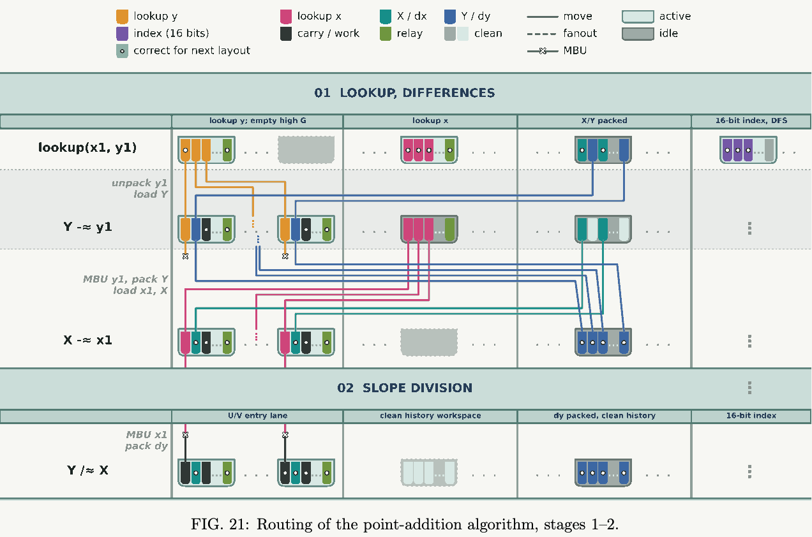

**图 21：点加法算法的路由，阶段 1–2。**

图例文字：`lookup y`＝查表所得 $y$；`lookup x`＝查表所得 $x$；`X / dx`＝$X/dx$；`Y / dy`＝$Y/dy$；`index (16 bits)`＝索引（16 位）；`carry / work`＝进位 / 工作空间；`relay`＝中继；`clean`＝干净；`correct for next layout`＝为下一布局修正；`move`＝移动；`fanout`＝扇出；`MBU`＝基于测量的反计算；`active`＝活动；`idle`＝空闲。

| 阶段 | 图中区域标签 | 图中的操作及衔接文字（自上而下） |
|---|---|---|
| 01　查表与求差（LOOKUP, DIFFERENCES） | 查表 $y$；高位 $G$ 为空。查表 $x$。$X/Y$ 紧凑存放。16 位索引、DFS。 | $\operatorname{lookup}(x1,y1)$；展开 $y1$，载入 $Y$；$Y\mathrel{-\!\approx}y1$；对 $y1$ 作 MBU，紧凑存放 $Y$；载入 $x1,X$；$X\mathrel{-\!\approx}x1$。 |
| 02　斜率除法（SLOPE DIVISION） | $U/V$ 入口通道。干净的历史记录工作空间。$dy$ 紧凑存放、干净的历史记录。16 位索引。 | 对 $x1$ 作 MBU；紧凑存放 $dy$；$Y\mathrel{/\!\approx}X$。 |

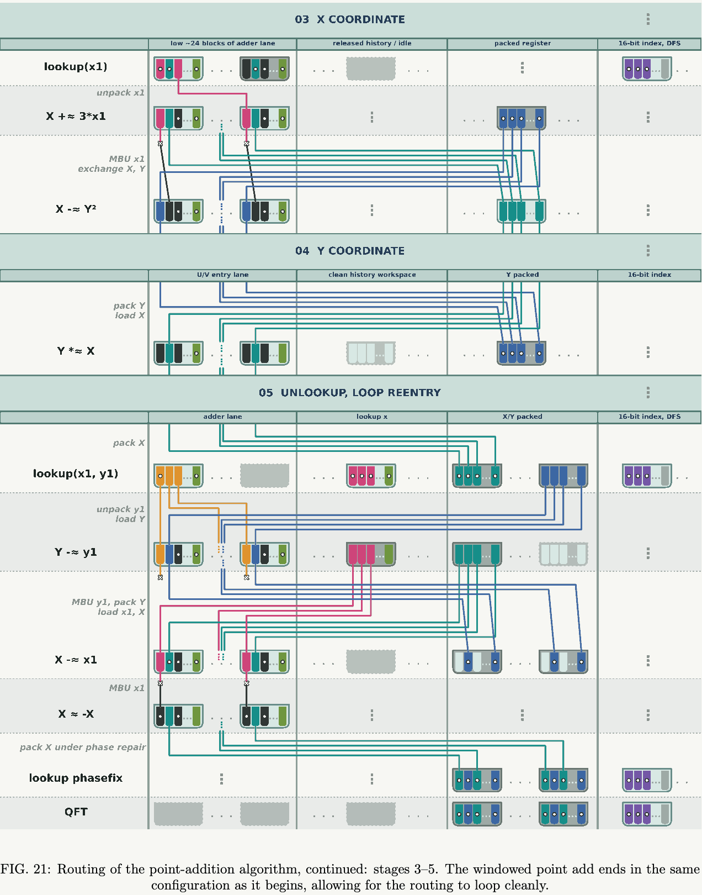

**图 21（续）：点加法算法的路由，阶段 3–5。窗口化点加法结束时的配置与开始时相同，因此路由可以顺畅地循环。**

| 阶段 | 图中区域标签 | 图中的操作及衔接文字（自上而下） |
|---|---|---|
| 03　$X$ 坐标（X COORDINATE） | 加法器通道的低端约 24 个块。已释放的历史记录 / 空闲。紧凑存放的寄存器。16 位索引、DFS。 | $\operatorname{lookup}(x1)$；展开 $x1$；$X\mathrel{+\!\approx}3*x1$；对 $x1$ 作 MBU；交换 $X,Y$；$X\mathrel{-\!\approx}Y^2$。 |
| 04　$Y$ 坐标（Y COORDINATE） | $U/V$ 入口通道。干净的历史记录工作空间。$Y$ 紧凑存放。16 位索引。 | 紧凑存放 $Y$；载入 $X$；$Y\mathrel{*\!\approx}X$。 |
| 05　撤销查表与重新进入循环（UNLOOKUP, LOOP REENTRY） | 加法器通道。查表 $x$。$X/Y$ 紧凑存放。16 位索引、DFS。 | 紧凑存放 $X$；$\operatorname{lookup}(x1,y1)$；展开 $y1$，载入 $Y$；$Y\mathrel{-\!\approx}y1$；对 $y1$ 作 MBU，紧凑存放 $Y$；载入 $x1,X$；$X\mathrel{-\!\approx}x1$；对 $x1$ 作 MBU；$X\approx-X$；在相位修复期间紧凑存放 $X$；查表相位修正；QFT。 |

### 附录 D：电路综合

（印刷页码 / PDF 页序：59–60。）

电路综合将已经验证的 spec 和 def 层次结构，转换为符合架构约束的可执行调度。入口接收根 spec 及其参数、目标架构、可选的布局计划和综合选项；返回测量调度及其指标，以及序列化的调度产物，所有下游报告都从该产物派生。

架构对象声明一组存储块和一组或多组工厂块。存储类型规定块的大小与形状、哪些操作可直接合法地在单个块内或两个块之间执行，以及每个块支持多少并发操作与逻辑测量。每组工厂指定资源态种类、块数、每块的态数，以及该工厂类型的制备和清理方案；对 ECC 流水线而言，使用 CCZ 工厂。合法性检查、布局和资源分配都以该对象为依据。

#### D.1 综合树与前沿降级

综合将根展开为综合树，记录分解层次结构、每个节点所选的 def、量子比特和经典比特绑定，以及组件上的经典条件。前沿降级循环反复选择一个前沿节点；如果该节点在架构上不能直接合法执行，就选择一个 def，分配并绑定该 def 的辅助位，再展开该节点，直到每个叶节点都符合架构约束。路由由布局和基于局部测量的构件处理，而不是依赖独立的全局 SWAP 网络：在当前几何结构中不合法的操作，会分解成逻辑测量、受控载入、CNOT 扇出或 PcP 构件等组件（不过，本工作成功地完全避免了对 PcP 作朴素分解）。

在这一细化过程中，依赖调度的资源绑定被推迟：工厂辅助位在树中是虚拟量子比特，因此 def 和合法性检查可保持一致，而物理工厂的分配则在之后调度时才确定。仅属于当前运行的事实——量子比特所有权和顺序依赖——记录在综合侧的状态中，绝不会泄露到可复用的 spec 和 def 中。另有两种机制，使应用规模的综合仍可处理：重复结构的紧凑表示，以及对已降级子树的记忆化重放。

#### D.2 紧凑重复与延迟参数

重复的算法结构保存为紧凑的重复子电路，而不是为每次迭代展开一个独立副本。编译时确定的边界决定循环体执行多少次，而迭代变量可以选择每次循环所用的操作数量子比特、寄存器切片、常数或实现变体。重复结构可以嵌套，也可以逆序遍历；对重复计算取逆时，会同时反转迭代顺序和所包含的操作。这种表示用于重复移位、乘法器数位扫描、查表遍历、模求逆轮次，以及点加法之上的重复工作单元。

在编译器选择实现、检查架构合法性、估算成本和记录综合状态时，重复体始终保持紧凑。若不同迭代确实需要不同电路形状，就由迭代变量选择相应替代方案；寄存器宽度变化就是常见例子。只有输出最终操作流时，编译器才会为每次循环代入具体操作数和属于该迭代的经典结果。尽管最终可执行调度仍包含每个操作，这种晚展开仍能减少编译工作量与内存使用。

#### D.3 记忆化降级与子树重放

第二种机制是类似动态规划的重放缓存。子树完全降级后，编译器会用一个结构键记录其展开结果，键中包含源 spec 类型与规范化参数、所选 def，以及兼容的辅助位绑定。这些不可变元组可进行哈希，因此重复出现的语义组件只需查一次字典，就能找到之前的降级结果，无需重复递归的 def 选择、子项支持测试、分配和布局决策。另有仅属于当前运行的缓存，用于记住偏好的 def 和架构支持结果。

重放命中时，编译器在新出现的位置复现缓存的子结构，并重新映射仅属于该次出现的经典标识。重放状态包括所选分解、辅助位绑定、兄弟节点拓扑、工厂借用注释和量子比特所有权类别；它不只是复制一串扁平化的门序列。如果已完成的子树或资源上下文不能安全复用，就拒绝该候选项，并执行普通展开。回退或编辑当前树会使受影响的缓存状态失效。这些限制使哈希仅仅是一项优化：启用或禁用重放都不得改变输出程序。

这种复用发生于分层综合阶段，在测量调度之前：调度器接收已绑定的串行流，并为每次出现构建具体层，因此重放带来的加速属于降级加速。调度器侧的可扩展性则来自紧凑打包的层表示，以及下文所述可选的经典条件延迟求值。

#### D.4 测量调度

除正文描述的通用过程外，调度器还对态注入采用资源池模型。每次 CCZ 工厂使用都拆成注入（三次 $ZZ$ 逻辑测量，每次将一个 CCZ 态量子比特与其存储目标耦合）和工厂清理测量。调度器跟踪每种工厂的可用资源态数，注入时减一，清理时加一；若清理延迟，传播中的相位修正就作为条件 Pauli 副产物跟踪。调度完成后，才将虚拟工厂索引分配到物理工厂块，并将每次注入与相应清理配对。在内部，层保存为块局部的 Pauli 位掩码和平坦指令缓冲区，而非逐门对象；正是这一表示变化使应用规模电路的调度成为可处理的任务。

#### D.5 布局计划

布局计划是为某个 spec 实现编写的、具有作用域的放置策略。它可以强制为其 spec 选择指定 def，并通过嵌套的子计划强制选择子项的 def；还将语义端口和辅助位绑定到放置规则：穿过存储块的串行条带、交错循环，或直接的块与槽位坐标。它也可为 Pauli 控制 Pauli（PcP）构件预留辅助量子比特池。设计层面的决策在计划中进入系统：哪些寄存器放在一起、存在哪些资源池、哪些 def 被强制选用。在规划的形状之下，编译器仍应用自己的局部策略；但改变计划会改变编译树、调度压力和最终指标。

### 附录 E：架构资源总量

（印刷页码 / PDF 页序：60–63。）

本节使用的编译后电路资源计数汇总在表 XI。

注意，Toffoli 注入总数不同于第 III 部分报告的估计；那里使用的是先前工作的计数方式。

原因有三点：（1）如第 X 节所述，编译后的电路始终执行条件相位比较器，而不是仅在操作实际执行时才计数（先前工作 [2, 28] 采用后者）；（2）我们的相位修正查表实现尚非最优，即尚未实现文献 [22] 的 `phaseup` 操作；（3）表 XI 的计数包括取代第一次点加法的初始查表。

**表 XI：编译后的电路资源计数，假设条件操作总会执行。**（印刷页码 / PDF 页序：60。）

| 资源 | 变量 | 总量 |
|---|---|---:|
| 测量层深度 | $D_{\mathrm{meas}}$ | 75,251,329 |
| Toffoli 注入 | $N_{\mathrm{Tof}}$ | 40,420,330 |
| 非 Toffoli 逻辑测量 | $N_{\mathrm{non-Tof}}$ | 369,882,166 |
| 峰值测量并行度 | $k_{\mathrm{cat}}^{(\mathrm{peak})}$ | 24 |

#### E.1 占用

假设每个离子每个 POC 的独立丢失率为 $p_{\mathrm{loss}}=10^{-7}$，包含 $n$ 个数据离子和 $n$ 个综合征辅助位的码块，所需平均重载率为

$$
R_{\mathrm{reload}}=(2n)p_{\mathrm{loss}}.
\tag{E1}
$$

架构所用三种码的每块重载率见表 XII。

**表 XII：每个离子每个 POC 的 $p_{\mathrm{loss}}=10^{-7}$ 时，每个码块的离子重载率。**（印刷页码 / PDF 页序：60。）

| 码 | $n$ | 物理量子比特数 $(2n)$ | 每个 POC 的预期丢失数 |
|---|---:|---:|---:|
| Q102 | 102 | 204 | $2.04\times10^{-5}$ |
| Q66 | 66 | 132 | $1.32\times10^{-5}$ |
| C6 | 6 | 12 | $1.20\times10^{-6}$ |

**整个算法的耗尽预算。** 对容量为 $r$ 的储备区，将两次连续补充之间的时间称为补充间隔，令 $X$ 为该间隔内所需替换离子的数量。定义耗尽为事件 $X>r$，即下一次补充之前，替换需求超过可用库存。假设任何局部或全局储备区耗尽都使本次运行失败，并选择储备区容量，将整次运行的总耗尽概率限制在目标值以下：

$$
\epsilon_{\mathrm{res}}=10^{-3}.
\tag{E2}
$$

达到这一目标，可确保储备区耗尽对一次尝试的失败概率至多贡献 0.1 个百分点。

对于第 E.2 节推导的运行时间界，设备最多运行表 XI 所列的 $D_{\mathrm{meas}}=75,251,329$ 个测量层。因此，

$$
\begin{aligned}
T_{\mathrm{run}}^{(\mathrm{POC})}
&=D_{\mathrm{meas}}\times T_{\mathrm{inj}}\\
&=75,251,329\times147.48\\
&=1.10980\times10^{10}\ \mathrm{POC}.
\end{aligned}
\tag{E3}
$$

设备包含 $69+4=73$ 个 Q102 块，其中额外的四个块为逻辑 CliNR 块。四座魔法态工厂包含四个 Q66 块和八个 C6 块，每座 Eastinthillation 工厂有两个专用 C6 块。采用这些组件分配，各类储备区的补充间隔总数为

$$
N_{\mathrm{Q102}}=73T_{\mathrm{run}}^{(\mathrm{POC})}/27=3.00057\times10^{10},
\tag{E4}
$$
$$
N_{\mathrm{Q66}}=4T_{\mathrm{run}}^{(\mathrm{POC})}/17=2.61129\times10^9,
\tag{E5}
$$
$$
N_{\mathrm{C6}}=8T_{\mathrm{run}}^{(\mathrm{POC})}/5.4=1.64415\times10^{10},
\tag{E6}
$$
$$
N_{\mathrm{global}}=T_{\mathrm{run}}^{(\mathrm{POC})}/5000=2.21960\times10^6.
\tag{E7}
$$

若 $q_i$ 为第 $i$ 类储备区在一个补充间隔中的耗尽概率，则并集界给出

$$
p_{\mathrm{res}}\le\sum_iN_iq_i.
\tag{E8}
$$

我们选择使这一界仍低于 $\epsilon_{\mathrm{res}}$ 的最小局部及全局储备区容量。相应的容量计算如下。

为确定每个局部储备区的容量，假设它可在 SEC 之间补充，并将一个 SEC 内的丢失数量建模为均值为

$$
\lambda=(2n)p_{\mathrm{loss}}T_{\mathrm{SEC}}
\tag{E9}
$$

的 Poisson 随机变量。

利用 $q_i(r)=\Pr[\operatorname{Poisson}(\lambda)>r]$，我们在每个码块的局部储备区中选择符合整次运行耗尽预算的最小离子数 $r$。结果见表 XIII。如果少一个离子，Q102、Q66 和 C6 对整次运行并集界的贡献将分别为 $0.835$、$0.00492$ 和 $0.345$，均高于 $10^{-3}$ 的耗尽预算。

**表 XIII：局部离子储备区大小，假设每个 SEC 只补充一次。**（印刷页码 / PDF 页序：61。）

| 码 | $T_{\mathrm{SEC}}$（POC） | $\lambda$ | $r$ | $q_i(r)$ |
|---|---:|---:|---:|---:|
| Q102 | 27.0 | $5.508\times10^{-4}$ | 3 | $3.83\times10^{-15}$ |
| Q66 | 17.0 | $2.244\times10^{-4}$ | 3 | $1.06\times10^{-16}$ |
| C6 | 5.4 | $6.480\times10^{-6}$ | 2 | $4.53\times10^{-17}$ |

与文献 [1] 的丢失模型不同，交换丢失模型不会产生级联丢失，因此全局储备区只需缓冲设备组件中的独立稳态丢失流，包括猫态资源束和 Bell 态资源。根据下面的载入率比较，假设储备区每秒补充一次，即每 $T_{\mathrm{refill}}=5000$ 个 POC 补充一次。对候选全局容量 $R_{\mathrm{global}}$，这一间隔内的平均丢失数为

$$
\lambda_{\mathrm{global}}
=(N_{\mathrm{components}}+R_{\mathrm{global}})p_{\mathrm{loss}}T_{\mathrm{refill}}.
\tag{E10}
$$

加入全局储备区之前，峰值组件分配包含 19,363 个量子比特。应用整次运行的储备区耗尽预算，得到 34 个离子的全局储备区，如表 XIV 所示。它在每个补充间隔中的耗尽概率为 $2.77\times10^{-10}$。如果缓冲区只有 33 个离子，整次运行的并集界会变成 $2.36\times10^{-3}$，因此 34 是符合式（E2）的最小容量。第 E.2 节中的运行时间换算给出 $\tau_{\mathrm{POC}}=200\,\mu\mathrm s$。因此，维持全局储备区所需的平均重载率为

$$
R_{\mathrm{load}}^{(\min)}
=\frac{1.9397\times10^{-3}}{\tau_{\mathrm{POC}}}
\approx9.70\ \text{离子/秒}.
\tag{E11}
$$

相较于 Walking Cat 架构目标量子比特平台中已经演示的载入能力，这一速率并不高。一项囚禁离子实验在所测最高功率下，每次烧蚀脉冲载入约十个钡离子。按所需平均速率，这相当于每秒约 0.970 次烧蚀脉冲 [86]。在中性原子系统中，连续重载已实现每秒产生 30,000 个初始化量子比特 [87]。

**表 XIV：独立稳态离子丢失下的全局储备区容量。$\rho_{\mathrm{loss}}$ 为每个 POC 的预期丢失数，$q_{\mathrm{global}}$ 为每个补充间隔的耗尽概率。**（印刷页码 / PDF 页序：61。）

| 设备 | 总量子比特数 | $\rho_{\mathrm{loss}}$ | $R_{\mathrm{global}}$ | $q_{\mathrm{global}}$ |
|---|---:|---:|---:|---:|
| secp256k1 | 19,397 | $1.9397\times10^{-3}$ | 34 | $2.77\times10^{-10}$ |

代入式（E8）得到

$$
p_{\mathrm{res}}\le7.32\times10^{-4}.
\tag{E12}
$$

因此，即使每次耗尽事件都会中止计算，一次运行在不发生储备区耗尽的情况下完成的概率仍至少为 99.927%。

**存储块与逻辑 CliNR 块。** 存储块和逻辑 CliNR 块均使用 Q102。每块包含 $n=102$ 个数据离子、相同数量的综合征辅助位，以及表 XIII 的三离子局部储备区，因此每块占用为

$$
n_{\mathrm{phys}}^{\mathrm{Q102}}=2n+r_{\mathrm{Q102}}=2(102)+3=207.
\tag{E13}
$$

于是，69 个存储块贡献 $69\times207=14,283$ 个物理量子比特。四个逻辑 CliNR 块另外贡献 $4\times207=828$ 个物理量子比特，因此 Q102 块总共占用 15,111 个物理量子比特。

**猫态寄存器数量。** 首先确定两种码使用的猫态验证轮数。对于目标验证错误率 $\epsilon=10^{-11}$ 和物理错误率 $p=10^{-4}$，Walking Cat 架构的验证轮数公式 [1] 给出

$$
\begin{aligned}
m&=\left\lceil\frac{\log\epsilon}{2\log(2p)}\right\rceil=\lceil1.49\rceil=2,\\
(2p)^2&=4\times10^{-8}>\epsilon,\qquad
(2p)^4=1.6\times10^{-15}<\epsilon.
\end{aligned}
\tag{E14}
$$

因此，在该界下，两轮验证既足够，也是最小轮数。下面采用 Walking Cat 的输运时序 $\eta=1/20$。

对于 Q102，$n=102$，表 IV 给出 $T_{\mathrm{SEC}}=27$ POC，且 $w_{\mathrm{cat}}=30$。一条长边能容纳 $s(102,30)=\lfloor102/30\rfloor=3$ 座工厂。因此，三次并行逻辑测量使用沿顶边相邻排列的三座工厂，占据 90 个站点；底边和两条短边均不需要工厂。每座工厂的循环距离为 $P_{\mathrm{loop}}(102)=212$ 个输运步，且

$$
\begin{aligned}
T_{\mathrm{prep}}(30,2)&=14.8\ \mathrm{POC},\\
T_{\mathrm{prep}}(30,2)+\eta P_{\mathrm{loop}}(102)&=25.4\ \mathrm{POC}.
\end{aligned}
\tag{E15}
$$

总时间小于 27 POC 的 SEC，因此命题 2 对这三次测量都给出 $r=1$。

对于 Q66，$n=66$、$T_{\mathrm{SEC}}=17$ POC，且 $w_{\mathrm{cat}}=16$。一条长边能容纳 $s(66,16)=\lfloor66/16\rfloor=4$ 座工厂，因此三次并行逻辑测量使用沿同一长边相邻排列的三座工厂，占据 48 个站点。每座工厂的循环距离为 $P_{\mathrm{loop}}(66)=140$ 个输运步，且

$$
\begin{aligned}
T_{\mathrm{prep}}(16,2)&=13.45\ \mathrm{POC},\\
T_{\mathrm{prep}}(16,2)+\eta P_{\mathrm{loop}}(66)&=20.45\ \mathrm{POC}.
\end{aligned}
\tag{E16}
$$

总时间超过一个 17 POC 的 SEC，但可容纳于两个 SEC 内，因此命题 2 给出每次测量需 $r=2$ 个寄存器，总共为六个权重为 16 的猫态寄存器。

**猫态资源束对与 Bell 态资源。** 令 $k_{\mathrm{cat}}$ 表示设备必须支持的最大并行逻辑测量数。第 XII.C.2 节的复用调度为每条测量流分配两个可移动猫态资源束。对 Q102，每个资源束包含一个权重为 30 的猫态寄存器和一组权重为 30 的验证位；权重 30 由 Q102 块内所执行的最宽逻辑测量决定。分配给一条测量流的两个资源束构成一个猫态资源束对。每个资源束占用 $2\times30=60$ 个物理量子比特，因此每个资源束对占用 120 个物理量子比特。所得占用为

$$
n_{\mathrm{phys}}^{\mathrm{cat}}(k_{\mathrm{cat}})
=2k_{\mathrm{cat}}(2\times30)=120k_{\mathrm{cat}}.
\tag{E17}
$$

如表 XI 所列，编译后电路的峰值需求是同时进行 $k_{\mathrm{cat}}^{(\mathrm{peak})}=24$ 次逻辑测量。因此猫态分配为

$$
n_{\mathrm{phys}}^{\mathrm{cat}}
=120k_{\mathrm{cat}}^{(\mathrm{peak})}=120(24)=2,880.
\tag{E18}
$$

每轮猫态生产中，每次涉及存储块的 LM2 测量消耗 $k_{\mathrm{Bell}}$ 个 Bell 对，用来拼接该轮使用的两个猫态；其中 $k_{\mathrm{Bell}}$ 是使拼接后猫态验证的未检出错误概率至多为 $\epsilon$ 所需的 Bell 对数。按照 Walking Cat 拼接协议 [1]，每个 Bell 对由一个小型酉电路制备。每对中的两个量子比特分别被路由到两个目标猫态工厂。在两座工厂中，分别测量每个 Bell 对量子比特与一个局部猫态量子比特之间的联合 $ZZ$ 稳定子奇偶校验。这将两个猫态拼接成一个更大的联合猫态。每个 Bell 对提供一次联合猫态的稳定子测量，因此 $k_{\mathrm{Bell}}$ 个 Bell 对提供 $k_{\mathrm{Bell}}$ 次冗余拼接校验。将单次拼接校验的错误率（包括 Bell 对和输运故障）记为 $p'\le4p$，错误的奇偶值可能在拼接猫态的一半上引起高权重 $X$ 错误，但除非全部 $k_{\mathrm{Bell}}$ 次拼接校验返回同一个错误值，否则该次拼接就会被拒绝。在 $p=10^{-4}$ 时，选择 $k_{\mathrm{Bell}}=4$，得到 $(p')^{k_{\mathrm{Bell}}}\le(4p)^4=2.56\times10^{-14}$，低于目标精度 $\epsilon=10^{-11}$。我们为峰值需求下同时进行的 12 次 LM2 测量各配置一个 Bell 态资源束。因此每个资源束包含 $2k_{\mathrm{Bell}}=8$ 个物理量子比特，包括这些量子比特正在输运时的占用。四个独立 Bell 对可在两个 POC 内并行制备，远小于 13.45–14.8 POC 的猫态生产间隔；我们假设预先安置这些资源束同样可以隐藏输运延迟，因此流水线不需要额外 Bell 对。由此，Bell 态分配为

$$
n_{\mathrm{phys}}^{\mathrm{Bell,LM2}}
=12\times k_{\mathrm{Bell}}\times2=12\times4\times2=96.
\tag{E19}
$$

**魔法态工厂。** 第 XII.E 节的吞吐量分析指定共需四座 Eastinthillation 工厂。每座工厂包含一个 Q66 块、两个专用 C6 块、一个局部储备区，以及三座权重为 16 的猫态工厂；储备区按表 XIII 为 Q66 配置三个替换离子，并为每个 C6 块配置两个替换离子。计入综合征辅助位后，每个 Q66 块及其两个 C6 块分别占用 $2(66)$ 和 $2\times2(6)$ 个物理量子比特，而每座猫态工厂包含两个权重为 16 的寄存器和一组 16 个验证辅助位，占用 $3\times16$ 个物理量子比特。最后，按照第 XII.E 节测量构造的要求，我们为每个 C6 块另计一个六量子比特的 C6 Bell 态源。因此，一座魔法态工厂的占用为

$$
\begin{aligned}
n_{\mathrm{phys}}^{\mathrm{magic}}
&=2(66)+2\times2(6)+(3+2\times2)\\
&\quad+3(3\times16)+2(6)\\
&=319,
\end{aligned}
\tag{E20}
$$

四座工厂总共占用

$$
N_{\mathrm{phys}}^{\mathrm{magic}}
=4n_{\mathrm{phys}}^{\mathrm{magic}}=4\times319=1,276
\tag{E21}
$$

个物理量子比特。

汇总各类组件的峰值分配，再加上全局储备区，得到设备占用

$$
\begin{aligned}
N_{\mathrm{phys}}
&=69(207)+24(120)+12(8)\\
&\quad+4(207)+4(319)+34=19,397.
\end{aligned}
\tag{E22}
$$

#### E.2 运行时间

如表 XI 所列，编译后算法的测量层深度为 $D_{\mathrm{meas}}=75,251,329$。为取得运行时间上界，我们给每个测量层都赋予一次 CCZ 注入的平均持续时间。

在编译后的椭圆曲线点加法电路所使用的逻辑测量中，CCZ 注入的平均持续时间最长。只要它出现在某个并行层中，就会决定关键路径，因为需要其结果才能确定数据块上后续的 Clifford 修正。如式（26）推导，CCZ 注入中三个独立 Viterbi 过程的联合平均停止时间为 5.46 个 Q102 SEC。由于一个 Q102 SEC 耗时 27 POC，得到 $T_{\mathrm{inj}}=147.48$ POC；用未四舍五入的持续时间计算，约为 0.02950 秒。因此，每次尝试的预期运行时间上界为

$$
\begin{aligned}
T_{\mathrm{run}}
&\lesssim D_{\mathrm{meas}}\times0.0294958\ \mathrm s\\
&=75,251,329\times0.0294958\ \mathrm s\\
&=2,219,600\ \mathrm s\approx25.7\ \text{天}.
\end{aligned}
\tag{E23}
$$

#### E.3 逻辑失败概率

我们计入五项对整个算法逻辑失败概率的贡献：Q102 块中的存储错误、逻辑测量错误、Toffoli 门消耗的 CCZ 态错误、iQFT 消耗的 $T$ 态错误，以及储备区耗尽。

**存储错误。** 为取上界，假设全部 $D_{\mathrm{meas}}=75,251,329$ 个测量层都发生于设备中全部 69 个 Q102 存储块上。但实际上，应用中只有一小部分量子比特需要在这整个时段连续保存量子信息，因此这一上界相当保守。得到

$$
\begin{aligned}
N_{\mathrm{SEC}}
&=D_{\mathrm{meas}}\times\tau_{\mathrm{CCZ}}^{\mathrm{avg}}\times69\\
&=75,251,329\times\tau_{\mathrm{CCZ}}^{\mathrm{avg}}\times69\\
&=2.83615\times10^{10}.
\end{aligned}
\tag{E24}
$$

按表 IV 给出的 Q102 每 SEC 逻辑错误率 $p_{L,\mathrm{SEC}}^{\mathrm{Q102}}=9.34\times10^{-12}$，对应的存储失败概率为

$$
p_{\mathrm{mem}}
=1-\left(1-p_{L,\mathrm{SEC}}^{\mathrm{Q102}}\right)^{N_{\mathrm{SEC}}}
=0.2327.
\tag{E25}
$$

四个 Q102 逻辑 CliNR 块仅在标架清除期间保存编码态，而非在整个算法运行期间。因此，其错误暴露计入下文的非 Toffoli 逻辑测量数，而不计入长期存储失败总量。

尽管计算出的存储失败概率较高，但“全部 69 个 Q102 块在整个算法期间持续保存量子信息”这一假设显著抬高了我们的估计。也可以通过增加码距或调整解码器直接降低该概率，如魔法态工厂中存储错误瓶颈的讨论所述。

**逻辑测量错误。** 对物理错误率 $p=10^{-4}$ 下权重为 30 的 Viterbi 测量，单轮比特翻转模型给出 $p_{\mathrm{flip},30}=2.1\times30\times10^{-4}=6.3\times10^{-3}$。因此，票差为五时，逻辑错误概率为

$$
p_{\mathrm{Vit},30}
=\left[1+\left(\frac{1-p_{\mathrm{flip},30}}{p_{\mathrm{flip},30}}\right)^5\right]^{-1}
=1.02\times10^{-11}.
\tag{E26}
$$

对表 XI 所列 $N_{\mathrm{non-Tof}}=369,882,166$ 次这样的非 Toffoli 逻辑测量，合计失败概率为 $1-(1-p_{\mathrm{Vit},30})^{N_{\mathrm{non-Tof}}}=0.00378$。

**Eastinthillation 工厂错误。** 由式（60），Eastinthillation 工厂每个被接受态的逻辑错误率为 $p_L^{\mathrm{CCZ}}\lesssim9.36\times10^{-10}$。表 XI 的 $N_{\mathrm{Tof}}=40,420,330$ 次 Toffoli 注入各使用一个被接受态，Eastinthillation 工厂的累计失败概率为

$$
p_{\mathrm{CCZ}}=1-(1-p_L^{\mathrm{CCZ}})^{N_{\mathrm{Tof}}}\lesssim0.0371.
\tag{E27}
$$

**iQFT 阶段错误。** iQFT 使用的 5,684 对被接受 $T$ 态和 464 次经综合得到的旋转贡献

$$
p_{\mathrm{iQFT}}\le7.64\times10^{-5},
\tag{E28}
$$

其计算见式（61）。

**储备区耗尽。** 设备的储备区耗尽概率至多为 $7.32\times10^{-4}$。

假设这五种失败机制在统计上独立，将各项贡献组合得到

$$
\begin{aligned}
p_{\mathrm{fail,alg}}
&\le1-(1-0.2327)(1-0.00378)\\
&\quad\times(1-0.0371)(1-7.64\times10^{-5})\\
&\quad\times(1-7.32\times10^{-4})\\
&=0.2646\approx26\%.
\end{aligned}
\tag{E29}
$$

### 附录 F：交换丢失敏感性

（本段位于印刷页码 / PDF 页序：63；图 22 续于第 64 页。）

我们选择 $p_{\mathrm{swap}}=0.5$，作为数量级为 1 的保守交换概率。具体取值对报告的逻辑错误率影响很小：采用抗交换 LDU 时，在所测试的 $[0,0.75]$ 范围内，模拟显示在统计不确定度之内，对 $p_{\mathrm{swap}}$ 没有可辨认的依赖，如图 22 所示。

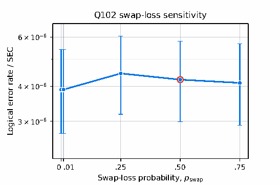

**图 22：** $[[102,22,9]]$ 码对交换丢失的敏感性。在 $p=10^{-3}$、$p_{\mathrm{leak}}=10^{-4}$ 和 $p_{\mathrm{loss}}=10^{-6}$ 下，绘出每次综合征提取电路（SEC）的逻辑错误率随 $p_{\mathrm{swap}}$ 的变化。每个点使用 $10^6$ 次试验，每次包含九次 SEC；误差棒为精确的 95% 二项置信区间，并已换算为每次 SEC 的错误率。红色圆圈标出默认模拟设置 $p_{\mathrm{swap}}=0.5$。

图中文字：标题“Q102 交换丢失敏感性”；横轴“交换丢失概率 $p_{\mathrm{swap}}$”，刻度 $0,0.01,0.25,0.50,0.75$；纵轴“每次 SEC 的逻辑错误率”。原文定位：印刷页码 64；PDF 页序 64。

### 附录 G：Eastinthillation 工厂的 Q66 代表元

本附录给出图 19 中每一个测量层在 Q66 工厂码块上的物理 Pauli 代表元。

#### 表 XV：RY0–RY3 各层的 Q66 代表元

原文定位：印刷页码 65；PDF 页序 65。

| 类别 | 目标 | 逻辑 Pauli | $w_{66}$ | 量子比特 $0,\ldots,65$ 上的物理 Pauli |
|---:|---|---|---:|---|
| 0 | `L3/Y0` | `YIII` | 16 | `IYIYYIIZIIIIIIIYIIIIIIIXXIIIIIIIIIZYIIIIIYIIIIZZXZIIIIIIIZIIIIIIYI` |
| 0 | `L2/Y2` | `IIYI` | 15 | `XIIIIYIIIIXXIIIIIIIIZYZIIIIIXIIIIXIIZZYIIIIIIYIIIIIYIIIIIIIIIIIZII` |

#### 表 XVI：接受判定层的 Q66 代表元

原文定位：印刷页码 65；PDF 页序 65。

| 类别 | 目标 | 逻辑 Pauli | $w_{66}$ | 量子比特 $0,\ldots,65$ 上的物理 Pauli |
|---:|---|---|---:|---|
| 0 | 接受判定（acceptance） | `ZIII` | 11 | `IIIIIIIIIIIIIIIIIIIZIIIIZIIIIIZIIIIIZIIIIIIZZIIIIIIIZIIZIZIIIZIZII` |
| 1 | 接受判定（acceptance） | `XIXI` | 10 | `IIIIIIIIIIIIIIIIIIXIIXXIIXXIIIXIIIIIIIIIIIIIIIIIIIIXIIIIXXIIIXIIII` |
| 2 | 接受判定（acceptance） | `YIYI` | 14 | `IIIIIIIIIIIXIIIIYZIIIIIIZIIYYIIZIIIIIIIIIIIIXIIYYIIXIIIIIIXYIIIIZI` |
| 3 | 接受判定（acceptance） | `IIZI` | 10 | `IIIIIIIIIIIIIIIIIIIIIZIIIIIIIIIZIIIIIIIZIIIIIIZZIIIIZZIZIIIIIIZZII` |
| 4 | 接受判定（acceptance） | `ZZII` | 11 | `IIIIIIIIIIIIIIIIIIZIZIIIIZIIIZIIZIIZIIIIIIZZIIIIIIIIIIIIIIIZIZIIIZ` |
| 5 | 接受判定（acceptance） | `XZXI` | 15 | `IXIIIIIIZYIIZIYIIIIIIIIIIIIIIIIYIIIXYYIIYIIIIXZIIIIIIIIZIIIIIIIZXI` |
| 6 | 接受判定（acceptance） | `YZYI` | 16 | `IIIIIIIIXIIIIXIIIIIIZIIIYYIIIIIIZIIIIZIIIXIIYYIIXIIIIZIYYIZIIIIIIZ` |
| 7 | 接受判定（acceptance） | `IZZI` | 11 | `IIIIIIIIIIIIIIIIIIIIIZIIIIZIIIIIZIIIIIZIIIIIIZZIIIIIIIZIIZIZIIIZIZ` |
| 8 | 接受判定（acceptance） | `ZIIZ` | 10 | `IIIIIIIIIIIIZIIIIIZIIIIIIZIIIIZIIIIZIIIIIIZIIIIIIIIIZZIIIIZIIIIZII` |
| 9 | 接受判定（acceptance） | `XIXZ` | 15 | `IIIIXIIIIIIIZYYXIIIIIIIYZIIIIIIIYIIXXZIXIIIZIIIIIIIIIIYIIIIIIIIIIY` |
| 10 | 接受判定（acceptance） | `YIYZ` | 16 | `IYIZIIIIZXIIIIYIIIIIIIIIZIIIIIIYIIZXYXIIXZIIIYZIIIIIIIIIIIIIIIIIYI` |
| 11 | 接受判定（acceptance） | `IIZZ` | 10 | `IIIIIIIIIIIIIIIIIIIIZIIIIIIIIIZIIIIIIIZIIIIIIZZIIIIZZIZIIIIIIZZIII` |
| 12 | 接受判定（acceptance） | `ZZIZ` | 10 | `IIIIIIIIIIIIIZIIIIIZIIIIIIZIIIIZIIIIZIIIIIIZIIIIIIIIIZZIIIIZIIIIZI` |
| 13 | 接受判定（acceptance） | `XZXZ` | 14 | `IIIIIIIIIIIIIIIIIIXIYIIIIIYIZZZIYIIIIIIIIIIIIIIIIIIYIXXXIYIIIIIYIZ` |
| 14 | 接受判定（acceptance） | `YZYZ` | 14 | `IIIIIIIIIIIIIIIIIIIIIIIIXZYIYYIYXIIIIIIIIIIIIIIIIIIIIIIIZYIYYIYXZI` |
| 15 | 接受判定（acceptance） | `IZZZ` | 11 | `IIIIIIIIIIIIIIIIZIZIIIIZIIIZIIZIIZIIIIIIZZIIIIIIIIIIIIIIIZIZIIIZII` |

#### 表 XVII：CCZ 注入层的 Q66 代表元

原文定位：印刷页码 65–67；PDF 页序 65–67。

| 类别 | 目标 | 逻辑 Pauli | $w_{66}$ | 量子比特 $0,\ldots,65$ 上的物理 Pauli |
|---:|---|---|---:|---|
| 0 | `MZ0` | `IIIZ` | 15 | `IIZZIIZIIIIIIIIIIZIIIIIZZIZZIIZIIIZIIIIZZIIIIIIZIIIIIIIZIIIIIIIIZI` |
| 0 | `MZ1` | `IZII` | 11 | `IZIIZIIZIIZIIZIIZIIZIIZIIZIIZIIZIIIIIIIIIIIIIIIIIIIIIIIIIIIIIIIIII` |
| 0 | `MZ2` | `ZIII` | 12 | `ZIIIIIIIZIIZIIIIIIIIZIIIIIIIIIIIIIIIIIZIIZZIIZIIIIZIIZIIIZIIIIIIIZ` |
| 1 | `MZ0` | `IIIZ` | 10 | `IIIIZIZZIIIIIIIZIZZZIIIIIIIIIIZIIIIIIIIIIIZIIIIIIIIIIZIIIIIIIIIIII` |
| 1 | `MZ1` | `IZII` | 10 | `IIIIIIIIIIIIIIZIIIIIZIIIIIIZIIIIZIIIIZIIIIIIZIIIIIIIIIZZIIIIZIIIIZ` |
| 1 | `MZ2` | `XIXI` | 10 | `IIIIIIIIIIXIIXIIIIIIIXIIIIXIIIIIIIIIIIIIIIIXIIIXXXIIXIIIIXIIIIIIII` |
| 2 | `MZ0` | `IIIZ` | 10 | `IIIIIIIIIIIIIIZIIIIIIZIIIIIZIIIZIIIIIIZZIIIIIIIZIIIIIIIIIIZZIZIIII` |
| 2 | `MZ1` | `IZII` | 15 | `IIIIIZIIZIIIZIIIIZZIZIZIZZIIZIZIIIIIIZIIIIIIZIIIIIZIIIIIIIIIIIIIZI` |
| 2 | `MZ2` | `YIYI` | 15 | `XIYIYIXXIIIZIZIYIIIIIIIIIIIIIIIIIYIYXIIIIZIIIZYIZIIIIIIIIIIIIIIIII` |
| 3 | `MZ0` | `IIIZ` | 10 | `IIIIIIZIZZZIIIIIIIIIIZIIIIIIZIZZIZIIIIIIIIIIZIIIIIIIIIIIIIIIIIIIII` |
| 3 | `MZ1` | `IZII` | 10 | `IIIIIZIIIIIZIIIIIIZIIIIZIIIIIIIIIIIZIIIIIIIIIZZIIIIZIIIIZIIIIZIIII` |
| 3 | `MZ2` | `IIZI` | 10 | `ZZIIIIIIIIIIIIIIIZIIIIIIIIIIIIIIZIIIIIIIIIZIIIIIZZZIIIIIIZIIIIIZII` |
| 4 | `MZ0` | `IIIZ` | 10 | `ZIIIZIIIIIIIIIIIIIIIZIIIIIIZIIIIIIZIIIIIIIIIZZIIIIIIIZIIIIIIIIIIZZ` |
| 4 | `MZ1` | `IZII` | 10 | `IIZIIIIIIZIIIIZIIIIIIIIIIIIIIZIIIIIIZZIIIIZIIIIZIIIIZIIIIIIZIIIIII` |
| 4 | `MZ2` | `ZZII` | 11 | `IIIIIZIZIIZIIIIIIIIIIIIIZIIIIIIZIIIIIIIZIZIZIIIIZZIIIIIIIZIIIIIIII` |
| 5 | `MZ0` | `IIIZ` | 10 | `IIIIIIIIIZIIIIIIZIZZIIIIIIIZIZZZIIIIIIIIIIIIIIIIIIIIIIZIIIIIIIIIIZ` |
| 5 | `MZ1` | `IZII` | 10 | `ZIIIIZIIIIIIIIIIIIIIZIIIIIZIIIIIIZIIIIZIIIIZIIIIIIZIIIIIIIIIZZIIII` |
| 5 | `MZ2` | `XZXI` | 15 | `IIZYIIZIYIIIIIIIIIIIIIIIIYIIXIIIIIYIIIIXZIIIIIIIIZIIIIIIIZXIIIXYYI` |
| 6 | `MZ0` | `IIIZ` | 10 | `IIIIIIIIIZIIIIIIZIZZIIIIIIIZIZZZIIIIIIIIIIIIIIIIIIIIIIZIIIIIIIIIIZ` |
| 6 | `MZ1` | `IZII` | 10 | `ZIIIIZIIIIIIIIIIIIIIZIIIIIZIIIIIIZIIIIZIIIIZIIIIIIZIIIIIIIIIZZIIII` |
| 6 | `MZ2` | `YZYI` | 16 | `IIIIIIXZYIYIYYZIIIIIIXIIIIIIIIIIIIIIZIIYIYXIIIIIIIIIXIIZIIIIIIZZII` |
| 7 | `MZ0` | `IIIZ` | 13 | `IIIZIIZIIIIIIIIIIIIIZZIZIIZIIIIIZZIIIIIZIIIZIIIIIIZIZIZIIIIIIIIIII` |
| 7 | `MZ1` | `IZII` | 12 | `IZIIIIIIZIZZZIIZIZIIIIIIIIIZIIIIIIZZIIIIIZIIIIIIIZIIIIIIIIIIIIIIII` |
| 7 | `MZ2` | `IZZI` | 13 | `IIIIZIIIIIIIIIIIIIZZIIZIIZIIZIIZIIIIIIIIIIZIZZIIIIIZIIIIIZIIIIIIZI` |
| 8 | `MZ0` | `IIIZ` | 11 | `ZIIIIIIIIIIIIIIIIIZIIIIIIIIZIIIIIIZZIIIIIIIZIIIIIZZZIIIIIIIIIIIIZZ` |
| 8 | `MZ1` | `IZII` | 11 | `IZIIZIIZIIZIIZIIZIIZIIZIIZIIZIIZIIIIIIIIIIIIIIIIIIIIIIIIIIIIIIIIII` |
| 8 | `MZ2` | `ZIIZ` | 11 | `IIZIIZIIZIIZIIZIIZIIZIIZIIZIIZIIZIIIIIIIIIIIIIIIIIIIIIIIIIIIIIIIII` |
| 9 | `MZ0` | `IIIZ` | 10 | `IIIIIIIIIIIIIIIIZIIIIIIIIIZIIIIIIIZIIIIIIZZIIIIZZIZIIIIIIZZIIIIIII` |
| 9 | `MZ1` | `IZII` | 12 | `IIIIIIIIIIIIIZZIIIIIIZZZZIIZIZIIIIIIIZIIIIIIIIIIIIIZIIZIIIIIIZIIII` |
| 9 | `MZ2` | `XIXZ` | 15 | `IYIXYIIIIIIIYIIIIIIIIIIIIIIIIIXIXYIIIIIIIIIYZZIIIIIIZIIIIIIZZIIXIY` |
| 10 | `MZ0` | `IIIZ` | 10 | `IIIIIIIIIIIIIIIIZIIIIIIIIIZIIIIIIIZIIIIIIZZIIIIZZIZIIIIIIZZIIIIIII` |
| 10 | `MZ1` | `IZII` | 10 | `IIIIIZIIIIIZIIIIIIZIIIIZIIIIIIIIIIIZIIIIIIIIIZZIIIIZIIIIZIIIIZIIII` |
| 10 | `MZ2` | `YIYZ` | 16 | `YZIIYIIIIIIIZZYIIIIIIIYIZIIIIIZIZXIIXIXIIIIYXIIIIIIIIYIIIIIIIIIIII` |
| 11 | `MZ0` | `IIIZ` | 15 | `IIIIIZIIIIIZZIIZIIZIIZIIIIIZIZIIZIIZIIIIIIIZIZIIIIIIIZIZIIIIIIIIIZ` |
| 11 | `MZ1` | `IZII` | 11 | `IZIIZIIZIIZIIZIIZIIZIIZIIZIIZIIZIIIIIIIIIIIIIIIIIIIIIIIIIIIIIIIIII` |
| 11 | `MZ2` | `IIZZ` | 12 | `IIIIIIZIZIIIIIIIIIIIIIIIZIIIIIZIIIIIIZZZIIIIIIIIZZIIIIIIIZIIIZZIII` |
| 12 | `MZ0` | `IIIZ` | 10 | `IIIIIIZIZZZIIIIIIIIIIZIIIIIIZIZZIZIIIIIIIIIIZIIIIIIIIIIIIIIIIIIIII` |
| 12 | `MZ1` | `IZII` | 10 | `IIIIIZIIIIIZIIIIIIZIIIIZIIIIIIIIIIIZIIIIIIIIIZZIIIIZIIIIZIIIIZIIII` |
| 12 | `MZ2` | `ZZIZ` | 10 | `IZIIIIIZIIIIIIZIIIIZIIIIIIIIIIIIIIIIIIIIIZZIIIIZIIIIZIIIIZIIIIIIZI` |
| 13 | `MZ0` | `IIIZ` | 10 | `IIIIIIZIIIIIZIIIZIIIIIIIIIIIIIIIZIIIIIIIIIIZZIZIIIIIIIIIZZIIIIIIIZ` |
| 13 | `MZ1` | `IZII` | 10 | `IIZIIIIIIZIIIIZIIIIIIIIIIIIIIZIIIIIIZZIIIIZIIIIZIIIIZIIIIIIZIIIIII` |
| 13 | `MZ2` | `XZXZ` | 15 | `XIIIIIIIIIIIIIIIIYIIIIYIXYZYIIIZIIIIIIIIIIIIIIIIZIXIIYXIIIXIIZIIYI` |
| 14 | `MZ0` | `IIIZ` | 10 | `IIIIIIIIIZIIIIIIZIZZIIIIIIIZIZZZIIIIIIIIIIIIIIIIIIIIIIZIIIIIIIIIIZ` |
| 14 | `MZ1` | `IZII` | 10 | `ZIIIIZIIIIIIIIIIIIIIZIIIIIZIIIIIIZIIIIZIIIIZIIIIIIZIIIIIIIIIZZIIII` |
| 14 | `MZ2` | `YZYZ` | 14 | `IIIIIIYIYIYYIXXZIIIIIIIIIIIIIIIIIIIIIZIYIYYIXYIIZIIIIIIIIIIIIIIIII` |
| 15 | `MZ0` | `IIIZ` | 10 | `IIIIIIZIZZZIIIIIIIIIIZIIIIIIZIZZIZIIIIIIIIIIZIIIIIIIIIIIIIIIIIIIII` |
| 15 | `MZ1` | `IZII` | 10 | `IIIIIZIIIIIIZIIIIZIIIIIIIIIIIIIIZIIIIIIZZIIIIZIIIIZIIIIZIIIIIIZIII` |
| 15 | `MZ2` | `IZZZ` | 11 | `IIIIIIIIIIIIIZIZIIIIZIIIZIIZIIIIIIIIIZZIIIIIIIIIIIIIIIZIZIIIZIIZII` |

#### 表 XVIII：受保护相位修正单元素层的 Q66 代表元

原文定位：印刷页码 67；PDF 页序 67。

| 类别 | 目标 | 逻辑 Pauli | $w_{66}$ | 量子比特 $0,\ldots,65$ 上的物理 Pauli |
|---:|---|---|---:|---|
| 0 | `S` | `IIXZ` | 15 | `IIIIIIIXIIIIIYIIXXIIIIIYIIIIIIIXIIIIIIZYIXIIYYIZIIIIIIZYIIIIIIIIZI` |
| 1 | `S` | `IXIZ` | 14 | `IIIIIIIIIZIXIIIIIXIIIIIIYYYIIIIIXIZIIIIIYYYIIIIIIZIIIIIZIXIIIIIIII` |
| 2 | `S` | `IZXI` | 15 | `YIIIIYIIIIXXIIIIIIIIIXIIIIZZYIIIIYIIIIYIIIIZIXIIIIZYIIIIIIZIIIIIII` |
| 3 | `S` | `IZXZ` | 15 | `IXZIIIIYIIYYZIIIZXIIIIIIIXIIIIIIIYIXIIYXIIIIIIZIIYIIIIIIIIIIIIIIII` |
| 4 | `S` | `XIYY` | 15 | `IIIIIIIIXIIIIIYIIXXIIIIIYIIIIIIIXIIIIIIZYIXIIYYIZIIIIIIZYIIIIIIIIZ` |
| 5 | `S` | `XIZI` | 14 | `IIIIIIIIZIXIIIIIXIIIIIIYYYIIIIIXIZIIIIIYYYIIIIIIZIIIIIZIXIIIIIIIII` |
| 6 | `S` | `XIZZ` | 16 | `IYYIIIIXIIYIYZZIIIIIIIIIIYIIIIIIZXIIIZIIXIXXIIIIYXIIIIIIIIIIIIIIII` |
| 7 | `S` | `XYYI` | 16 | `XIYIYIIZIZIIIIIZIZZYIIIIIIIXYIIIIXIIYIYIIIIIIYIIIIIIYIIIIIIIIIIIII` |
| 8 | `S` | `XYYZ` | 16 | `IIXZIIYIXIIIIIIIIIIIIIIIXYIZIIIIYZIYIIXZIIYIIIIXIYZIIIIIIIIIIIIIII` |
| 9 | `S` | `XZYY` | 15 | `IIIYIZIZYYIIIIIIIIZXIIIIIIYIIIIXIZIIYIIIIIIYIIIIIYIZIIIIIIIIIIIIYI` |
| 10 | `S` | `XZZI` | 16 | `IXXIZIIIIYIYXIZIZYYIIIIIIXIIZIIIIYIIZIIIIZIYIIIIIIIIIIIIIIIIIIIIII` |
| 11 | `S` | `XZZZ` | 16 | `IYIXXIIIIIZIIIIYIIIIIIIYXIIIIIZIZIIYIIIIIXIZIIZIYIIIIIIIIIIIIIIIYZ` |
| 12 | `S` | `YIXY` | 15 | `IIIIYIIIIYIIIIIIIXIIIIIIYXIIIIZIXIIIIYIIIIYIIIIYXXIIIIZIIIIIIIIIZZ` |
| 13 | `S` | `YYXI` | 16 | `XIYIYIIZIIIIIIIIIIIXIZIIIIIXYIIIIXIIYIYIZIIIIYZIIIIIXIZIIIIIIIIIII` |
| 14 | `S` | `YYXZ` | 15 | `IIIIIYIIXIYIIIIIIIIIIIIXIYIIIIIYIYXIXIYIIIIZIIIIYIIIIIIZXIIIIIIIIY` |
| 15 | `S` | `YZXY` | 14 | `IIIIIYIIIIYIIIIXIIIIXXIIIZIIIIIYIZIIIIZIIIIYIIIIYIIIIIIYIIIIIXIIIZ` |
| 16 | `S` | `ZXZZ` | 16 | `ZIYIXXIIIIIZIIIIYIIIIIIIYXIIIIIZIZIIYIIIIIXIZIIZIYIIIIIIIIIIIIIIIY` |
| 17 | `S` | `ZZZX` | 16 | `IIYIIIXIIIIIZXIZIIYIIYIIIIIIXIIIIIIIIIIYIIYIIXIZXIIIIIZIIIYIIIIIIZ` |

#### 表 XIX：终端相位修正 DMG 三元组的 Q66 代表元

原文定位：印刷页码 68；PDF 页序 68。

| 类别 | 目标 | 逻辑 Pauli | $w_{66}$ | 量子比特 $0,\ldots,65$ 上的物理 Pauli |
|---:|---|---|---:|---|
| 0 | `MX0` | `IIIX` | 14 | `IXIIIIIIIIXIXXXIIXIIXXIIXIIIXIIIIXIIIIIIIIIIXIIXIIIIIIIIIIIIIIIIIX` |
| 0 | `MX1` | `IXII` | 15 | `IIIIXXIIXIIIIIIIIIIIIIXXIXXIIXXIXIIIIIXXIIIIIXIIIIIIIIIIIXIIIIXIII` |
| 0 | `MX2` | `IIXI` | 11 | `IIIIIIIIIIIIIIIIIIIIIIIIIIIIIIIIIIXIIXIIXIIXIIXIIXIIXIIXIIXIIXIIXI` |
| 1 | `MX0` | `IIIX` | 12 | `IIIIIXXIIIXXIXIIIIIIIIIIXIIXIIIIXXIXIIIIIIIIIIIIIIIXIIIIIXIIIIIIII` |
| 1 | `MX1` | `YYXI` | 18 | `YZZIXIIIIIIIIIIIIXIZYYIIIYXIXIIZIIIIYIXIIIIIZXIIIIYIIIIIZIIIIIIIII` |
| 1 | `MX2` | `IIXI` | 11 | `IIIIIIIIIIIIIIIIIIIIIIIIIIIIIIIIIIXIIXIIXIIXIIXIIXIIXIIXIIXIIXIIXI` |
| 2 | `MX0` | `IIIX` | 11 | `XXIIIIIIXIIIIIXIXIIIXIXIIXIIIIIIIIIIIIIIIIIIIIIXIIIIIXIIIIXIIIIIII` |
| 2 | `MX1` | `IXII` | 12 | `IIIIIIXXIIIIIIIXIIXIIXIIIIIXIIIIIIIXIIXIIIIIIXXIIIIXIIIIIIIXIIIIII` |
| 2 | `MX2` | `XIZI` | 14 | `IIIIXIIIIIIYYYIIIIIXIIIIIIIIIZIXIIIIZIIIIIZIXIIIIIIIIIZIIIIIYYYIII` |
| 3 | `MX0` | `IIIX` | 11 | `XIIXIIIIXIIIIIXXIIIIIIIIIIIIIXIIIXIIIIIIIIXIXIIIIIIIXXIIIIIIIIIIII` |
| 3 | `MX1` | `XYYI` | 17 | `IIIIXIIIIIIIXIIIIYZIYIZZYIIIIIIIXIIIIXIZZIIIIIYIIYIYIIIIXIIIIIIIIZ` |
| 3 | `MX2` | `XZZI` | 16 | `IIIIIIYIIXXZIZIIIIIIIIIIIYYIIIXIIIZIIIYIIYIIIZIYZIIIIIIIIYIIIIIYII` |
| 4 | `MX0` | `YIXY` | 15 | `IIIYIIIIXXIIIIIIIIIXIIIIZZYIIIIYIIIIYIIIIZIXIIIIZYIIIIIIZIIIIIIIYI` |
| 4 | `MX1` | `IXII` | 10 | `IIIIIXIIIIIIXXXIIIIIXIIIIIIIIIIIXIIIIIIIIIIIIXIIIIIIIIIIIIIIIXXXII` |
| 4 | `MX2` | `IIXI` | 10 | `IXIIIIXIIIIXIIIIXXIIIIIIIIIXIIIIIIIIIIIXIIIIXIIIIIIXIIIIIXIIIIIIII` |
| 5 | `MX0` | `YZXY` | 14 | `IZIIIIIYIIIIIIYIIIIYIIIIXIIIIXXIIIIIIXIIIZZIIIIZIIIIYIIIIYIIIIIIYI` |
| 5 | `MX1` | `YYXZ` | 15 | `IIXIYIIIIIYIIIIIIYIIXIYIIIIIIIIIIIZXIIIIIIIIYYXIXIYIIIIZIIIIYIIIII` |
| 5 | `MX2` | `IIXI` | 10 | `IIIIIIIIIXIIIIIIXIIIIXIIIIXIIIIXXXIIIIIXIIIIIIIIIIIIIIXIIIIXIIIIII` |
| 6 | `MX0` | `XIYY` | 15 | `IIXIIIIIYIIXXIIIIIYIIIIIIIXIIIIIIZYIXIIYYIZIIIIIIZYIIIIIIIIZIIIIII` |
| 6 | `MX1` | `IXII` | 10 | `XIIIIIIXIXXIIIIXXIIIIIIXIIIIIIIIXIIIIIIIIXIIIIIIIIIIIIIIIIIIIIIIXI` |
| 6 | `MX2` | `XIZZ` | 16 | `IIIIXIIIIIIIIYXIIIIXIYIIIIIIIIZXIIIIIIZIIIIIZYZIIIIIYZIIIIIIXYYIII` |
| 7 | `MX0` | `XZYY` | 15 | `IIIYIZIZYYIIIIIIIIZXIIIIIIYIIIIXIZIIYIIIIIIYIIIIIYIZIIIIIIIIIIIIYI` |
| 7 | `MX1` | `XYYZ` | 16 | `IIIIIIIIIIIIXYIZIIIIYIIXZIIYIXIIIIIXIYZIIIIIIIIIIIIIIIZIYIIXZIIYII` |
| 7 | `MX2` | `XZZZ` | 18 | `IIIIIIYIIIIZIIZIIYIIIZIIIIIIIIIIZIIIIIIZYXYIYZIZIIZIYYIYIIIIIIXIII` |

#### 表 XX：终端相位修正 DMG 二元组的 Q66 代表元

原文定位：印刷页码 68–70；PDF 页序 68–70。

| 类别 | 目标 | 逻辑 Pauli | $w_{66}$ | 量子比特 $0,\ldots,65$ 上的物理 Pauli |
|---:|---|---|---:|---|
| 0 | `MX0` | `IIIX` | 11 | `XXIIIIIIXIIIIIXIXIIIXIXIIXIIIIIIIIIIIIIIIIIIIIIXIIIIIXIIIIXIIIIIII` |
| 0 | `MX2` | `XIZI` | 14 | `IIIIXIIIIIIYYYIIIIIXIIIIIIIIIZIXIIIIZIIIIIZIXIIIIIIIIIZIIIIIYYYIII` |
| 1 | `MX0` | `IIIX` | 11 | `XIIXIIIIXIIIIIXXIIIIIIIIIIIIIXIIIXIIIIIIIIXIXIIIIIIIXXIIIIIIIIIIII` |
| 1 | `MX1` | `XYYI` | 17 | `IIIIXIIIIIIIXIIIIYZIYIZZYIIIIIIIXIIIIXIZZIIIIIYIIYIYIIIIXIIIIIIIIZ` |
| 2 | `P0` | `IIIX` | 14 | `IXIIIIIIIIXIXXXIIXIIXXIIXIIIXIIIIXIIIIIIIIIIXIIXIIIIIIIIIIIIIIIIIX` |
| 2 | `P1` | `ZXZI` | 17 | `IIIZIYIIIZIYIIIZXIIIIIIIIIIXIIIIIIYXYIIIZIIZIZIIZXIIIIIIIXXIIIIIII` |
| 3 | `P0` | `IIXI` | 12 | `IIIXXIIXIIIXIIIIIXXIIIIIIXIIIIIXIXIIIIXIXIIIIIIIIIIIIIIIIIIIIIIIXI` |
| 3 | `P1` | `IZIX` | 20 | `IXXIIXYIIIIIIYIIIIIIYIIZZIIZIIZIIIXIXIIIIIIXIIZZIIIIIIIIIIIIZYYYIX` |
| 4 | `MX1` | `YYXI` | 18 | `YZZIXIIIIIIIIIIIIXIZYYIIIYXIXIIZIIIIYIXIIIIIZXIIIIYIIIIIZIIIIIIIII` |
| 4 | `MX2` | `IIXI` | 11 | `IIIIIIIIIIIIIIIIIIIIIIIIIIIIIIIIIIXIIXIIXIIXIIXIIXIIXIIXIIXIIXIIXI` |
| 5 | `MX0` | `YZXY` | 14 | `IZIIIIIYIIIIIIYIIIIYIIIIXIIIIXXIIIIIIXIIIZZIIIIZIIIIYIIIIYIIIIIIYI` |
| 5 | `MX2` | `IIXI` | 10 | `IIIIIIIIIXIIIIIIXIIIIXIIIIXIIIIXXXIIIIIXIIIIIIIIIIIIIIXIIIIXIIIIII` |
| 6 | `P0` | `IIXZ` | 19 | `IIZIIIIIIIIIIIIIXIZIIIIIIIZIIIIXIZZXXXIIXIIYXIIIIYYYIIIIIYYIIIIIXI` |
| 6 | `P1` | `IXIZ` | 16 | `ZIIIIXIIZIIIIIXXIIIIIYYYIIIIIIXIYIIIIIIIIZIIIIYIIIIIZIXIIIIIIIXYII` |
| 7 | `P0` | `IIXZ` | 18 | `ZIIIIIIIIZIIIIIZIIIIIIIIIIIIIIIIIZXIIXIIXIIXIIYZIYZIXIIXIIYIIXIIYZ` |
| 7 | `P1` | `YYXI` | 18 | `IIIXIZIYIIIZZIIIIZIIYIIXYIIIXXIYIIIIIIIYIXZIIIIIXIIIIYIIIZIIIIIIII` |
| 8 | `P0` | `IIXZ` | 17 | `IIIIIIIXIIXIYXXIIIXYIYZIIIYIIXYIYYYYIIIIIIIIIIIIIIIIIIIIIIIIIIIIYI` |
| 8 | `P1` | `YYXZ` | 18 | `IIXIZYIIIYIYIIIIIIIIIIIIIIIXYIIIIIIIIIXZIXIZZXIIIIXZXIIIIIZIIIIIIZ` |
| 9 | `MX0` | `XIYY` | 15 | `IIXIIIIIYIIXXIIIIIYIIIIIIIXIIIIIIZYIXIIYYIZIIIIIIZYIIIIIIIIZIIIIII` |
| 9 | `MX1` | `IXII` | 10 | `XIIIIIIXIXXIIIIXXIIIIIIXIIIIIIIIXIIIIIIIIXIIIIIIIIIIIIIIIIIIIIIIXI` |
| 10 | `MX1` | `IXII` | 12 | `IIIIIIXXIIIIIIIXIIXIIXIIIIIXIIIIIIIXIIXIIIIIIXXIIIIXIIIIIIIXIIIIII` |
| 10 | `MX2` | `XIZI` | 14 | `IIIIXIIIIIIYYYIIIIIXIIIIIIIIIZIXIIIIZIIIIIZIXIIIIIIIIIZIIIIIYYYIII` |
| 11 | `P0` | `IXII` | 11 | `XXXIIIIIIIIIXXIIIIXXIIIIIIXIIIIIIXIIIIIIIXIIXIIIIIIIIIIIIIIIIIIIII` |
| 11 | `P1` | `ZIZX` | 18 | `IIIXIIIYIZIZIIYIIIIIIIXIIIIXIZYIIIIYIIIIYIIYIXIYIIIIIXXIIIIIYZIIII` |
| 12 | `B1` | `IXIZ` | 14 | `IIIIIIZIXIIIIIXIIIIIIYYYIIIIIXIIIIIIIYYYIIIIIIZIIIIIZIXIIIIIIIIIZI` |
| 12 | `B2` | `XIZI` | 14 | `IIZIXIIIIIXIIIIIIYYYIIIIIXIIIIIIIYYYIIIIIIZIIIIIZIXIIIIIIIIIZIIIII` |
| 13 | `P0` | `IXIZ` | 18 | `XIIXIXYIZZZIXIIIIIIIXZIIIIIIYXYZXZIIIIIIIIIIYIIIIIIIIIIIIIIIIIIIXI` |
| 13 | `P1` | `XIZZ` | 16 | `IIXIIIIZIIIIIIIIIIIIIIZZYIIIIIIIIIIIIXYZYIIIIIIYIIIIIZIIIIXXXIXIIZ` |
| 14 | `P0` | `IZIX` | 18 | `IIIIIIIIIIIXIIIIIIZIYXIIIIIIIXIIIZIIIXXYIYIIIXYZZIIYIYIIIIZIIIIIIZ` |
| 14 | `P1` | `IZXI` | 18 | `IXIXIIIIIIIIZZIIIIIYIIIZXIIIXIIXIIIYYIIIIIYYIIIIIZIIZIIIZXIIIYIIII` |
| 15 | `P0` | `IZIX` | 16 | `XIIYIIIIXZIIIIYXIIIIIIIIIIIIZYIIIYIZIZIIIIYIXIIZIIIIYXIIIIIIIIIIII` |
| 15 | `P1` | `XIZI` | 14 | `IIIIIYYYIIIIIXIIIIIIIIIZIXIIIIIXIIIIZIXIIIIIIIIIZIIIIIYYYIIIIIIZII` |
| 16 | `P0` | `IZIX` | 20 | `XIIZZZZXIYXZIIIXIIIXIIXIIIIIZYIIIYIIYIIXIIIYIIIIIIXIYIIIIIIIIIIIII` |
| 16 | `P1` | `XZZI` | 17 | `IIIIIIIIIIIIIIIIIIIIIYIIIIZIIIIIYIXXIXZIIIIIXZZIIIIIIIZXXYIYIIIZIZ` |
| 17 | `P0` | `IZXI` | 22 | `XZXXZIIZIIYIIZIIZIXYXXYXXYIXZXIZIIIIIIIIIIIIIIIIIIIIIIIIIIIIIIIIXI` |
| 17 | `P1` | `YIXY` | 22 | `IIIIIZIIIIIIIIIIIIIIIIIIIIIIIIIIIZZXZIXIZXZIYZZYZZYZIXIIXIIYIIXIIX` |
| 18 | `P0` | `IZXI` | 17 | `XIIYZZYXIZIZIIXIIIIIXXIIIIIIYZIIIYIIYIIIIIIYIIIIIIIIZIIIIIIIIIIIII` |
| 18 | `P1` | `YZXY` | 19 | `IYIIIIIIZIIIIIIZIIIIIIXIIIIXIIYIIIYIIIXXIXIIIIIIYZIIIZIXZZIIYIIYIX` |
| 19 | `MX0` | `XIYY` | 15 | `IIXIIIIIYIIXXIIIIIYIIIIIIIXIIIIIIZYIXIIYYIZIIIIIIZYIIIIIIIIZIIIIII` |
| 19 | `MX2` | `XIZZ` | 16 | `IIIIXIIIIIIIIYXIIIIXIYIIIIIIIIZXIIIIIIZIIIIIZYZIIIIIYZIIIIIIXYYIII` |
| 20 | `P0` | `XIYY` | 15 | `IIIYIIIIIIIXIIIIIIIIXIIIIIYIIXXIIIZYIIIIIIIIZIIIIIIZYIXIIYYIZIIIII` |
| 20 | `P1` | `ZXZI` | 15 | `IIIIIIXYYIIIIIIZIIYYIIZIXXIIIIIIXIIIIIZYIIIIIIIXIIYIIIIZIIIIIIIIII` |
| 21 | `P0` | `XIZX` | 15 | `XIIIIIYIIXXIIIIIYIIIIIIIXIIIIIIIIIXIIYYIZIIIIIIZYIIIIIIIIZIIIIIIZY` |
| 21 | `P1` | `ZXZZ` | 16 | `IIIXIXIIIIIYIIIIIIZXIYYIIZIYYIIIIIIYYIIIIIIIZIIIIIIIZYIIIIIIZIIIII` |
| 22 | `P0` | `XIZZ` | 16 | `IZIIIIIIXIIIZIIIIIIIZIIIIIIIZIXIIYIYZIIIIIIYYIXIIIIZIYIIIIIIIIIIXY` |
| 22 | `P1` | `XZYY` | 15 | `IIIIXIIIIYIZIZYYIIIIIIIIZXIIIIIIYIIIIYIZIIYIIIIIIYIIIIIYIZIIIIIIII` |
| 23 | `MX1` | `XYYI` | 17 | `IIIIXIIIIIIIXIIIIYZIYIZZYIIIIIIIXIIIIXIZZIIIIIYIIYIYIIIIXIIIIIIIIZ` |
| 23 | `MX2` | `XZZI` | 16 | `IIIIIIYIIXXZIZIIIIIIIIIIIYYIIIXIIIZIIIYIIYIIIZIYZIIIIIIIIYIIIIIYII` |
| 24 | `P0` | `XYYI` | 16 | `XIYIYIIZIZIIIIIZIZZYIIIIIIIXYIIIIXIIYIYIIIIIIYIIIIIIYIIIIIIIIIIIII` |
| 24 | `P1` | `XZZX` | 16 | `IYIIIIXIXIYIIIIIIIIIIIIZYIIIIXIIZIXZIIIIYIIZIIIYXIIIIIIIIIIIIZYIII` |
| 25 | `P0` | `XYYI` | 16 | `XIYIYIIZIZIIIIIZIZZYIIIIIIIXYIIIIXIIYIYIIIIIIYIIIIIIYIIIIIIIIIIIII` |
| 25 | `P1` | `XZZZ` | 16 | `IZIIIIZIIIIIIIZIIIIIIYIZIZIIIIIIXIYXIYIZIIIIXIIIIIIIIIIYYXIYIIIIII` |
| 26 | `P0` | `XYYI` | 16 | `ZYIIIIIIIXYIIIIXIYIYIIZIZIIIIIZIZIYIIIIIIIIIIIIIXIIYIYIIIIIIYIIIII` |
| 26 | `P1` | `ZIZX` | 17 | `IIIIIIIIIIIIYIIIIIZIXXIIIIIYIIIIIZIYIIYYYZYIIYIIIYIIIIIIIZIYIIIIZI` |
| 27 | `MX0` | `XZYY` | 15 | `IIIYIZIZYYIIIIIIIIZXIIIIIIYIIIIXIZIIYIIIIIIYIIIIIYIZIIIIIIIIIIIIYI` |
| 27 | `MX1` | `XYYZ` | 16 | `IIIIIIIIIIIIXYIZIIIIYIIXZIIYIXIIIIIXIYZIIIIIIIIIIIIIIIZIYIIXZIIYII` |
| 28 | `P0` | `XYYZ` | 16 | `YIYIXZIIIIIIIIIIIIIYIIIIIIZXXIIIIXZIYIYIIIIZZXIIIIIIYIIIIIIIIIIIII` |
| 28 | `P1` | `XZZI` | 16 | `IIIIIIIXXIIIIIIXIYYIZIZYYIIIIIIXIIIIIIIYZIIIIIZIIYIZIIIIIIIIIIIIIZ` |
| 29 | `MX1` | `XYYZ` | 16 | `IIIIIIIIIIIIXYIZIIIIYIIXZIIYIXIIIIIXIYZIIIIIIIIIIIIIIIZIYIIXZIIYII` |
| 29 | `MX2` | `XZZZ` | 18 | `IIIIIIYIIIIZIIZIIYIIIZIIIIIIIIIIZIIIIIIZYXYIYZIZIIZIYYIYIIIIIIXIII` |
| 30 | `P0` | `XYYZ` | 16 | `IIIYIYIIZIIIIIIIIIIIIXYIIIIIIYIIXIIXIZIYIZIIXIYZIIIIIIIZIIIIIIIIIX` |
| 30 | `P1` | `ZIYY` | 16 | `YIXIZIIZIIIIIIIIIXIIIIIIIXYIZIIXIIYIYIIIZIIYIIIIIIYZIIIIIIIIIIIIXI` |
| 31 | `MX0` | `XZYY` | 15 | `IIIYIZIZYYIIIIIIIIZXIIIIIIYIIIIXIZIIYIIIIIIYIIIIIYIZIIIIIIIIIIIIYI` |
| 31 | `MX2` | `XZZZ` | 18 | `IIIIIIYIIIIZIIZIIYIIIZIIIIIIIIIIZIIIIIIZYXYIYZIZIIZIYYIYIIIIIIXIII` |
| 32 | `P0` | `XZYY` | 18 | `IIIZIIYIIYIIIIIIIIXIIIIIIIIXIIZIIZIYIIYIXIYXXYIIIIIXYZIIIIIYIIIIII` |
| 32 | `P1` | `YYXZ` | 19 | `IIXIIIIIYIXIIXIZIZIIIIYIIIYIXZIYIIIIIIIIIXIIIIXIIZIIIIXIIYYIIIXZII` |
| 33 | `P0` | `YIIY` | 20 | `IIYIXYIIZIIZXIZIIZIIYXXYXXYXIYIXZXIIIIIIIIIIIIIIIIIIIIIIIIIIIIIIII` |
| 33 | `P1` | `ZXZZ` | 18 | `IZIIIIIYIIZIIZIIIIXIIIIIIIIIIIIIIIIIIZIZIXYXIXZIIZIIIXXIYZIIIIIYII` |
| 34 | `P0` | `YIXY` | 15 | `IIIYIIIIIIIXIIIIIIYXIIIIZIXIIIIYIIIIYIIIIYXXIIIIZIIIIIIIIIZZIIIIYI` |
| 34 | `P1` | `ZXZI` | 15 | `YYIIZIXXIIIIIIXIIIIIIXYYIIIIIIZIIIIIIZIIIIIIIIIIIIIIIZYIIIIIIIXIIY` |
| 35 | `P0` | `YYXI` | 17 | `IYIIIIIIIZIIIIYIIIIIIIIIZIIIIIZIIXXYIYIIYZIZYIIXIIIIIIYIIIIIIIIIYX` |
| 35 | `P1` | `ZIYY` | 16 | `IIIIXYIZIIIIYIIXZIIYIXIIIIIIIIIIIIIIIIIIIIIIIIZIYIIXZIIYIIIIXIYZII` |
| 36 | `P0` | `YYXI` | 16 | `IIYIZXIIIZIIIIIYIIIIIIIIXYIIIIIIYIIYIZIXIIYIIIYYIXIIIIIIIIIIIIIIIZ` |
| 36 | `P1` | `ZIZX` | 16 | `IIIZIIYYIIZIIIXIIIIXIIIIIIXIYYIXIIIIIIZIIIIZIIIIIIIIXIIIIIIYYIIIXI` |
| 37 | `P0` | `YYXZ` | 15 | `IIIIIYIIXIYIIIIIIIIIIIIXIYIIIIIYIYXIXIYIIIIZIIIIYIIIIIIZXIIIIIIIIY` |
| 37 | `P1` | `YZIY` | 15 | `IYXIIIIZIXIIIIYIIIIYIIIIIIIXIIIIIIIIIIIIIZZIIIIYIIIIYIIIIYXXIIIIZI` |
| 38 | `MX0` | `YZXY` | 14 | `IZIIIIIYIIIIIIYIIIIYIIIIXIIIIXXIIIIIIXIIIZZIIIIZIIIIYIIIIYIIIIIIYI` |
| 38 | `MX1` | `YYXZ` | 15 | `IIXIYIIIIIYIIIIIIYIIXIYIIIIIIIIIIIZXIIIIIIIIYYXIXIYIIIIZIIIIYIIIII` |
| 39 | `P0` | `ZIYY` | 16 | `YIXZIIIIIIIIIIIIIYIIIIIIZXXIIIIYIIYIYIIIIZZXIIIIIIYIIIIIIIIIIIIIXZ` |
| 39 | `P1` | `ZXZZ` | 16 | `IIIIIYIIIIIIZXIYYIIZIYYIIIIIIIXIXIIIIIZIIIIIIIZYIIIIIIZIIIIIIIYYII` |
| 40 | `P0` | `ZIZX` | 20 | `IIIZXIIIIIIZZXIXXYIIYIIXYIIYIIIYIIIYYIIIIZIIIIIXIIYIIZIIIIIIIIIIZI` |
| 40 | `P1` | `ZXZI` | 18 | `IIIIIIIIXIIIIIYIIIIIIYIIIYIIZYIIXIIIIXYYZIIIIIIIZIIIIIYXXIIIZIIYIZ` |
